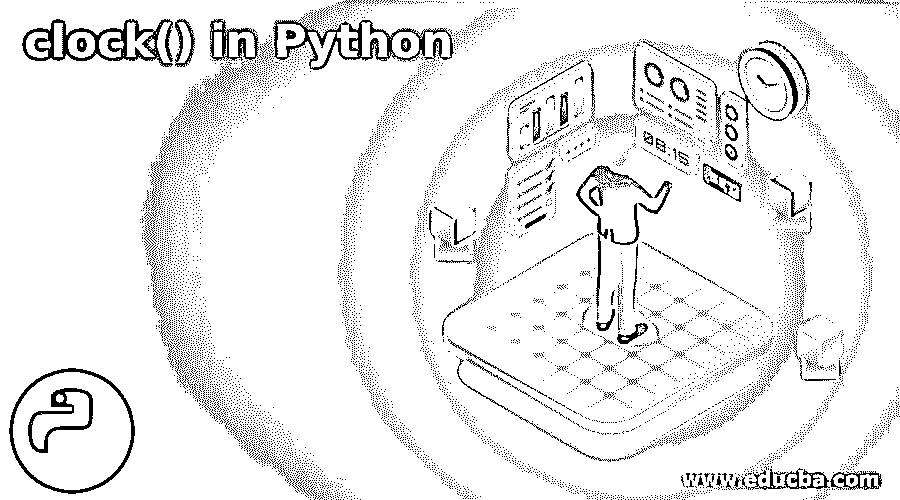

# Python 中的 clock()

> 原文：<https://www.educba.com/clock-in-python/>




## Python 中的 Clock()简介

python 中的 Clock()函数是时间模块的一部分，包含几种类型的时间表示。python 中的时间模块涵盖了 **a.** CPU 时间；系统在多个作业同时运行的多处理环境中执行一个作业， **b.** 一个程序完成执行所用的经过时间或运行时间或时钟时间， **c.** 当前时间表示为基准日期和现在之间的绝对时间间隔，用秒表示。

这些时间模块基本上是指 C 库存储库，用于执行各种与时间相关的功能。然而，由于其对平台的过度依赖，这些模块在 pythons 的更高版本中被弃用。

<small>网页开发、编程语言、软件测试&其他</small>

### Python 中时间的表示

以下是 Python 中时间的各种表示形式:

#### 1.CPU 时间 time.clock()

Processer time 以秒为单位表示的是自处理程序启动以来 CPU 花费的时间。在分时模式下，CPU 为多个任务服务，每个任务以循环方式只获得一段时间。因此，特定进程消耗的 CPU 时间可以通过在进程启动之前和进程完成之后拍摄时间照片并计算差值来测量。

**例子**

在下面的例子中，在启动一个进程之前和完成一个进程之后记录 CPU 时间，差值显示为执行一个进程的 CPU 时间。因此，时间的度量单位是秒，这个过程是计算从 1 到 100000 的数字之和。

```
# Code to explain time.clock() function in python
import time
time1 = time.clock() # Store current CPU time in time1
print("Before the start of the processing ") # Display the initial CPU time
print("CPU time (in seconds):", time1) # (in Seconds)
print()
count = 0
n = 0
while n < 100000: # Process loop to compute
    count = count + n # sum of numbers from 1 to 100000
    n = n +1 # end of loop
print ("Sum Value  1+2+3+4..100000   ", count) #print the computation result
time2 = time.clock() # Store the current CPU time in time2
print()
print("After the end of processing")
print("CPU time ", time2) # Display the CPU time post processing
# Compute the difference and display it
print()
print("Processing time consumed for computing 1-100000 nos", time2 - time1)
```

**输出:**


#### 2.经过的时间或时钟时间 time.time()

Time.time()函数返回基准时间和现在时间之间的时差，以秒为单位。基准时间也称为历元，随操作系统的不同而不同。对于 Windows 和 Unix 系统，01-01-1970 00:00 是纪元，可以通过执行命令 time.gmtime(0)来知道。

可以通过在启动进程之前和完成进程之后存储 time.time()值并计算两者之间的差值来计算进程的运行时间。

**例子**

本练习旨在计算完成一项工作所需的时间或时间间隔

```
# Code to compute elapsed or Clock time to execute a process in python
import time
time1 = time.time() # Store time lag between epoch & now in time1
print("Starting ") # Display the time lag from epoch 01-jan-1970
print("Epoch  time (in seconds):", time1) #and now (in Seconds)
print()
count = 0
n = 0
while n < 10000000: # Process loop to compute
    count = count + n # sum of numbers from 1 to 10000000
    n = n +1 # end of loop
print ("Sum Value  1+2+3+4..10000000   ", count) #print the computation result
time2 = time.time() #Store time lag between epoch& now in time2
print ()
print("After the end of processing")
print("Epoch time ", time2) # Display the elapsed time post processing
#Compute the difference and display it
print()
print("Elapsed time for computing 1-10000000 nos " , time2 - time1, " seconds")
```

**输出:**


time.time()是 1970 年 1 月 1 日和现在的格林威治标准时间或 UTC(协调世界时)之间的时间差。大纪元和现在之间的时间差距大约是 51 年 6 个月 2 天 12 小时，也就是 51×365.25 x24x 60 X60+6×30.5 x24x-60-X60+2x 24x 60 X60+12x 60 X60 = 1625464800 秒(大约)。

#### 3.纪元时间(基线)行时间. gmtime(0)

此操作系统中的纪元时间是 1970 年 1 月 1 日 00:00

**例子**

```
import time
print (time.gmtime(0)) # print the base time for this OS (epoch)
print ()
print ()
print (time.time(), "Seconds from the epoch") # Current elapsed time in seconds
# (time lag from epoch 01-Jan-1970 00:00)
```

**输出:**


| **Sl** | **属性** | **值** | **备注** |
| one | Tm _ 年 | One thousand nine hundred and seventy | 基准年 |
| Two | Tm_mon(消歧义) | one | 月 |
| three | Tm_mday | one | 一天 |
| four | Tm _ 小时 | Zero | 小时 |
| five | Tm_min | Zero | 分钟 |
| six | Tm _ 秒 | Zero | 第二 |
| seven | Tm_wday | three | 星期几(0-6)0-星期一 |
| eight | 日 | one | 一年中的第几天 |
| nine | Tm_isdat | Zero | Whether time reflects daylight saving time applies or not,1–已应用 0–未应用 |

#### 4.当前时间 time.localtime()

Time.localtime()以详细格式(时间元组格式)返回当前 GMT 或 UTC

**例子**

```
import time
print ()
print (time.localtime())  # print the GMT local time in tuple format
print ()
```

**输出:**


| **Sl** | **属性** | **值** | **备注** |
| one | Tm _ 年 | Two thousand and twenty-one | 基准年 |
| Two | Tm_mon(消歧义) | seven | 月 |
| three | Tm_mday | five | 一天 |
| four | Tm _ 小时 | eight | 小时 |
| five | Tm_min | Fifty-three | 分钟 |
| six | Tm _ 秒 | six | 第二 |
| seven | Tm_wday | Zero | 星期几(0-6)0-星期一 |
| eight | 日 | One hundred and eighty-six | 一年中的第几天 |
| nine | Tm_isdat | Zero | Whether time reflects daylight saving time applies or not,1–已应用 0–未应用 |

#### 5.可读格式 time.asctime()中的当前时间

time.asctime()以可读格式返回当前时间

**例子**

```
import time
print ()
print (time.asctime()) # print the GMT local time in readable format
print ()
```

**输出:**


#### 6.睡眠模式时间.睡眠(n)

Time.sleep(n)命令使进程保持睡眠或休眠模式 n 秒。

### 结论–Python 中的 clock()

Python 时间函数因其多功能性，方便开发人员测量任何进程的 CPU 时间和运行时间，并通过修改代码相应地优化进程。

### 推荐文章

这是 Python 中 clock()的指南。这里我们讨论 Python 中时间的各种表示，以及它的例子和代码实现。您也可以看看以下文章，了解更多信息–

1.  [Python 时区](https://www.educba.com/python-timezone/)
2.  [Python 倒计时定时器](https://www.educba.com/python-countdown-timer/)
3.  [Python 线程定时器](https://www.educba.com/python-threading-timer/)
4.  [Python 中的完全数](https://www.educba.com/perfect-number-in-python/)


