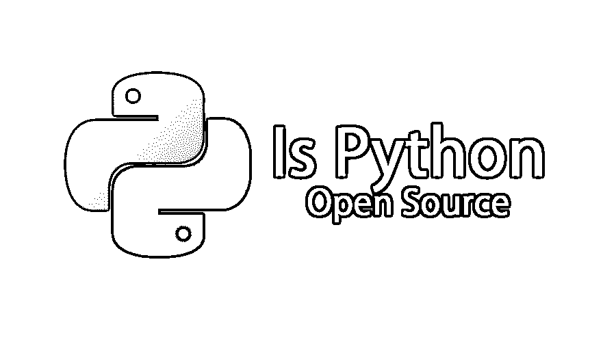

# Python 是开源的吗？

> 原文：<https://www.educba.com/is-python-open-source/>

## Python 是开源的吗？

因为我们想弄清楚 python 是开源的，所以是的，Python 是开源的，这意味着它是免费的，Python 开源不是不同的编程语言，每个人都可以出于任何目的免费使用它。python 软件基金会管理 python 语言。它是在 OSI 批准的开源许可下开发的，使它可以免费获得、使用和分发。开放源码倡议(OSI)是一个加州公共福利公司，具有 501(c)3 免税地位，成立于 1998 年。80 年代末和 90 年代初，吉多·范·罗苏姆在荷兰国家数学和计算机科学研究所开发了 Python。有关 Python 历史和许可的更多信息，请参考以下链接。[https://docs.python.org/3/license.html](https://docs.python.org/3/license.html)

### Python 是什么？

Python 是一种高级的、解释性的、交互式的和面向对象的编程语言。Python 被设计成具有高度可读性。与其他编程语言相比，它像英语一样具有较少的语法结构。

<small>网页开发、编程语言、软件测试&其他</small>

### Python 的特性

python 的特性解释如下。

#### 解释

Python 在运行时由解释器处理。执行程序前无需编译程序。

#### 相互作用的

Python 可以在交互模式下运行，也就是说，程序可以在命令行 shell 中编写，它可以为每个语句提供即时输出。

#### 跨平台语言

Python 可以在不同的平台上工作，如 Windows、Linux、Mac 等。

#### 易于学习

Python 易学易用；它是开发者友好的。

#### 表达的

Python 易于阅读和理解。python 的语法就像英语语句。

#### 大量的图书馆

Python 提供了大量的库、模块和函数，支持应用程序的快速开发。

#### GUI 支持

Python 支持图形用户界面的开发。

#### 完整的

Python 可以很容易地与其他语言集成，如 Java、 [C/C++](https://www.educba.com/c-vs-c-plus-plus/) 等。

#### 数据库

Python 为大量数据库提供了接口。

#### 免费和开源

Python 在官网上是免费的。任何人都可以使用它，修改再分发。但是 Python 语言是有版权的。

### Python 编程语言的特点

下面描述了以下特征。

#### 面向对象

Python 支持面向对象的编程风格，将代码封装在对象中。

#### 数据类型

Python 有多种基本数据类型，如整数、浮点数、字符串(ASCII 和 Unicode)、列表、字典等。

#### 模块和包

代码可以分成包和模块。

#### 错误处理

它支持抛出和捕获异常，这导致了更干净的错误处理。

#### 内存管理

自动内存管理释放内存，而不是在代码中手动处理它。

#### 动态类型化

数据类型是强类型和动态类型；将任何变量从一种数据类型转换为另一种数据类型都会导致异常，因此错误会在最早被捕获。

#### 高级功能

Python 包含高级特性，如生成器和列表理解。

### 使用 Python 的软件开发领域

Python 是一种通用语言，广泛应用于软件开发的各个领域。下面是几个可以使用 Python 的例子。

#### 基于控制台的应用

Python 可以用于开发基于控制台的应用程序。

#### 网络应用

可以使用 Python 开发 web 应用程序。它提供了处理 HTML、XML、JSON、请求等协议的库。它提供了 Django、Pyramid 等各种框架。，用于 web 应用程序开发。

#### 桌面 GUI 应用程序

Python 提供了各种[框架](https://www.educba.com/python-frameworks/)像 Kivy、PyQt、Tkinter PyGUI 等。，用于开发桌面 GUI 应用程序。

#### 科学和数字计算应用

Python 提供了各种库和包，像 SciPy、 [Pandas](https://www.educba.com/what-is-pandas/) 、IPython 等。，用于使用 Python 开发数值和科学计算。

#### 商业应用

Python 用于构建业务应用程序，如 ERP、电子商务应用程序等。

#### 基于音频或视频的应用

Python 可以用来开发多媒体应用，包括图像、音频、视频，还可以用来制作卡通等。一些实时应用程序有 TimPlayer、cplay 等。

#### 机器学习应用

Python 确实包含机器学习的特殊库，即 scipy 和 numpy，它们对于线性代数和了解机器学习的核心方法非常有用。

### 使用 Python 的实时示例

各种公司广泛使用 Python 作为开发他们的应用程序或产品的代码基础。下面提到几个例子。谷歌、DropBox、网飞、Instagram、Splunk、BuzzFeed、脸书、Spotify 和许多其他公司都使用 Python 进行开发。

### Python 版本

Python 的第一个版本是在 1994 年发布的 Python 1.0。现在最新版本是 Python 3.7.0，2018 年 6 月 27 日发布。从 Python 1.0 到 3.7，各种各样的新特性和对现有特性的增强不断涌现。

### 你想为 Python 做贡献吗？

因为我们清除了 python 开源，你可以通过提交任何模块或应用程序来为 Python 做贡献，或者你甚至可以提出任何错误或者甚至为它提供修复。若要投稿，您可以将您的作品提交到官方 python 站点。下面提到了其中的一些。

*   要报告这个错误，请使用链接[https://bugs.python.org/](https://bugs.python.org/)
*   要对官方 Python 文档做出贡献，请加入文档 SIG，写信给 docs@python.org，或者使用问题跟踪器来贡献文档补丁。
*   要向 Python 社区发布您的模块或应用程序，请参考本指南发布指南。更多信息请参考 Python 邮件列表指南。
*   要对 Python 核心的错误修复或其他补丁做出贡献，请阅读 Python 开发人员指南，了解有关 Python 开发过程的更多信息。
*   要对 Python 核心提出修改建议，请参考本指南 CompLangPython 来发表您的想法。如果您有一个实现，请遵循 Python 补丁指南。

### 结论

我们很清楚 Python 是开源的，Python 是广泛使用的健壮编程语言。Python 非常容易学习和实现，提供了代码行的简单用法。它可以用来开发各种各样的应用程序。有各种教程可以学习 Python 你可以跟随他们中的任何一个来精通 Python 语言。

### 推荐文章

这是 Python 是开源的吗？。在这里，我们将讨论基本概念、用途、特性以及 python 版本和实时示例。您也可以阅读以下文章，了解更多信息——

1.  [Python 流](https://www.educba.com/python-stream/)
2.  [备忘单 Python](https://www.educba.com/cheat-sheet-python/)
3.  [Python vs Matlab](https://www.educba.com/python-vs-matlab/)
4.  [Python 的版本](https://www.educba.com/versions-of-python/)

