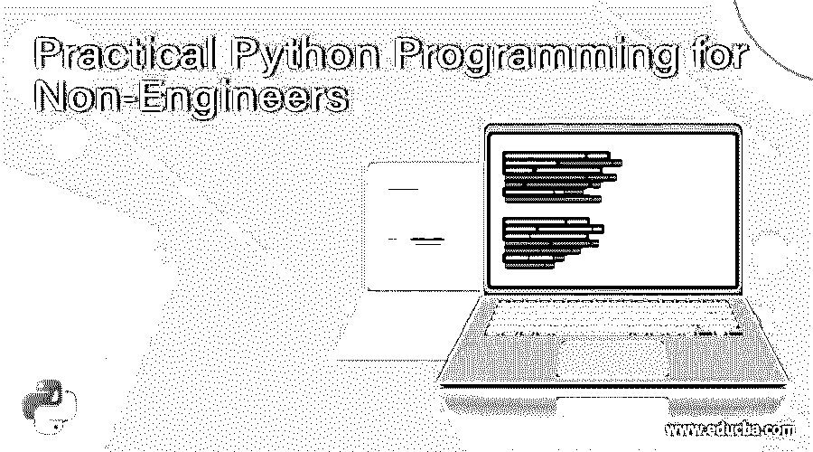

# 面向非工程师的实用 Python 编程

> 原文：<https://www.educba.com/practical-python-programming-for-non-engineers/>




## 实用 Python 编程简介

欢迎来到我的下一篇关于 [Python](https://www.educba.com/software-development/courses/python-certification-course/ "Python Training Course Bundle") 编程的博客。我再次在这里给你一些关于 Python 的令人上瘾的提示。但这一次，它不是基于黑客攻击、Phreaking 或安全破坏。它是关于在我们的日常任务中使用 python 编程。那么，让我们开始吧。

[什么是编程](https://www.educba.com/concepts-of-programming-languages/ "Programming Concepts for Beginners")？别担心。我在这里不是给你编程的典型定义。我今天要讲的部分是编程在我们日常生活中的应用，以及它如何帮助我们实现自动化。

<small>网页开发、编程语言、软件测试&其他</small>

### 面向非工程师的 Python 编程

针对非工程师的 python 编程的详细解释:

#### 乏味的任务

我们生活中的每个人都不是软件工程师。但是，每个人都有自己需要处理的事情。但是编程可以让很多事情变得简单。我们每天的日程表上都有很多事情要做。我们可以让机器来处理这些事情，而不是跟踪这些事情。我们可以通过简单的编程来实现手头任务的自动化。虽然有很多商业软件，但我们不能什么都花钱。此外，他们不会按照我们自己的定制需求。此外，创建我们自己的程序是完全不同的水平。目前我能想到的最好的语言是 Python 编程。让我告诉你怎么做。

#### Python v/s 世界

如果你以前有一些编程知识，特别是 C 或 C++，你可能会知道创建一个程序，然后调试它，使它成为一个干净的程序是多么乏味。但是 Python 却不是这样。甚至不像 Java、汇编、JavaScript 或任何其他语言，Python 没有那些难以记忆的语法。

Python 对用户非常友好，并且有一种明确的做事方式。与 ruby 不同，ruby 是 python 编程的另一个竞争对手，ruby 太用户友好了，有很多方法来完成一个 python，python 不提供这些。Python 编程有缩进和用户可读的代码。

我能想到的最好的例子之一就是这个。每隔一段时间，或者对某些人来说，我们有一种时不时从 youtube 上下载视频的习惯。所以，我们肯定可以通过从网上下载一些随机软件来下载这些视频并使用它。但有时，这并不容易。网络上的大多数软件都充斥着[木马和病毒](https://www.educba.com/viruses-function/ "Viruses and Trojans: We Live in Your Wires")。

所以，你不能简单地依赖他们。天知道那个软件里到底渗透了什么样的逻辑炸弹。因此，我们不用带人类经历所有这些麻烦，而是用 python 编程把我们自己从所有这些麻烦中拯救出来。很久以前我在网上的某个地方发现了这个，从那以后我就一直在使用它。通过这个，你可以用一个简单的命令下载 youtube 视频。

事情是这样的:

**步骤 1:** [安装 Python](https://www.educba.com/install-python/) ，pip 并确保在安装时选择环境变量，这样你就可以从任何地方从命令行调用 Python。

**步骤 2:** 使用此命令下载 youtube 模块

*T2`*>>>pip install youtube-dl*`*

**第三步:**完成。就是这样。不，第三步。现在，每当您需要下载任何视频时，只需在命令行上使用此命令，下载您的视频:

`>>youtube-dl [OPTIONS] URL [URL...]`

现在，你可能对我所说的有一个确切的想法。这难道不比从互联网上下载任何安装了木马的软件容易得多吗？

请注意， **youtube-dl** 是一个小型命令行程序，用于从 YouTube.com 和其他一些网站下载视频。它需要 Python 解释器，版本 2.6、2.7 或 3.2+，并且它不是特定于平台的。它应该可以在你的 Unix 机器、Windows 或 Mac OS X 上工作。你也可以尝试>>>YouTube-dl-help 并检查必要的步骤，例如，如果你想从 https 或 http 或其他端口或类似的地方下载它。

### 工作:祝生日快乐，极客模式开启

如果你没有厌倦这个博客，并且还在看这个，我会更上一层楼。让我们假设你是你朋友中的一个极客，他们一直告诉你你有多无聊，你一天 24 小时中有 16 小时在电脑上。然后，这是展示你有多棒的一种方式。现在，我假设您已经了解了 python 编程的一些知识，我将继续学习。

假设你这周有一个朋友的生日，你需要以一种古怪的方式做一些事情来给你所有的朋友留下深刻的印象。那么，首先，让我们列一个清单，当你去参加生日聚会时，有哪些东西。将会有蛋糕、蜡烛和生日歌曲祝你生日快乐。因此，让我们创建一个虚拟蛋糕，它的阴影具有均衡器效果，对应于背景中播放的“生日快乐”歌曲。在这里，蛋糕上会有火焰随机飘动的蜡烛。

此外，我们将有一个生日快乐信息的花式展示。我们需要做的第一件事是导入一些模块，使它们正常工作。那么，开始吧(记住这是一段需要放在一个 xyz.py 文件中的代码)

```
>>import scipy.io.wavfile as wavfile
>>>import numpy as np
>>>import pylab as pl
>>>import time
>>>import os
>>>import sys
>>>import subprocess
>>>from scipy import mean
>>>from random import randint
```

现在让我们为 wave/mp3 文件编写一段代码，当这段代码被执行时，它将被运行。

```
>>>FILE = "Song.mp3"
>>>rate, data = wavfile.read(FILE)
>>>t_total = len(data[:,0])/rate
>>>display_rate = 1500 #number of frames processed in one iteration
>>>sample_size = 120
>>>max_display = 90
>>>data_length = len(data) #total number of frames
>>>_min = min([abs(x) for x in data[:,0]]) #max amplitude in the wav
>>>_max = max([abs(x) for x in data[:,0]]) #min amplitude in the wav
>>>correction = 0.645
```

***Note:** Everything written in red or starting with # tag are comments. The values such as correction value and length of song will differ from person to person depending upon the chosen song and other stuff. You may need to tweak these things as per your choice of song.*

现在是蛋糕部分。这是我为蛋糕写的一段代码。您可以根据蛋糕的外观来更改蛋糕的显示字符和大小。

```
>>>cols = int(subprocess.Popen("tput cols",shell=True,stdout=subprocess.PIPE,stderr=subprocess.PIPE).stdout.readlines()[0]) #columns in terminal
>>>display_char = "8"
>>>cake_size = 50
```

现在我们需要把蛋糕放在火上，这样看起来就像一支蜡烛在燃烧。

```
flame_flutter_rate = 50 FLAMES = [ " . ", ". ", " ." ]
current_flame = ""
```

`os.system("tput civis") #hide cursor`

现在，如果你在 mac 上，你可能需要打开 iTunes 或其他播放器来播放这首歌。因此，如果您在 mac 上，那么取消注释下面的 os.system 命令代码。(只需简单地去掉 hash#标签)

```
#os.system("open "+FILE)
```

```
for _f in range(data_length/display_rate):
```

```
# fluttering effect to candle flames
```

```
if _f%flame_flutter_rate == 0:
```

```
current_flame = (" "*(cols/2 - cake_size/2))+((" "+FLAMES[randint(0,2)]+" ")*(cake_size/5))
print current_flame
```

```
# candles
```

```
print (" "*(cols/2 - cake_size/2))+(" | "*(cake_size/5))
```

```
# cake top layer
print (" "*(cols/2 - cake_size/2))+("-"*cake_size)
```

```
bucket = []
mug = []
```

```
# mug contains the current frame samples (absolute values) of given sample_size
# average of mugs are put into bucket
```

```
for value in data[:,0][_f*display_rate+1:(_f+1)*display_rate]:
mug.append(abs(value))
```

```
if len(mug) == sample_size:
```

```
bucket.append(mean(mug))
mug = []
```

```
bucket = [ (float)((x - _min) * max_display)/(_max - _min) for x in bucket ]
```

```
# print the equalizer from the bucket
for value in bucket:
print (" "*(cols/2 - cake_size/2))+"| "+("8"*(value%(cake_size-2)))+(" "*(cake_size-value-2))+"|"
```

```
# bottom crust of the cake
print (" "*(cols/2 - cake_size/2))+("-"*cake_size)
```

```
# print happy birthday message
os.system("figlet -c -f small Happy Birthday Chetan!")
```

```
# sleep to match with the audio
```

"""

***注意:**睡眠时间必须乘以修正值
这是因为几个因素，如从睡眠中醒来所用的时间、所用终端的类型..等等
改变修正值以适应你的需要*

"""

```
time.sleep(((float)(display_rate * t_total) / data_length)*correction)
```

```
# clear screen
if _f != data_length/display_rate-1:
os.system("clear")
```

```
raw_input()
```

***Note:** This code was written in python 2.7.9\. You may need to make some changes if you are using python v3.4/earlier or later.*

这是我无聊时做的几个例子。只是改个名字，为其他人做些改变。因此，这不仅使 python 编程变得有趣，而且它还可以完成你的日常任务。

你甚至可以创建自己的待办事项列表或记事本之类的东西。现在你可能认为有 n 个程序在做同样的事情，所以为什么要写你自己的呢？原因在于定制。当您购买或下载软件时，您不知道源代码是什么，或者如果您需要一些自己的定制，您甚至可能需要购买该软件。但是 python 编程非常容易理解和编写，你不需要购买任何东西。

此外，说实话，我最初开始使用 python 编程来自动化我的日常任务，但后来我对此非常感兴趣，开始学习与此相关的一切，现在我的 [job](https://www.educba.com/new-job-career/ "10 Things to Do When Starting a New Job") profile 也是如此；用 Python 编写程序。

这篇博客到此结束，但在我结束之前，我会给你一些提示，这样你可以去查看一些人们用 python 做的很酷的自动化东西，我确信你会惊讶地看到人们用[简单编程](https://www.educba.com/10-simple-yet-useful-tips-on-python-programming/ "10 Simple Yet Useful Tips on Python Programming")做了什么。还有一本名为《用 Python 自动化枯燥的东西》的书。一定要检查一下。

所以，这是我的清单:

1.  用一个简单的代码重命名多个文件(我说的是超过 100、200 甚至 1000 的文件)

2.  自动化工作中的脚本(如果你是系统工程师)

3.  创建一个 RSS 阅读器(因为使用内置阅读器太主流了)

4.  创建一个密码保护的电话簿(非常简单)

5.  创建一个密码保护的记事本来保存密码和个人文件(包括图像和文件)

6.  使用智能搜索下载 mp3 文件(直接从网上随机下载同名的 mp3 文件)

### 推荐文章

这里有一些文章可以帮助你获得更多关于实用 Python 编程的细节，所以只要浏览一下链接就可以了。

1.  [Python vs JavaScript](https://www.educba.com/python-vs-javascript/)
2.  [Python 面试问题](https://www.educba.com/python-interview-questions/)
3.  [Python 职业生涯](https://www.educba.com/careers-in-python/)
4.  [Python 编程技巧](https://www.educba.com/10-simple-yet-useful-tips-on-python-programming/)


