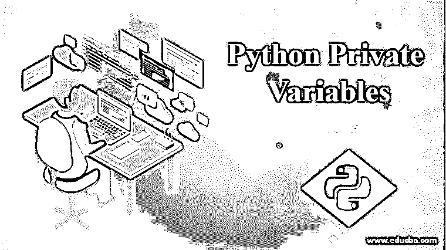

# Python 私有变量

> 原文：<https://www.educba.com/python-private-variables/>




## Python 私有变量简介

一般来说，私有变量是那些只能在它们所属的类中可见和可访问的变量，而不能在类或任何其他类之外。这些变量用于在程序运行时访问值，该程序用于对其他类隐藏数据。在 Java 中，私有变量使用关键字 private 声明为 private，这使得带有 private 的变量和方法只能访问类内部和类外部的成员，而私有方法不能被覆盖。实际上，在 Python 中，没有声明这样的东西，也没有任何可以被称为私有成员的东西。但是可以通过在任何需要声明为私有的变量或方法的开头添加两个下划线(__)来实现。

### Python 中私有变量是如何工作的？

实际上，Python 编程语言没有任何私有成员或变量，比如在 Java 中，它是使用关键字 private 来完成的，但是在 Python 中，它是使用两个下划线来完成的

<small>网页开发、编程语言、软件测试&其他</small>

(__)位于任何需要声明为私有的变量或方法的开头。在 Python 中，当我们使用被声明为私有数据成员的变量时，对于程序员来说，值很容易被修改或更改，就像当我们将其声明为公共时一样。如果变量被声明为公共，那么它可以被任何类访问，并且可以修改或更改变量值，这将导致代码崩溃。让我们看一个在 Python 中如何使用私有变量以及如何声明私有变量的例子。

### 实现 Python 私有变量的示例

下面是提到的例子:

#### 示例#1

**代码:**

```
class mainclass:
    __privateVariable = 2020;
    def __privateMethod(self):
        print("I'm inside class mainclass that is this is private method")
    def insideclass(self):
        print("Private Variable: ",mainclass.__privateVariable)
        self.__privateMethod()
foo = mainclass()
foo.insideclass()
```

**输出:**


**解释:**在上面的程序中，我们有一个定义为“mainclass”的类，在这个类中，我们使用两个下划线私有变量“__PrivateVariable”和私有方法“__PrivateMethod”将变量和方法声明为 private，因此可以使用同一个类“main class”来访问这些变量和方法，但是如果我们在这个类之外访问这些变量和方法，那么我们会得到一个错误，说在这个类中没有这样的属性。这可以在下面的输出代码中演示:

#### 实施例 2

**代码:**

```
class mainclass:
    __privateVariable = 2020;

    def __privateMethod(self):
        print("I'm inside class mainclass that is this is private method")

    def insideclass(self):
        print("Private Variable: ",mainclass.__privateVariable)

foo = mainclass()
foo.insideclass()
foo.__privateMethod()
```

**输出:**


**解释:**在上面的程序中，我们可以注意到这个方法是私有的，但是我们试图在类“mainclass”之外访问它，所以它给出了一个错误，说声明的类没有这个属性的实例。所以，一般来说，在类中声明的所有变量和方法默认情况下都是公共的，但是当我们在它们前面使用下划线时，它们就变成了私有类成员，只能在它们所属的类中访问，而不能在外部类中访问。这种将变量或方法私有的过程被称为数据混淆或名称混淆，以避免子类定义的名称模糊。这有助于在不中断类内方法调用的情况下覆盖子类的方法。

在 Python 中，不支持真正的私有，因此被称为“弱内部使用指示器”。所以这里只有一个下划线(_)，用于声明模块中的私有变量、方法、函数和类。所以只用一个下划线，我们也可以声明私有变量和方法。让我们用下面的代码来演示这一点:

#### 实施例 3

**代码:**

```
class Vehicle:
    def _start_engine(self):
        return "Start the Bike."
    def run(self):
        return self._start_engine()
if __name__ == '__main__':
    bike = Vehicle()
    print(bike._start_engine())
    print("Bike has started.")
    bike.run()
    print("Bike is running.")
```

**输出:**


**解释:**所以在上面的代码中，我们可以使用 private 方法“_start_engine”来使其私有。但是单下划线没有被更多地使用，因为单下划线(_)只是意味着你不能从类外部访问它，而双下划线(__)也是同样的意思，但是它比单下划线更加严格。

单下划线用得不多，因为如果有时使用单下划线声明的私有方法修改了 ant 类变量，并且如果调用了该方法，那么它就有可能破坏类行为。由于双下划线(__)是声明私有类成员的最广泛和有效的用例，以避免子类定义名称的模糊性，因此对这种机制的支持较少，也称为名称篡改；所以 Python 没有像 C++，Java 中那样有私有变量可以随时访问任何成员变量，因为 Python 没有那么差的暴露类成员变量。

### 结论

一般来说，任何编程语言都有 3 个访问修饰符，它们是私有的、公共的和受保护的。在 Python 中，我们也有所有这些访问修饰符，但是没有使用私有访问修饰符，或者我们可以说它在 Python 中不太受支持，因为它可以很好地向私有类成员变量或方法公开。私有变量只能在它所属的类内部访问，但不能被外部类访问。在 Python 中，为了声明私有变量或方法，使用单下划线或双下划线，而单下划线在实践中并不多见，因为双下划线使用得更多，因为它支持在类中访问变量，并且支持名称管理机制。

### 推荐文章

这是 Python 私有变量的指南。在这里，我们讨论 Python 私有变量的介绍，以及它是如何工作的，还有相应的例子。你也可以通过我们的其他相关文章来了解更多。

1.  [Python 倒计时定时器](https://www.educba.com/python-countdown-timer/)
2.  [Python 排序数组](https://www.educba.com/python-sort-array/)
3.  [Python argparse](https://www.educba.com/python-argparse/)
4.  [Python 计数器](https://www.educba.com/python-counter/)


