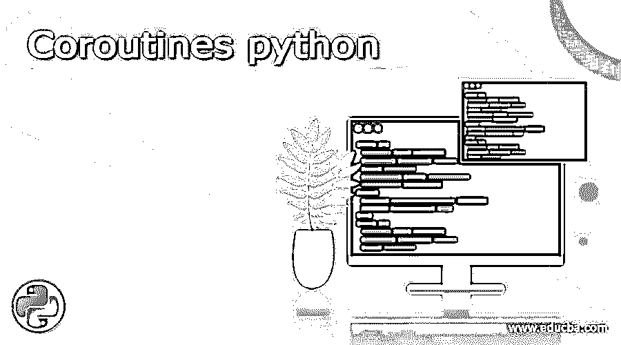

# 协同程序 python

> 原文：<https://www.educba.com/coroutines-python/>




## 协程 python 简介

*   协程 Python 基本上是子程序的简化。这适用于支持性和多任务处理，在这种情况下，一个方法有时甚至在需要时空闲时主动放弃控制权，以使几个应用程序能够同时执行。
*   由于我们可能知道函数也叫子程序、子过程、过程等。函数被定义为为了完成一个确定的任务而收集在一起的一系列指令，但是当逻辑函数被分成几个独立的阶段作为一个微小的函数本身时，那么这些辅助函数就被称为子例程。
*   对比子程序，协程 Python 包含几个中断和重启执行的入口点。然而，协程不包括帮助以不同的顺序调用协程并同步输出的 main 函数。

**语法**

通常，以 await/async 语法结构开始的协程是编写 asyncio 应用程序的理想方式。众所周知，协同程序 Python 是易被发现的；因此，它可以从提供语法代码的其他协同程序中等待，如下所示:

<small>网页开发、编程语言、软件测试&其他</small>

```
import asyncio
async def nested():
return 32
async def main():
# If we call only nested() then nothing happens
# Object of a coroutine will be formed but not awaited,
# Thus, no execution occurs.
nested()
# So we will do it differently now and await it:
print(await nested()) # prints “32”.
asyncio.run(main())
```

在这个概念中，术语“协程”可以实现为两个完全相关的概念:

*   **协程函数:**它是一个异步定义函数
*   **协程对象:**调用协程函数输出的对象。

aysncio 还维护传统的基于生成器的协程。此处的任务用于同时安排 goroutines。例如，当一个协程被封装到一个包含 asyncio.create_task()等函数的任务中时，协程 Python 通常被调度为很快执行，代码如下:

```
import asyncio
async def nested():
return 32
async def main():
# schedule nested() for executing soon instantly
# with "main()"
Task = asyncio.create_task(nested())
# "task" now can be applied to cancel the “nested” or
# can be simply awaiting to wait till it is finished.
await task
asyncio.run(main())
```

### python 中的协程是如何工作的？

在 Python 中，它的先决条件是生成器，这与协程略有相似，但在我们练习语句 yield 的方式上有一些额外的方法和微小的变化。协程与生成器相关，但有如下有限差异:

*   协程甚至可以消耗数据，
*   对于迭代，生成器生成数据。

例如，下面的代码片段(需要 Python 3.7 以上版本)将结果打印为“let's”，等待 1 秒钟，然后再次打印为“start”，如下所示:

```
import asyncio
async def main():
print('let's')
await asyncio.sleep(2)
print('start')
asyncio.run(main())
>> let’s
start
```

现在，基本上，当我们调用一个协程时，它并不计划它执行:

```
main()
```

实际上，为了执行协程，asyncio 提供了三个主要工具:

*   函数 asyncio.run()，用于运行顶级函数 main()的入口点。
*   等待协程。因此，下面这段代码接下来打印单词“let's ”,等待几秒钟。之后，它打印另一个单词“start”，等待几秒钟:
*   函数 asyncio.create_task()，用于像 asyncio 的任务一样同时运行协程。

我们有三种类型的协程，在几个上下文中有很多东西:

1.  **简单的协程**–它不是异步 io，是一个常见的生成器协程。
2.  **生成器协同程序**–通过继承异步执行，异步 io。
3.  **本地协同程序**–通过最新的异步/等待执行异步 io。

### 协程 python 的例子

正如我们所知道的，协程负责消费指向它的值。关键字 yield 的特定控制决定了用户处理的是一个还是另一个。有了协程的所有必要概念，让我们开始用协程 Python 编写我们的第一段代码，将协程定义为:

```
def bare_bones():
while True:
value = (yield)
```

现在，你能猜出收益率的回报是什么吗？好吧，我们把它扭曲成了协程。首先，它不包含任何值；或者，我们将通过方法 send()在外部传递它的值。

这为一致的 Python 函数提供了相似性，而 while True:块在接受值时确认协程的常量实现。这个值是通过语句 yield 一起得到的。但是上面的代码不实用，所以让我们添加一些打印语句，

```
def bare_bones():
    print("I am writing my primary coroutine!")
    while True:
        value = (yield)
        print(value)
```

如果我们应用代码，

```
Coroutine = bare_bones()
```

协同程序需要 next()方法，该方法将在最初被调用。这将启动协程的实现，直到它到达它的初始断点(value = (yield))。在这之后，它停止并返回 main 上的实现，然后闲置，等待新的输入；

```
I am writing my primary coroutine!
```

同样，我们可以用 send()方法发送新的输入:

```
Coroutine.send("Hello World")
```

在这里，变量值接收类型为“Hello World”的字符串，然后打印它，之后，值为 true 的 while 循环的新迭代将迫使协程再次等待新值的提供，这可以执行多次。

最后，一旦它完成了协程，并且不想再创建对它的使用，我们可以通过调用 close()方法来释放资源。它将引发一个需要处理的异常 GeneratorExit。我们有一个实例如下:

```
def bare_bones():
    print("I am writing my primary Coroutine!")
    try:
        while True:
            value = (yield)
            print(value)
    except GeneratorExit:
        print("I am leaving coroutine...")
coroutine = bare_bones()
next(coroutine)
coroutine.send("Hello World!")
coroutine.send("I am learning Coroutines Python")
coroutine.close()
```

**输出:**


### 结论

*   这个协程 Python 是一种特殊的函数，它有意地为调用者提供了一个控制器，但并不在流程中完成它的透视图，作为在惰性状态下支持它的替代方法。
*   协同程序 Python 可以中止它的执行，然后将控制权分配给其他协同程序，并从它停止的地方重新开始执行，这与 function 不同。

### 推荐文章

这是一个关于协程 python 的指南。在这里，我们讨论了协同程序如何在 python 中工作，并给出了协同程序的例子。您也可以看看以下文章，了解更多信息–

1.  [BFS 算法 Python](https://www.educba.com/bfs-algorithm-python/)
2.  [树遍历 Python](https://www.educba.com/tree-traversal-python/)
3.  [sprintf Python](https://www.educba.com/sprintf-python/)
4.  [Python 中的 Deque](https://www.educba.com/deque-in-python/)


