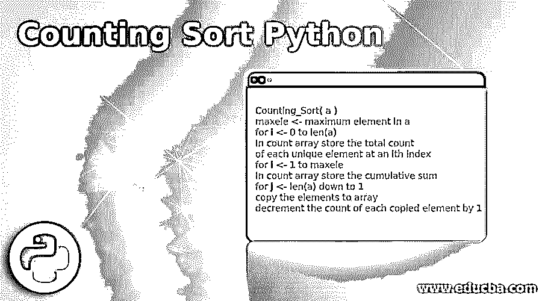

# 计数排序 Python

> 原文：<https://www.educba.com/counting-sort-python/>




## 计数排序 Python 简介

python 中的计数排序用于通过计算数组中每个唯一项的出现次数来对数组进行排序。Python 还提供了对数组进行排序的内置方法。计数排序是一种排序算法，其工作原理是计算数组中唯一元素的出现次数，并通过对这些计数执行算术运算来查找每个元素在数组中的位置。计数保存在辅助数组中，排序是通过将计数映射为辅助数组的索引来完成的。计数排序的运行时间是线性的 O(n)。

### 计数排序算法

计数排序的算法如下所示:

<small>网页开发、编程语言、软件测试&其他</small>

```
Counting_Sort( a )
maxele <- maximum element in a
for i <- 0 to len(a)
In count array store the total count of each unique element at an ith index
for i <- 1 to maxele
In count array store the cumulative sum
for j <- len(a) down to 1
copy the elements to an array
decrement the count of each copied element by 1
```

**返回值:**

*   该方法的返回值是排序后的数组。

### Python 中计数排序的实现

下面给出了 python 中计数排序的工作原理:

1.首先，将指定数组中最大的元素确定为 max。

给定数组:[3，1，1，7，2，2，0]，max=7

2.创建一个数组，所有元素为 0，长度为 max+1。这个列表用于跟踪数组中元素的数量。

计数数组:[0，0，0，0，0，0，0，0，0]

3.在计数列表中，将每个变量的计数存储在其各自的索引处。

考虑元素 2 的例子，它的计数是 2，那么 2 被存储在计数数组的第二个位置。如果元素“6”不在数组中，则 0 存储在第 6 个位置。

存储的每个元素的计数:[1，2，2，1，0，0，0，1]

4.保存 count 数组的元素总数。它有助于在排序后的数组的右索引中放置元素。

累积计数:[1，3，5，6，6，6，6，6，7]

5.在计数数组中，找到原始数组中每个成员的索引。这给出了产品的总数。将元素放在计算出的索引处。在每个元素都被放置到适当的位置后，将其计数减一。

计数排序:[0，1，1，2，2，3，7]

### 计数排序 Python 示例

下面提到不同例子:

#### 示例#1

python 中对数字数组进行计数排序的示例。

**代码:**

```
def counting_Sort(ary):
  size = len(ary)
  output = [0] * size
  # create and initialize count array
  count = [0] * 10
  # In the count array, keep track of how many of each variable there are.
  for no in range(0, size):
      count[ary[no]] += 1
  # Keep track of the total number of count
  for no in range(1, 10):
      count[no] += count[no - 1]
  # In the count array, find the index of each member of the original array.
  # and place the elements in output array
  no = size - 1
  while no >= 0:
    output[count[ary[no]] - 1] = ary[no]
    count[ary[no]] -= 1
    no -= 1
  # Copy the sorted elements into original array
  for no in range(0, size):
      ary[no] = output[no]
data = [ 4, 2, 4, 1, 3, 7, 9 ]
print( "The given array is: " )
print( data )
counting_Sort( data )
print( "The sorted array in ascending Order is: " )
print(data)
```

**输出:**


与上面的程序一样，创建了输出数组(存储数组大小的 0)和计数数组(存储大小为 10 的 0)。接下来，在计数数组中，记录每个变量有多少个，并存储累积计数。接下来，确定计数数组中原始数组的每个数字的索引，并将它们放入输出数组中。最后，将排序后的输出数组复制到传递的数组中进行打印，如上面的输出所示。

#### 实施例 2

python 中对字符数组进行计数排序的示例。

**代码:**

```
def counting_Sort(ary):
   size = len(ary)
   output = [0] * size
   # create and initialize with 0 the count array to store
   # count of each characters
   count = [0 for no in range(256)]
   # In the count array, keep track of how many of each variable there are.
   for no in ary:
      count[ord(no)] += 1
   # Keep track of the total number of count
   for no in range(256):
       count[no] += count[no - 1]
   # In the count array, find the index of each character of the original array.
   # and place the elements in output array
   no = size - 1
   while no >= 0:
     output[count[ord(ary[no])] - 1] = ary[no]
     count[ord(ary[no])] -= 1
     no -= 1
  # Copy the sorted elements into original array
  for no in range(0, size):
      ary[no] = output[no]
  data = [ 'a', 'f', 't', 'w' ]
  print( "The given array is: " )
  print( data )
  counting_Sort( data )
  print( "The sorted array in ascending Order is: " )
  print( data )
```

**输出:**


与上面的程序一样，创建了输出数组(存储数组大小的 0)和计数数组(存储大小为 256 的 0)。接下来，在 count 数组中，跟踪每个字符有多少个，并在 ord()函数的帮助下存储累积计数，该函数返回指定字符的整数表示。接下来，确定 count 数组中原始数组的每个字符的索引，并将它们放入输出数组中。最后，将排序后的输出数组复制到传递的数组中进行打印，如上面的输出所示。

#### 实施例 3

python 中对给定字符串中的字符进行排序的计数排序示例。

**代码:**

```
def counting_Sort(ary):
size = len(ary)
output = [0] * size
# create and initialize with 0 the count array to store
# count od each characters
count = [0 for i in range(256)]
# In the count array, keep track of how many of each variable there are.
for no in ary:
count[ord(no)] += 1
# Keep track of the total number of count
for no in range(256):
count[no] += count[no - 1]
# create the string to store the resultant string
str = ["" for no in ary]
# In the count array, find the index of each character of the original array.
# and place the elements in output array
no = size - 1
while no >= 0:
output[count[ord(ary[no])] - 1] = ary[no]
count[ord(ary[no])] -= 1
no -= 1
# Copy the sorted elements into original array
for i in range(len(ary)):
str[i] = output[i]
return "".join( str )
data = "hello"
print( "The given array is: " )
print( data )
data = counting_Sort( data )
print( "The sorted array in ascending Order is: " )
print( data )
```

**输出:**


与上面的程序一样，创建了输出数组(存储数组大小的 0)、计数数组(存储大小为 256 的 0)和 str(存储数组大小的" ")。接下来，在 count 数组中，跟踪每个字符有多少个，并在 ord()函数的帮助下存储累积计数，该函数返回指定字符的整数表示。接下来，确定 count 数组中原始数组的每个字符的索引，并将它们放入输出数组中。最后，将排序后的输出数组复制到 str 数组中，并在 join()方法的帮助下连接数组中的每个字符，返回升序排列的字符串。

### 结论

python 中的排序字符串用于通过计算数组中每个唯一项的出现次数来对数组进行排序。

### 推荐文章

这是一个计数排序 Python 的指南。这里我们分别讨论计数排序的介绍、算法、工作和例子。您也可以看看以下文章，了解更多信息–

1.  [Python 测试框架](https://www.educba.com/python-testing-framework/)
2.  [Python 字符串包含](https://www.educba.com/python-string-contains/)
3.  [Python 创建目录](https://www.educba.com/python-create-directory/)
4.  [Python 列表扩展](https://www.educba.com/python-list-extend/)


