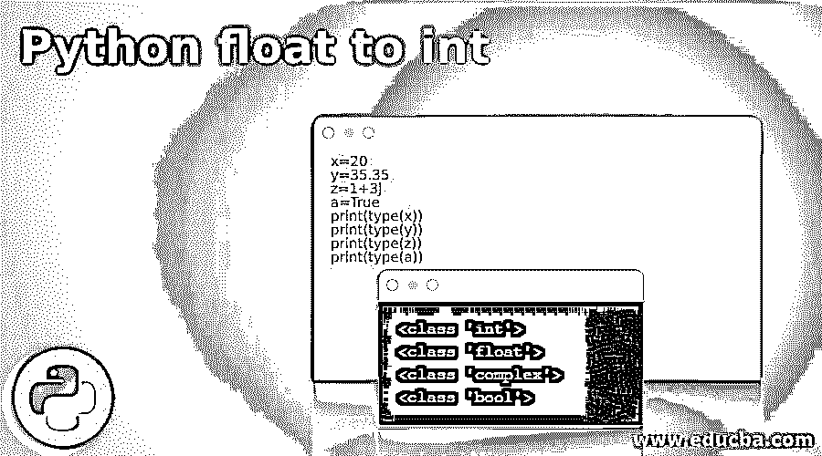
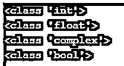
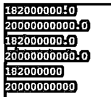
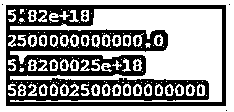

# Python 浮点到整数

> 原文：<https://www.educba.com/python-float-to-int/>




## Python float to int 简介

下面的文章提供了 Python float to int 的概要。在 Python 中，我们作为变量使用或存储的所有值都将具有唯一的数据类型。它解释了值的性质，根据这一点，Python 会自动为该值分配一种数据类型，它有助于定义允许在特定结构中执行和存储的操作类型(绕过编译器)，并且数据类型是可变的，适用于特定的操作。用户可以将数据类型从 float 改为 int 或 string，反之亦然。

**Python 浮点到整数的语法**

<small>网页开发、编程语言、软件测试&其他</small>

Python 对不同的值集有不同的数据类型，Integers 处理数字，float 处理十进制和数字字符，Boolean 处理二进制值(真或假)，还有可以接受字母数字值的字符串，python 允许不同的数据结构，如 List、Tuple、Dictionary & Sets，用于处理不同的问题。

在下面的例子中，我们声明了 4 个不同的值，并检查了这些值的数据类型，以给出 python 数据类型的概念。

**代码:**

```
x=20
y=35.35
z=1+3j
a=True
print(type(x))
print(type(y))
print(type(z))
print(type(a))
```

**输出:**




### Python 中如何把 float 转换成 int？

让我们看看在 float 到 int 的转换中使用的两个函数，反之亦然。

#### 1.float()函数

该函数从字符串或数字中返回一个浮点值。

**语法:**

```
float(argument)
```

此方法中只能使用一个参数，并且是可选的。此函数中可以使用两种类型的参数。

*   **数字:**数字可以是任意浮点数，也可以是整数。
*   **字符串:**字符串必须包含任何类型的数字。

此方法忽略任何右边或左边的空白。可以使用 NaN 或 int。我们也可以使用数学运算符。

#### 2.int()函数

函数的作用是:将给定的值转换成整数值。

**语法:**

```
int(argument)
```

如果函数中没有传递参数，它将返回零。如果没有给定基数值，默认基数设置为 10。整数对象可以用数字或字符串来构造。

### Python 浮点到 int 的例子

下面给出了 Python float to int 的例子:

#### 示例#1

让我们看一个简单的例子，打印给定变量的整数值。

**代码:**

```
#code to print integer value
a = 5
print(int(a))
```

**输出:**


在上面的代码中，我们已经向名为 a 的变量声明了值 5。

在下一行中，我们使用了 int()函数来获取整数值 5 并打印出来。

#### 实施例 2

**代码:**

```
#code to print integer value
x=10/3
print(x)
print(int(x))
```

**输出:**


在上面的代码中，我们将变量 x 的值声明为 10/3。

在下一行中，我们打印了 x 的值，这是一个浮点数。

在下一行中，我们使用 int()函数将该值转换为整数值，并打印该整数值。

#### 实施例 3

在下一个例子中，我们将看到如何将两个浮点值相加，并将它们转换成一个整数值。

**代码:**

```
#type conversion from float to int
a  = 5.3
b = 3.2
c = a + b
print(float(c))
#convert float to int
print(int(c))
```

**输出:**


在上面的例子中，我们给 a 和 b 分别赋值 5.3 和 3.2。在下一行中，我们添加了 a 和 b，并将变量赋给了另一个变量 c。最后，我们在下一行中将浮点值转换为整数值并打印出来。

#### 实施例 4

在这个例子中，我们将看到如何减去两个浮点值，并将结果转换为整数值。

**代码:**

```
#code to subtract float values and convert it to int value
x = 10.1
y = 5.5
z = x-y
print(float(z))
print(int(z))
```

**输出:**


在上面的代码中，两个浮点值 10.1 和 5.5 被分别赋给两个变量 x 和 y。然后减去的值存储在 z 变量中。在下一行打印 z 的浮点值，在最后一行打印 z 的整数值。

#### 实施例 5

考虑数字 1.82e18。它是浮点数的另一种形式。字母 e 代表十进制。因此，数字 1.82e18 可以表示为 1.82 * 10^18.让我们看一个使用这种浮点数形式的简单代码。

**代码:**

```
#code to print two floating point numbers and convert it to int value
a=1.82e8
b=2e10
print(a)
print(b)
print(float(a))
print(float(b))
print(int(a))
print(int(b))
```

**输出:**




在上面的代码中，将两个浮点数 1.82e8 & 2e10 分别赋给了两个变量 a 和 b。接下来的两行只打印 a 和 b 的值。在接下来的两行中，a 和 b 的浮点值由 float()函数打印。最后，最后两行分别打印 a 和 b 的整数值。

#### 实施例 6

在这个例子中，我们将看到如何对浮点数进行简单的算术运算。

**代码:**

```
#code to add two float values convert it to int value
a=5.82e18
b=2.5e12
print(float(a))
print(float(b))
#add two values and assign to c
c =a + b
print(float(c))
print(int(c))
```

**输出:**




和前面的例子一样，两个浮点数 5.82e18 和 2.5e12 分别赋给了两个变量 a 和 b。接下来的两行只打印 a 和 b 的值。在接下来的两行中，a 和 b 的浮点值由 float()函数打印。两个浮点值相加并存储在第三个变量 c 中。最后一行使用 int()函数打印 c 的整数值。

### 结论

在本文中，我们已经看到了使用各种示例进行的浮点到整数的转换。在 python 中，数据类型转换被认为是非常重要的，因为它被用于各种实时场景。此外，当在数据科学领域使用不同种类的算法时，我们需要转换数据类型。

### 推荐文章

这是一个 Python 浮点到 int 的指南。这里我们讨论一下入门，如何在 Python 中把 float 转换成 int？和示例。您也可以看看以下文章，了解更多信息–

1.  [Python 结束于](https://www.educba.com/python-endswith/)
2.  [Python 多行字符串](https://www.educba.com/python-multiline-string/)
3.  [Python 转储](https://www.educba.com/python-dump/)
4.  [Python 值错误](https://www.educba.com/python-valueerror/)


