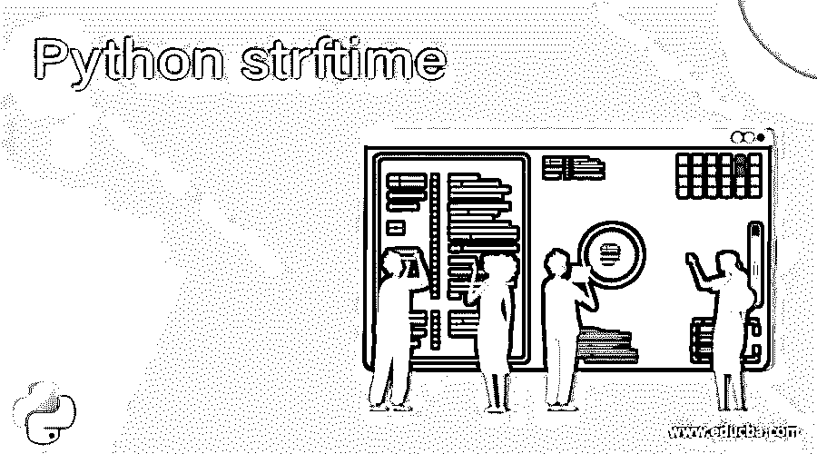
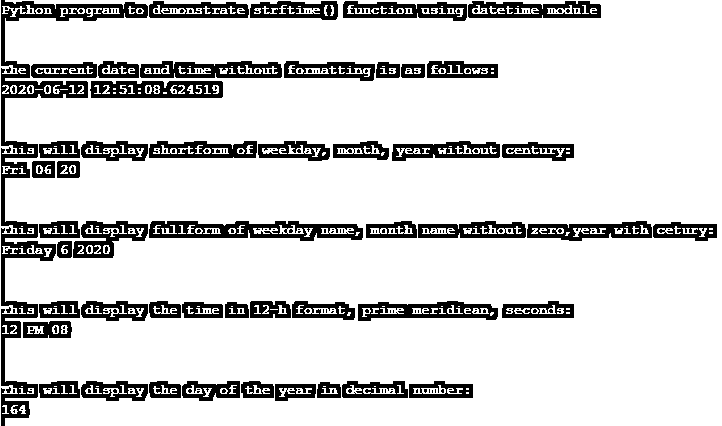
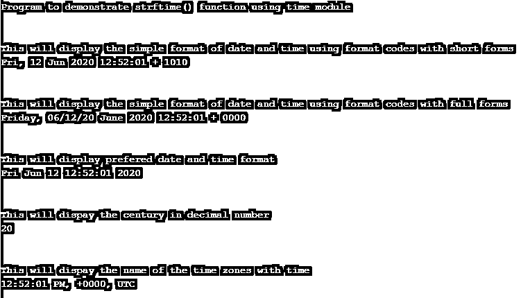

# Python strftime

> 原文： [https://www.educba.com/python-strftime/](https://www.educba.com/python-strftime/)




## Python strftime 的定义

在本文中，我们将讨论 Python 中的 strftime()函数。这个函数在 datetime 和 time 模块中都存在，strftime()函数在这两个模块中的工作方式是相同的，但语法不同。在本文中，我们将看到 strftime()是一个函数，用于将 localtime()或 gmtime()返回的日期和时间格式转换为指定格式的可读字符串。datetime 模块是 python 中的内置模块。strftime()函数将 format 作为参数，Python 中指定了不同种类的格式，根据参数中指定的格式返回可读字符串中的日期和时间。

### Python 中 strftime()函数的使用

本节将看到 strftime()函数，它将时间对象转换成指定格式的可读字符串。该函数在 Python 中的 datetime 模块和 time 模块中都可用。让我们看看下面两个模块中 strftime()的语法和示例。

<small>网页开发、编程语言、软件测试&其他</small>

**日期时间模块中的语法:**

```
do.strftime(format)
```

**参数:**

*   **format:** 用于指定字符串格式，这意味着它有一个指令列表，可以用来指定格式字符串。

**时间模块中的语法:**

```
t.strftime(format [,t])
```

**参数:**

*   **t:** 用于以秒为单位指定时间。
*   **format:** 用于指定字符串格式，这意味着它有一个指令列表，可以用来指定格式字符串。

让我们看看指令或格式代码列表:

*   为了以简短的形式表示工作日的名称，我们使用“%a”。
*   为了以完整的形式表示工作日的名称，我们使用“%A”。
*   为了用简短的形式表示月份名称，我们使用“%b”。
*   为了以完整的形式表示月份的名称，我们使用“%B”。
*   要用不带世纪的十进制数表示年份，那么我们用“%-y”。
*   要用一个世纪来表示十进制数中的年份，那么我们用“%Y”。
*   要用十进制数来表示 24 小时格式的时间，那么我们使用“%-H”。
*   要用十进制数来表示 12 小时格式的时间，那么我们使用“%-I”。
*   为了用十进制数来表示时间，我们使用“%-S”。
*   为了表示时区的名称，我们使用“%Z”。

有许多这样的指令用于指定格式代码，以便将日期-时间格式转换成可读的字符串格式。

### Python 中 strftime()函数的示例

现在让我们看看下面的例子，这些例子使用上面的格式指令代码将给定的时间和时间格式转换成可读的字符串。我们将使用 datetime 模块和 time 模块作为示例。我们应该注意，这个时间戳的范围是 0 到 60。但是在极少数情况下，由于某些历史原因，这意味着时间戳的范围是从 0 到 61。

#### 示例#1

让我们看一个使用 Python 中的 datetime 模块演示 strftime()函数的例子。

**代码:**

```
from datetime import datetime as dt
print("Python program to demonstrate strftime() function using datetime module")
print("\n")
now = dt.now()
print("The current date and time without formatting is as follows:")
print(now)
print("\n")
s = now.strftime("%a %m %y")
print("This will display shortform of weekday, month, year without century:")
print(s)
print("\n")
s = now.strftime("%A %-m %Y")
print("This will display fullform of weekday name, month name without zero,year with cetury: ")
print(s)
print("\n")
s = now.strftime("%-I %p %S")
print("This will display the time in 12-h format, prime meridiean, seconds:")
print(s)
print("\n")
s = now.strftime("%-j")
print("This will display the day of the year in decimal number:")
print(s)
```

**输出:**




在上面的程序中，我们可以看到我们正在使用 datetime 模块，然后我们正在创建 datetime 对象为“dt”，然后我们可以调用函数 strftime()函数。但是要在不使用 strftime()的情况下打印当前日期和时间，那么我们就使用 now()函数 then；后来，我们使用上面列表中的各种格式代码将这种格式转换成可读的字符串。

#### 实施例 2

让我们看一个使用时间模块演示 strftime()函数的例子。

**代码:**

```
from time import gmtime, strftime
print("Program to demonstrate strftime() function using time module")
print("\n")
s = strftime("%a, %d %b %Y %H:%M:%S + 1010", gmtime())
print("This will display the simple format of date and time using format codes with short forms")
print(s)
print("\n")
s = strftime("%A, %D %B %Y %H:%M:%S + 0000", gmtime())
print("This will display the simple format of date and time using format codes with full forms")
print(s)
print("\n")
# this will show you the preferd date time format
s = strftime("%c")
print("This will display prefered date and time format")
print(s)
print("\n")
s = strftime("%C")
print("This will dispay the century in decimal number")
print(s)
print("\n")
s = strftime("%r, %z, %Z")
print("This will dispay the name of the time zones with time")
print(s)
```

**输出:**




在上面的程序中，我们可以看到我们有一个导入的时间模块，我们使用 strftime()函数和上面给出的列表中列出的格式代码。

### 结论

在本文中，我们总结使用 strftime()函数；我们需要使用时间模块或日期时间模块。在本文中，我们看到 strftime()函数主要用于显示日期和时间，从与时间相关的对象到使用指定格式代码或指令的可读字符串。在本文中，我们还列出了一些指令或格式代码及其含义。

### 推荐文章

这是一个 Python strftime 的指南。这里我们讨论 python 中 strftime()函数的工作原理，以及多个例子和它的代码实现。您也可以看看以下文章，了解更多信息–

1.  [Python 输入函数](https://www.educba.com/python-input-function/)
2.  [Python 数组函数](https://www.educba.com/python-array-functions/)
3.  [Python 的幂函数](https://www.educba.com/python-power-function/)
4.  [Python 列表函数](https://www.educba.com/python-list-functions/)


