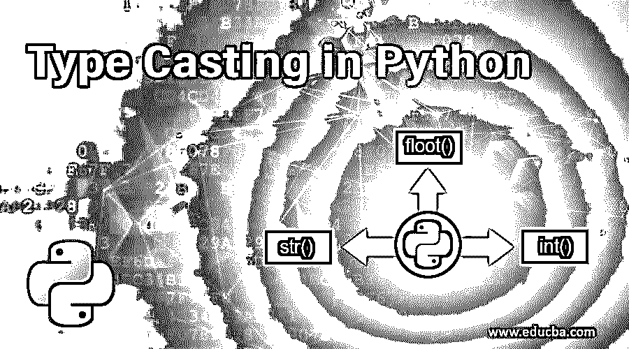
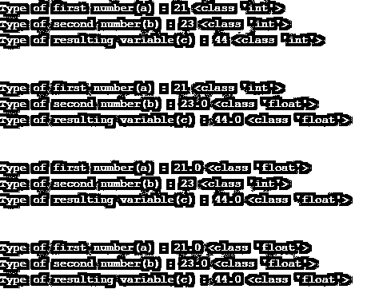
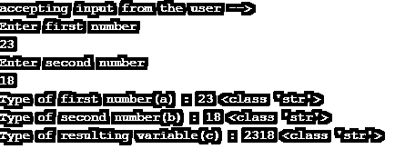
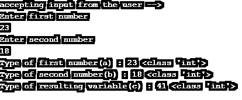
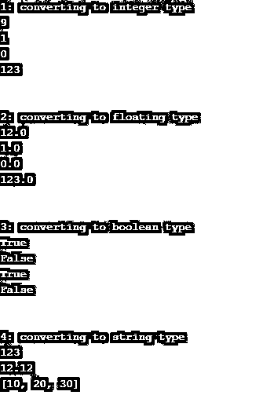

# Python 中的类型转换

> 原文：<https://www.educba.com/type-casting-in-python/>




## Python 中的类型转换简介

类型转换是一种方法，用于将某一数据类型中声明的变量/值更改为不同的数据类型，以匹配代码片段需要执行的操作。在 python 中，这个特性可以通过使用 int()、string()、float()等构造函数来实现。类型转换过程的执行可以通过使用两种不同类型的类型转换来执行，例如隐式类型转换和显式类型转换。

### Python 中的类型转换

Python 有两种类型的类型转换:

<small>网页开发、编程语言、软件测试&其他</small>

#### 1.隐式类型铸造

隐式类型转换由解释器自动执行，无需用户干预。Python 自动将一种数据类型转换成另一种数据类型。这个过程不需要任何用户参与 Python 促进了较低数据类型的转换，比如 integer 到较高数据类型说 float 避免数据丢失。这种类型的转换或类型转换称为向上转换。

#### 2.显式类型转换

在显式类型转换中，用户或程序员将对象的数据类型转换为所需的数据类型。在 Python 中，我们使用像 int()、float()、str()、bool()等预定义函数来执行显式类型转换。

**语法:**

```
(Required datatype) (Expression)
**           ↓**
(Desired type)
```

### Python 中的类型转换示例

以下是 python 中类型转换的示例:

#### 示例# 1–隐式类型转换/转换

说明隐式类型转换/转换的程序。

**Python 文件:Example1.py**

```
# Program to illustrate Implicit type conversion
# creating addition() function to add two numbers
def addition(a, b):
    print("Type of first number(a) :", a, type(a))
    print("Type of second number(b) :", b, type(b))
    c = a + b
    print("Type of resulting variable(c) :",  c, type(c))
# addition() function calls with different inputs
addition(21, 23)   # both integers
print('\n')
addition(21, 23.0) # second being float
print('\n')
addition(21.0, 23) # first being float
print('\n')
addition(21.0, 23.0) # both float
```

**输出:Example1.py**




**说明:**

定义了两个数相加的函数。打印第一个输入数字的类型、第二个输入数字和总和的类型。

*   **第一次调用加法():**两个输入数都是整数类型，所以结果也是整数。在这种情况下，不需要类型转换。
*   **第二次调用加法():**第一次输入是整数，第二次输入是浮点类型。因此 python 解释器在内部将整数类型转换为浮点类型，以避免数据丢失。因此，结果是浮点型的，如上面的输出所示。
*   **第三次调用加法():**第一次输入是浮点数，第二次输入是整数类型。因此 python 解释器在内部将整数类型转换为浮点类型，以避免数据丢失。因此，结果是一个浮动类型。
*   **加法的第四个调用():**两个数都是浮点型。所以 python 解释器在这里不会执行任何类型的转换。因此，结果是一个浮动类型。

#### 示例# 2–显式类型转换

下面是显式类型转换的示例。

**Python 文件:Example2.py**

```
# Program to illustrate Explicit type conversion
# creating addition() function to add two numbers
def addition(a, b):
    print("Type of first number(a) :", a, type(a))
    print("Type of second number(b) :", b, type(b))
    c = a + b
    print("Type of resulting variable(c) :", c, type(c))
print("accepting input from the user -->")
print("Enter first number")
num1 = input()
print("Enter second number")
num2 = input()
# addition() function call
addition(num1, num2)
print('\n')
```

**输出:Example2.py**




**说明:**

*   在上面的程序中，定义了 addition()函数，它将计算两个数的和。提示用户通过 input()语句输入两个数字。
*   最后，用数字 23 和 18 调用 addition()。但是结果是 2318，如下面的输出所示，而不是 41。为什么？？
*   这是因为 input()的返回类型是字符串。因此，用户输入的数字被视为字符串值。因此，输出是字符串的连接，而不是预期输出的整数的和。在这种情况下，Python 本身不会执行任何类型转换。这可以通过显式类型转换来纠正。

**以上代码可以修改为:**

```
# Program to illustrate Explicit type conversion
# creating addition() function to add two numbers
def addition(a, b):
    print("Type of first number(a) :", a, type(a))
    print("Type of second number(b) :", b, type(b))
    c = a + b
    print("Type of resulting variable(c) :", c, type(c))
# addition() function calls with different inputs
print("accepting input from the user -->")
print("Enter first number")
# Explicit typecasting
num1 = int(input())
print("Enter second number")
num2 = int(input())
# addition() function call
addition(num1, num2)
print('\n')
```

在这个程序中，int(input())会将字符串转换为整数类型。因此，我们将得到如下所示的期望输出:

**输出:**




#### 示例 3–使用构造函数进行显式类型转换

使用构造函数(如 int()、float()、str()等)进行显式类型转换。

**Python 文件:Example3.py**

```
# Explicit Type conversion using constructor functions
# 1 --> Converting to integer type using int()
print("1: converting to integer type")
print(int(9.6)) # float to int
print(int(True)) # bool to int
print(int(False)) # bool to int
print("123") # str to int
print('\n')
# 2 --> converting to float type using float()
print("2: converting to floating type")
print(float(12)) # int to float
print(float(True)) # bool to float
print(float(False)) # bool to float
print(float("123")) # string to float
print('\n')
# 3 --> converting to bool type using bool()
print("3: converting to boolean type")
print(bool(12)) # integer to bool
print(bool(0.0)) # float to bool
print(bool([1,2,3])) # list to bool
print(bool()) # tuple to bool
print('\n')
# 4 --> converting to string type using str()
print("4: converting to string type")
print(str(123))  # integer to string
print(str(12.12)) # float to string
print(str([10, 20, 30])) # list to strings
```

**输出:Example3.py**




**Note:** Constructor functions are not limited to the above four ones. In fact list of constructor functions is quite exhaustive. It includes dict(), tuple(), list(), oct(), hex(), bin() and so on.

### 结论

在任何编程语言中，都需要将一种数据类型的值转换为另一种数据类型。Python 提供了隐式类型转换和显式类型转换。

python 解释器在没有程序员干预的情况下执行隐式类型转换。程序员执行显式类型转换。

### 推荐文章

这是 Python 中类型转换的指南。这里我们讨论 python 中造型的基本概念、两种不同类型和各种例子。您也可以阅读以下文章，了解更多信息——

1.  [Python 中的迭代器](https://www.educba.com/iterators-in-python/)
2.  [列出 Python 中的方法](https://www.educba.com/list-method-in-python/)
3.  [Linux 上的 Python IDE](https://www.educba.com/python-ide-on-linux/)
4.  [Python 文件方法](https://www.educba.com/python-file-methods/)


