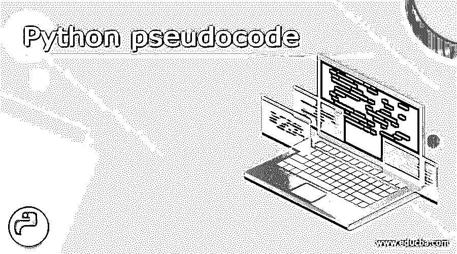

# Python 伪代码

> 原文：<https://www.educba.com/python-pseudocode/>

## Python 伪代码介绍

Python 伪代码更像是相关代码的算法表示。这意味着当一个守则预计将制定它不能直接起草。代码首先需要生成 Python 伪代码，然后需要形成实际的代码。这种形成类似英语句子的算法表示的过程就是 Python 伪代码的含义。简单地说，Python 伪代码是代码的无语法表示。因此，Python 伪代码不包含任何代码。Python 伪代码必须是算法逻辑的非常接近的表示。必须这样，Python 伪代码的每一行都可以成比例地翻译成实际代码。Python 伪代码有助于将实际代码轻松翻译给非技术人员。这些是在编程中使用 Python 伪代码的主要优势。因此，简单来说，主要的描述是 Python 伪代码是代码的无语法表示。因此，Python 伪代码不包含任何实际代码。

### Python 伪代码的要点

每当需要与其他领域的人联系时，Python 伪代码将是沟通桥梁的最佳元素。基本上，除了预期要编码的技术方面之外，还需要针对某些特定领域进行编码。具体来说，由于商业原因，程序员需要与数学家、金融专家、生物技术专家、医疗保健专家或任何其他特定领域的专家联系。例如，如果一个基于生物技术的软件预期被创建，那么就需要与生物技术专家联系来构建该软件。有时，我们需要确保开发人员和其他领域专家之间的交流需要相互理解和顺畅。这可以通过基于 Python 伪代码的算法来实现。这使业务专家和技术程序员的理解保持一致。

<small>网页开发、编程语言、软件测试&其他</small>

使用 python 等语言进行软件开发时，最令人兴奋的过程之一是将 HLD 转换为业务逻辑和代码的过程。将业务逻辑转换成代码的过程是基于 python 的应用程序开发环境中最繁忙的过程。因为这一部分将会产生许多业务问题，需要业务人员和程序员共同协商解决。因此，当在业务逻辑层和实际代码之间引入额外的 python 伪代码层时，这个过程将大大简化编码中的困难。因此，编写伪代码有助于轻松地将算法表示转换为实际代码。

在 python 应用程序构建过程中拥有伪代码的过程将有助于轻松构建应用程序的文档。这是拥有伪代码的另一个非常重要的方面。因此，每一个应用程序，不管它涉及的领域和复杂性如何，也不管它是用什么技术开发的，都必须有相关的文档。这种应用程序级别的文档将很好地理解它与什么类型的应用程序相关，以及应用程序背后的业务逻辑是如何构建的，这只能通过其中包含的强大伪代码来实现。这是任何应用程序的关键能力之一，因此文档的存在是一个非常关键的部分，这些文档可以仅基于所涉及的伪代码来启动和顺利进行。应用程序中伪代码的存在使得应用程序文档化的过程相对容易执行。这是在 python 级别的应用程序中构建伪代码的主要优势之一。

开发 python 级伪代码的另一个关键部分是他们修复应用程序中出现的问题、顾虑和 bug 的能力。所以，这意味着 python 应用程序的错误，而调试这些错误是一个非常常见的方面。可能存在如此容易产生和创建的错误。但是除此之外，修复这些错误是一个非常关键的方面。当涉及的代码非常密集和过长时，识别应用程序中产生的错误就变得非常困难。当使用这些应用程序的伪代码时，可以复杂地处理这个困难。引用伪代码简化了 bug 检测和修复的过程，所以这是在基于 python 的应用程序中生成和编写伪代码的另一个重要原因。

### Python 伪代码中的五大协议

1.  python 中的伪代码必须是一行一行的，所以涉及到的每个语句都必须用一行伪代码来表示。
2.  正如在 python 代码中如何使用缩进一样，这些缩进在 python 伪代码中也必须是首选的。
3.  确保伪代码的每个语句都简单易懂。
4.  确保伪代码的第一个单词总是大写字母。
5.  确保在需要的地方使用句点和分隔符。

### Python 伪代码示例

**Python 伪代码:**

从用户处检索要反转到变量 sample_number 中的数字。
将临时变量 test_number 初始化为零。
执行 while 循环，直到 sample_number 变量大于零。
用 10 对 sample_number 变量取模，并存储余数。
将 test_number 的临时数乘以 10，并将返回值加到余数上。
将生成的 test_number 打印到控制台上。

**Python 程序:**

`sample_number = int(input("Number to be reversed: "))
test_number = 0
while(sample_number>0):
remainder_number = sample_number % 10
test_number = (test_number * 10) + remainder_number
sample_number = sample_number//10
print("Value after reverse : {}".format(test_number))`

**输出:**

### 结论

伪代码的存在有助于应用程序级别的编码，这是一个更容易开发的方面。我们可以从上面给出的例子中注意到，基于在代码上草拟的伪代码，编码方面变得多么灵活。对所有执行的应用程序级编程使用伪代码应该是一个标准的方面。

### 推荐文章

这是一个 Python 伪代码的指南。这里我们讨论 Python 伪代码的简介、要点、Python 伪代码中的五个主要协议。您也可以看看以下文章，了解更多信息–

1.  [Python 中的烧瓶](https://www.educba.com/flask-in-python/)
2.  [Python 字符串包含](https://www.educba.com/python-string-contains/)
3.  [Python 创建目录](https://www.educba.com/python-create-directory/)
4.  [Python 列表扩展](https://www.educba.com/python-list-extend/)

