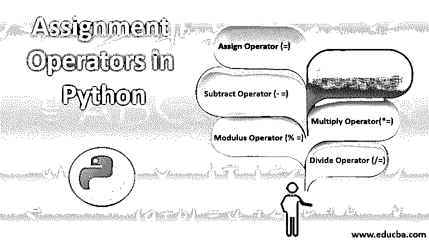
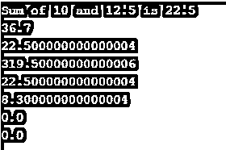

# Python 中的赋值运算符

> 原文：<https://www.educba.com/assignment-operators-in-python/>




## Python 中赋值运算符的介绍

python 中的赋值运算符允许以特定的方式为变量赋值。它们中的每一个都是为解决特定的情况而设计的，必须根据上下文来使用。Python 提供了各种类型的赋值操作符，每种操作符的应用都完全由用户在给定上下文中的需求决定。赋值操作符允许跳过步骤，在某种程度上，这是一种捷径。由于存在许多赋值操作符，了解它们的工作原理变得非常重要。

### 赋值运算符的类型

我们讨论了 Python 中各种类型的赋值运算符，如下表所示。

<small>网页开发、编程语言、软件测试&其他</small>

| **Python 中的赋值运算符** | **描述** | **例子** |
| **=** | 它给一个变量赋予一个特定的值。 | a = 29，温度= -30.9 |
| **+=** | 将右侧运算符上指定的值添加到运算符左侧的变量中。 | 假设变量 a 的值是 10，我们执行 a += 21，那么变量 a 就变成了 31。 |
| **-=** | 从运算符左侧的变量中减去运算符右侧指定的值。 | 假设变量 a 的值是 21，我们执行 a -= 10，那么变量 a 就变成了 11。 |
| ***=** | 将运算符左侧指定的变量乘以运算符右侧的值。 | 假设变量 a 的值是 6，我们执行 a *= 4，那么变量 a 就变成了 24。 |
| **/=** | 将运算符左侧指定的变量除以运算符右侧指定的值。 | 假设变量 a 的值是 9，我们执行 a /= 3，那么变量 a 就变成了 9。 |
| **%=** | 将运算符左侧的变量除以运算符右侧指定的值，并将余数放入运算符左侧的变量中。 | 假设变量 a 的值是 12，我们执行 a %= 5。运算返回的余数是 2，a 将被赋值为 2。 |
| **//=** | 将运算符左侧的变量除以运算符右侧指定的值，并将结果的整数部分放入变量中。 | 假设变量 a 的值是 12，我们执行 a //= 5。结果的整数部分是 2。因此，a 将被赋值为 2。 |
| ****=** | 将运算符左侧指定的变量的值提升到运算符右侧指定的值的幂 | 假设 a 的值是 2，当我们执行 a **= 4 时，它会将 2 提升到 4 的幂，从而返回一个 as 16。 |

### 实现赋值运算符

现在我们已经理解了每个操作符的功能，让我们通过下面的 Python 程序代码和随后的输出来看看每个操作符的工作原理。

#### 1.= '运算符

**代码:**

```
b = 100
print('The initial value of variable b is ' + str(b))
```

**输出:**


**代码:**

```
b = 12.67 * 94.53
print('The value of variable b is ' + str(b))
```

**输出:**


#### 2.+= '运算符

**代码:**

```
b = 100
b += 21.9
print('The value of variable b is ' + str(b))
```

**输出:**


#### 3.-= '运算符

**代码:**

```
b = 100
b -= 21.9
print('The value of variable b is ' + str(b))
```

**输出:**


#### 4.*= '运算符

**代码:**

```
b = 13.4
b *= 7.57
print('The value of variable b is ' + str(b))
```

**输出:**


#### 5./=运算符。

**代码:**

```
b = 130
b /= 1.33
print('The value of variable b is ' + str(b))
```

**输出:**


#### 6.“%=”运算符

**代码:**

```
b = 27
b %= 5
print('The value of variable b is ' + str(b))
```

**输出:**


#### 7.//=运算符。

**代码:**

```
b = 27
b //= 5
print('The value of variable b is ' + str(b))
```

**输出:**


#### 8.**=操作员。”

**代码:**

```
b = 3
b **= 4
print('The value of variable b is ' + str(b))
```

**输出:**


在上一节中，我们刚刚看到了如何使用每个操作符，并通过检查各自的输出来验证它们的功能。现在，我们将通过另一个程序代码来演示它们的用法，这将在下一节中讨论。让我们看一下程序代码。

**代码:**

```
p = 10
q = 12.5
r = 14.2
sum = p + q
print('Sum of ' + str(p) +' and '+str(q)+' is '+str(sum))
sum += r
print(sum)
sum -= r
print(sum)
sum *= r
print(sum)
sum /= r
print(sum)
sum %= r
print(sum)
sum //= r
print(sum)
sum **= r
print(sum)
```

**输出:**




最初，三个变量 p、q 和 r 被赋予一定的值。然后将变量 p 和 q 的值之和赋给一个我们称之为 sum 的变量。然后打印变量 p 和 q 的和。此外，我们使用了每个以“+=”开始的赋值操作符。我们将变量 r 添加到变量 sum 中，结果会相应地返回。然后我们从变量 sum 中减去变量 r 的值。每次使用一个运算符时，都会打印出结果。接下来，我们使用' *= '操作符来检查乘法是如何发生的以及返回什么值。在使用每个运算符后检查结果是很重要的，因为这有助于理解运算如何影响结果。接下来，我们使用“/=”运算符返回除法运算后的结果。最后两个操作返回值 0。这是因为之前的赋值操作将值赋给了变量 sum。

### 结论

赋值运算符是 Python 编程中至关重要的元素。在涉及将较大的任务分解成较小单元的情况下，它们非常有用。这些操作符的应用在大规模程序中是显而易见的，在这些程序中，程序代码需要被优化到最大可能的程度。

### 推荐文章

这是 Python 中赋值运算符的指南。这里我们讨论 python 中赋值操作符的介绍和类型，以及它的代码实现。您也可以看看以下文章，了解更多信息–

1.  [Python 中的字符串运算符](https://www.educba.com/string-operators-in-python/)
2.  [Python 中的多重继承](https://www.educba.com/multiple-inheritance-in-python/)
3.  [Python 模数运算符](https://www.educba.com/python-modulus-operator/)
4.  [Python 余数运算符](https://www.educba.com/python-remainder-operator/)


