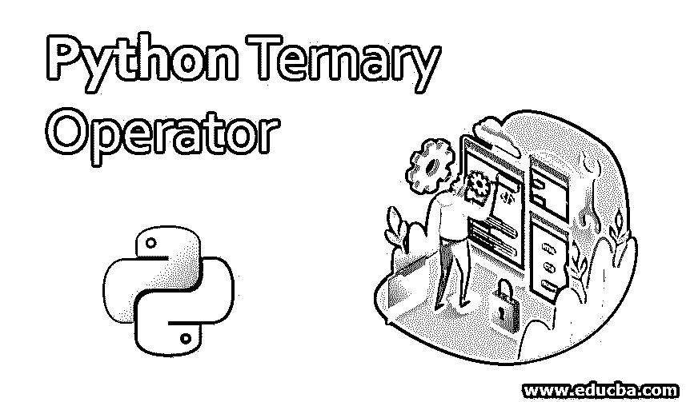
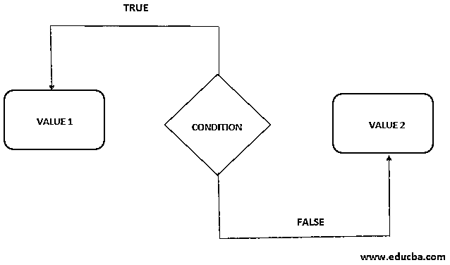

# Python 三元运算符

> 原文：<https://www.educba.com/python-ternary-operator/>




## Python 三元运算符简介

Python 是最用户友好的编程语言之一，几乎没有语法问题，正在成为全球发展最快的编程语言之一。一个强大的 Python 用户和开发者社区为这种语言的完善和发展做出了贡献。自 1991 年问世以来，Python 在本质上一直是非常动态的，并且它仍在随着时间的推移而不断发展，新的功能不断增加，旧的功能逐渐减少。

三元运算符是 Python 2.5 版本中的一个增强功能。它帮助我们在一行中用 Python 编写[条件语句。它可以被认为是 if-else 代码块的单行表示。让我们看看三元运算符的语法，并更详细地看看它的应用。](https://www.educba.com/conditional-statements-in-python/)

<small>网页开发、编程语言、软件测试&其他</small>

**语法:**

```
var = true_val if condition else false_val
```

三元运算符中有三个操作数

*   **条件:**它是一个布尔表达式，计算结果为 true 或 false。
*   **true_val:** 如果表达式被评估为真，则为该值赋值。
*   **false_val:** 如果表达式被评估为 false，则该值将被赋值。

下图将有助于说明这一点:




### Python 三元运算符的示例

让我们来看一个确定一个数是奇数还是偶数的简单程序。我们将首先使用普通的 if-else 语句，然后使用三元运算符来更好地理解它的用法。

#### 1.使用 If-Else 代码块

**代码:**

```
num=int(input("Enter number to check :"))
if(num%2==0):
    msg=str(num)+"is an even number"
else:
    msg=str(num)+"is an odd number"
print(msg)
```

**输出:**


下面是对于奇数，


#### 2.使用三元运算符

**代码:**

```
num=int(input("Enter number to check :"))
msg=str(num)+"is an even number" if num%2==0 else str(num)+"is an odd number"
print(msg)
```

**输出:**


下面是对于奇数，


在上面的例子中，我们看到 if-else 块和三元运算符都可以实现相同的功能。使用 if-else 块，需要 6 行代码，而[使用三元运算符](https://www.educba.com/ternary-operator-in-php/)，只需要 3 行代码。达到同样的功能需要一半的时间和精力。因此，对于复杂的程序，使用三元运算符应该是必须的。

**Note:** The above code uses Modulus Operator (%), another useful operator to know about. There is a separate article for that which can be referred to.

### 三元运算符的用法

下面是 Python 三元运算符的其他用法:

#### 1.使用 Python 元组

**代码:**

```
a=3
print(("Odd","Even") [a%2==0])
```

**输出:**


下面是检查它的另一个例子，

**代码:**

```
a=24
print(("Odd","Even") [a%2==0])
```

**输出:**


在上面的例子中，我们[使用的是使用 Python 元组的三元运算符](https://www.educba.com/ternary-operator-javascript/)。在方括号内提供了用于确定奇数或偶数的条件，即[a%2==0]，并且基于该条件的值将在元组内传递，第一个值，即在这种情况下的“奇数”用于负面情况，第二个值，即在这种情况下的“偶数”用于正面情况。

#### 2.使用 Python 字典

**代码:**

```
a=40
print({True:"Even", False: "Odd"} [a%2==0])
```

**输出:**


下面是检查它的另一个例子，

**代码:**

```
a=15
print({True:"Even", False: "Odd"} [a%2==0])
```

**输出:**


在上面的例子中，我们使用 Python 字典使用三元运算符[。确定奇数或偶数的条件在方括号中提供，即[a%2==0]，基于该条件的值将在字典中传递。这些关键字将分别为 True 和 False，并且将提到各个关键字的值。](https://www.educba.com/python-dictionary-methods/)

这里，当条件 a%2==0 为真时，则 a 是偶数，因此键“真”的值是“偶数”，反之，键“假”的值是“奇数”。

#### 3.使用 Python Lambda 函数

**代码:**

```
a=3
print((lambda:"Odd", lambda: "Even") [a%2==0]())
```

**输出:**


下面是检查它的另一个例子，

**代码:**

```
a=20
print((lambda:"Odd", lambda: "Even") [a%2==0]())
```

**输出:**


在上面的例子中，我们使用 Python lambda 函数使用三元运算符。确定奇数或偶数的条件在方括号中提供，即[a%2==0]，基于该条件的值将如上所示进行传递。第一个值用于消极场景，第二个值用于积极场景。

这里，当 a%2==0 为真时，则偶数，因此“偶数”作为第二个值，而“奇数”作为第一个值。

### 三元算子的局限性

以下是三元运算符的一些限制，解释如下:

*   虽然[三元运算符可以用来](https://www.educba.com/c-sharp-ternary-operators/)代替 if-else 语句，但它仅限于单个 if-else 语句。
*   对于多个 if-else 语句，不使用三元运算符。
*   尽管三元运算符可用作嵌套 if-else，用于具有三个可能值的条件。

### 作为嵌套 If-Else 的三元运算符

**代码:**

```
num1, num2=5,3
print("Both num1 and num2 are equal" if num1==num2 else "num1 is greater than num2" if num1>num2 else "num2 is greater than num1")
```

**输出:**


这是一个简单的比较两个数字的例子，以确定哪一个比另一个大。它可能看起来像一个只有两个输出值的例子。“num1 大于 num2”和“num2 大于 num1”。但是为了更好的编程实践，我们必须考虑两个数字相等的情况。，总共有 3 个场景。为了适应这三种情况，我们必须使用三元运算符作为嵌套的 if-else。

### 结论

在下面的文章中，我们讨论了三元运算符，这是 Python 最重要的工具之一，它减少了代码大小，取代了传统的 if-else 语句，从而提高了代码的可读性。三元运算符的不同用法及其语法和示例也已详细讨论。

### 推荐文章

这是一个 Python 三元运算符的指南。这里我们讨论 Python 三元运算符的语法和示例，以及它的用法和局限性。您也可以浏览我们的其他相关文章，了解更多信息——

1.  [Python 多行注释](https://www.educba.com/python-multiline-comment/)
2.  [Python 中的质数](https://www.educba.com/prime-numbers-in-python/)
3.  [用 Python 复制列表](https://www.educba.com/copy-list-in-python/)
4.  [Python Web 开发](https://www.educba.com/python-web-development/)


