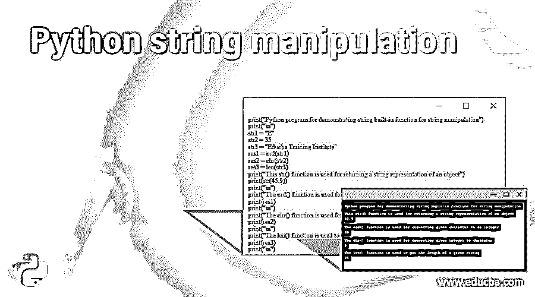
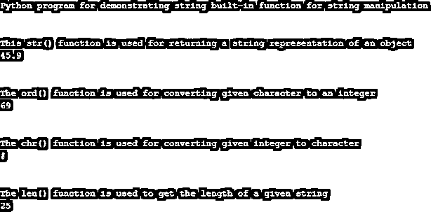

# Python 字符串操作

> 原文：<https://www.educba.com/python-string-manipulation/>




## Python 字符串操作简介

在 Python 中，使用单引号或双引号来声明字符串，将其定义为字符序列。字符串操作是对字符串进行操作的过程，如切片、解析、分析等。在许多不同的编程语言中，包括 Python，都提供了字符串数据类型来处理这样的字符串操作，这使用了 Python 中字符串数据类型“str”提供的字符串的不同函数。在 Python 中，字符串数据类型用于表示文本数据，在每个涉及字符串的应用程序中都会用到它。在本文中，我们将讨论字符串操作中使用的字符串的各种功能。在这个主题中，我们将学习 Python 字符串操作。

### Python 中字符串操作的工作原理

在 Python 中，字符串类“str”提供了各种字符串操作方法，其中几乎每个应用程序都在其应用程序中使用字符串。在 Python 中，字符串要么用单引号声明，要么用双引号声明，这与要求数据类型声明任何其他类型的其他编程语言不同。在 Python 中，一些内置的字符串方法用于字符串操作。在 Python 中，有用于字符串操作的操作符、函数和方法。让我们在下面的章节中一个一个来看。

<small>网页开发、编程语言、软件测试&其他</small>

### 字符串操作中使用的运算符

首先，让我们使用一些可以在字符串操作中使用的字符串操作符。

#### 1.*操作员

当我们想要创建给定字符串的多个副本时，使用这个操作符。让我们考虑下面的例子来演示这个操作符。

**举例:**

```
star_op = "educba "
res = star_op * 4
print(res)
```

**输出:**


在上面的程序中，我们可以看到，我们使用“star_op”变量和“educba”字符串声明了一个字符串，并且使用*运算符，我们有“res”变量，它将存储语句“res * 4”的结果，该语句将给定的字符串“educba”打印 4 次。

#### 2.+运算符

Python + operator 可用于连接给定的字符串，如下例所示。

**举例:**

```
str1 = "Educba "
str2 = "Training "
str3 = "Institute"
res = str1 + str2 + str3
print(res)
```

**输出:**


在上面的程序中，我们可以看到我们使用了“+”操作符来连接给定的字符串，结果如上面的屏幕截图所示。类似地，许多不同的操作符用于字符串操作，例如“in”、“not”、“等。操作员。

现在我们将看到 Python 中一些用于字符串操作的字符串内置函数。让我们在下一节讨论几个字符串内置函数。有很多不同的函数，比如 chr()、len()、str()和 ord()。

让我们用每个函数的例子来演示这些函数。

```
print("Python program for demonstrating string built-in function for string manipulation")
print("\n")
str1 = "E"
str2 = 35
str3 = "Educba Training Institute"
res1 = ord(str1)
res2 = chr(str2)
res3 = len(str3)
print("This str() function is used for returning a string representation of an object")
print(str(45.9))
print("\n")
print("The ord() function is used for converting given character to an integer")
print(res1)
print("\n")
print("The chr() function is used for converting given integer to character")
print(res2)
print("\n")
print("The len() function is used to get the length of a given string")
print(res3)
print("\n")
```

**输出:**




在上面的程序中，我们可以看到我们使用了 4 个不同的字符串内置函数来演示使用这些字符串函数的字符串操作。在上面的程序中，我们可以看到 str()函数将返回以字符串表示形式传递给这个函数的对象，ord()函数将返回给定字符的整数形式，chr()函数返回传递给函数的给定整数的字符形式，len()函数返回给定字符串中的字符数作为参数。

字符串索引是 Python 中字符串操作的另一个过程。由于一个字符串有一组字符来访问字符串中的每个字符，我们需要使用索引方法来检索使用索引或键值的指定字符。让我们在下面的部分用一个例子来演示。

假设我们声明一个字符串，并给给定字符串的每个字符一个索引值。

```
str_indx = "Educba"
print("The character of the specified  index of 2 of the given string is as follows")
print(str_indx[2])
```

**输出:**


在上面的程序中，我们可以看到我们声明了一个字符串“Educba”，并且每个都有一个索引，E 为 0，d 为 1，u 为 2，c 为 3，b 为 4，a 为 5。在这里，我们要求打印索引为 2 的字符，即“u”。

字符串切片是字符串操作中使用的另一个过程。Python 中的字符串切片被定义为从给定的字符串中提取子字符串，其中 Python 允许一种有助于字符串切片的索引形式。字符串切片使用 s[a:b]的形式，其中“a”是起始索引，“b”是结束索引，它返回从索引“a”到索引“b”的字符串。让我们在下面的例子中演示一下。

**举例:**

```
str_indx = "Educba"
print("The given string is sliced to obtain substring is as follows")
print(str_indx[2 : 5])
```

**输出:**


在上面的程序中，我们可以看到我们声明了一个字符串“Educba ”,我们试图使用为每个字符指定的索引来提取一个子字符串或给定字符串的一部分。在程序中，我们已经指定提取字符串 str_indx[2:5]，这将产生“ucb”子字符串。因此，我们将从索引 2 到索引 5 提取字符，以形成一个子串，我们可以在上面的截图中看到。

### 结论

在本文中，我们可以得出结论，Python 中的字符串操作被定义为使用解析、切片、索引等过程来操作字符串的过程。在本文中，我们看到了使用 Python 提供的字符串操作符、函数和方法来完成字符串操作。因此我们看到很少用例子来描述字符串操作符、字符串函数和字符串方法。我们还看到了字符串索引和字符串切片概念以及字符串操作的例子。

### 推荐文章

这是一个 Python 字符串操作的指南。这里我们讨论 Python 中字符串操作的工作原理，以及字符串操作中使用的操作符。您也可以看看以下文章，了解更多信息–

1.  [Python 转储](https://www.educba.com/python-dump/)
2.  [Python 名称错误](https://www.educba.com/python-nameerror/)
3.  [Python 目录](https://www.educba.com/python-directories/)
4.  [Python 文件读取线](https://www.educba.com/python-file-readline/)


