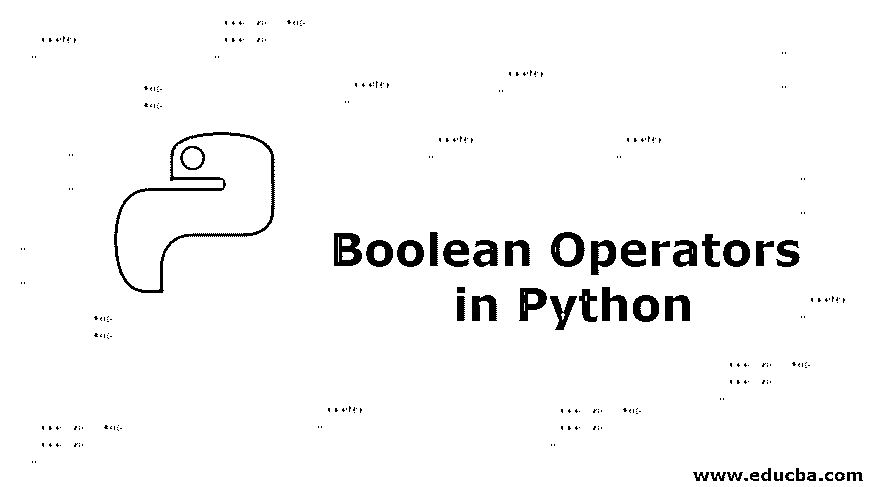
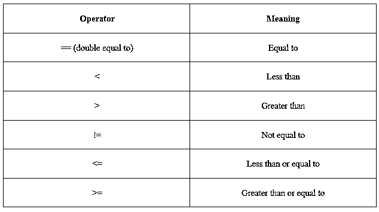
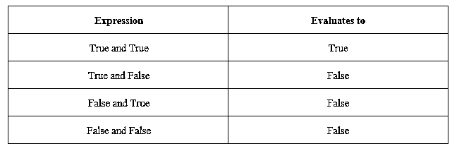

# Python 中的布尔运算符

> 原文：<https://www.educba.com/boolean-operators-in-python/>




## Python 中布尔运算符的介绍

运算符，如 not、and、or，用于在 Python 中执行逻辑运算，涉及它们的运算结果以 TRUE 或 FALSE 返回。not 运算符的优先级最高，其次是运算符，运算符的优先级最低。not 运算符的优先级低于非布尔运算符。在 Python 编程语言中，and 以及 or 运算符被称为短路运算符，也称为布尔运算符

### 布尔值

像整数、浮点、双精度、字符串等数据类型。，有可能持有无限的价值；布尔类型的变量可以有两个值:TRUE 或 FALSE。在作为编程语言的 Python 中，True 和 False 值被表示为一个字符串，不用双引号或单引号将它们括起来，它们总是以大写的 T 和 f 开头。

<small>网页开发、编程语言、软件测试&其他</small>

**代码:**

```
>>> bool_var = True
>>> bool_var
True
```

在上面的例子中，名为 bool_var 的变量存储布尔值 True，当您在终端上打印它时，它将值显示为 True。

**代码:**

```
>>> True
>>> True
```

默认情况下，布尔值 True 在 Python 中为 True，False 在 Python 中为 False。

**代码:**

```
>>> true
Traceback (most recent call last):
File "<stdin>", line 1, in <module>
NameError: name 'true' is not defined
```

上面的例子显示，用小写字母 T 拼写为 true 的字符串被视为变量，而不是布尔值。

**代码:**

```
>>> True = 3+5
File "<stdin>", line 1
SyntaxError: can't assign to keyword
```

这个例子表明，在 Python 中，我们不能将任何值或表达式赋给布尔值 True 或 False。

**代码:**

```
>>> a = 1
>>> bool(a)
True
>>> a = 0
>>> bool(a)
False
>>> a = “some string”
>>> bool(a)
True
>>> a = “”
>>> bool(a)
False
```

从上面的例子可以看出，当类型转换为 Boolean 时，除 0 之外的任何数值数据类型的值和除空字符串之外的任何字符串数据类型的值都给出 True 值；否则，它会将其视为假。

### Python 中不同的布尔运算符

布尔运算符是对布尔值进行运算的运算符，如果它应用于非布尔值，则该值首先被类型化，然后被运算。这些也可以看作是逻辑运算符[，布尔运算的最终结果是一个布尔值，真或假。](https://www.educba.com/matlab-logical-operators/)

#### 1.比较运算符

如下表所述，有六个比较运算符，它们将表达式计算为布尔值。




现在，让我们分别考虑一个例子，看看它们在 Python 编程语言中的表现。

**代码:**

```
>>> a = 1
>>> a == 1
True
>>> a != 10
True
>>> a != 1
False
>>> a > 10
False
>>> a < 12
True
>>> a >= 1
True
>>> a <= 7
True
```

因此，您可以看到，将整数值 1 赋给变量“a ”,并将其与许多其他整数值进行比较，我们会根据场景得到不同的布尔结果。“a”的值也可以以类似的方式与其他变量进行比较。

#### 2.二元布尔运算符

这些运算符是对两个布尔型值进行运算的运算符。“and”操作符和“or”操作符是两个二元布尔操作符，它们对某些逻辑进行操作以再次给出布尔值。这两个逻辑二元布尔运算符的标准真值表如下。

“与”运算符的真值表。即使一个值为假，那么整个表达式也为假。




or 运算符的真值表。即使一个值为真，那么整个表达式也为真。


现在，让我们看一些 Python 中的例子。在 Python 中，这些运算符由关键字“and”和“or”分别用于“and”逻辑和“or”逻辑。

**代码:**

```
>>> a = True
>>> b = False
>>> a and b
False
>>> a or b
True
```

#### 3.“非”算符

“非”运算符是逻辑布尔运算符，它补充变量的当前布尔值。也就是说，如果值为“真”，则 not 运算符会将其修改为“假”，反之亦然。在 Python 中，用关键字‘not’来表示。

让我们看看 Python 中的‘not’操作符。

**代码:**

```
>>> a = True
>>> not a
False
>>> not not not not a
>>> True
```

这就是 Python 中‘not’操作符的工作方式。

### 二元布尔运算符和比较运算符的组合

因为[比较运算符](https://www.educba.com/comparison-operators-in-powershell/)计算布尔值，而二元运算符对两个布尔值进行运算，所以我们可以有一个表达式，它使用二元布尔运算符和比较运算符的组合来再次获得布尔结果。

让我们考虑几个例子，看看如何利用这个特性。

**代码:**

```
>>> (5 > 3) and (7 == 7)
True
```

第一个括号求值为 True，第二个也为 True，最后的表达式将为 True 和 True，这是真的。

我们也可以在这种表达式中使用‘not’运算符。

**代码:**

```
>>> (7 > 3) and (9 != 8) and not False
True
```

在这个示例中，最终的“not False”也计算为 True，(9！= 8)的计算结果为 True ,( 7 > 3)的计算结果也为 True，这就给出了(True and True and True)的最终表达式，其结果为 True。

**Note:** The expressions inside the brackets are evaluated on [priority in Python](https://www.educba.com/advantages-of-python/). The priority of other operators goes like this. If the expression is filled with mathematical operators, the ‘and’ operators, the ‘or’ operators and the ‘not’ operators, then the mathematical operators are evaluated first followed by the ‘not’ operators, followed by the ‘and’ operators and at the end the ‘or’ operators.

### 结论

布尔运算符是编程时方便使用的主要逻辑之一，尤其是在逻辑中做一些决策时。彻底了解它们的行为会让你成为一名杰出的程序员。

### 推荐文章

这是 Python 中布尔运算符的指南。这里我们详细讨论 Python 中的布尔值和不同的布尔运算符。您也可以阅读以下文章，了解更多信息——

1.  [层次集群 Python](https://www.educba.com/hierarchical-cluster-python/)
2.  [Python 中的 While 循环](https://www.educba.com/while-loop-in-python/)
3.  [Python 抛出异常](https://www.educba.com/python-throw-exception/)
4.  [Python dateutil](https://www.educba.com/python-dateutil/)


