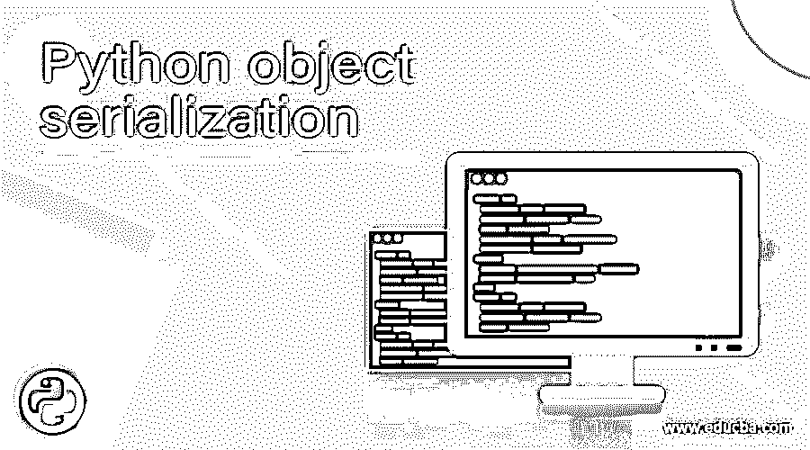
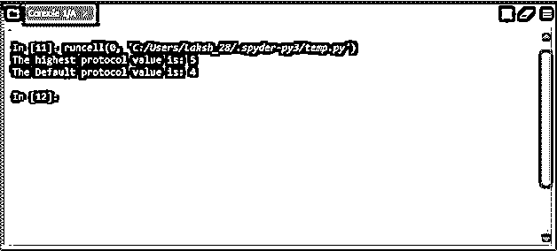
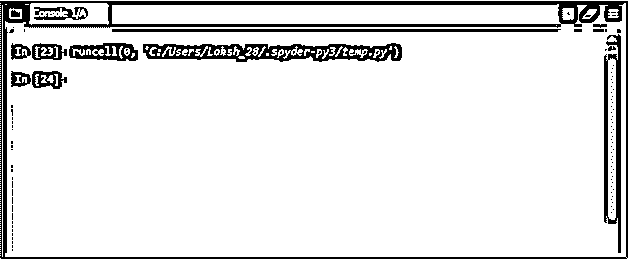
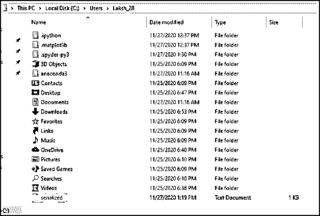
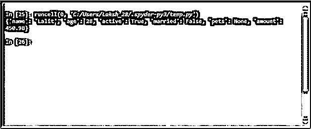
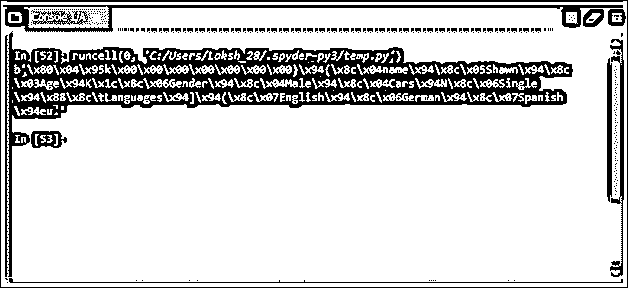
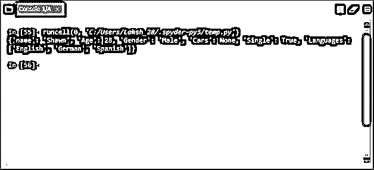

# Python 对象序列化

> 原文：<https://www.educba.com/python-object-serialization/>




## Python 对象序列化简介

当我们在数据存储和解包的上下文中定义 Python 对象序列化时，它被认为是一种方法。其中我们可以将 python 数据对象转换/翻译成字节格式。这种字节格式是可存储的(作为文件或在缓冲存储器中)。除此之外，您还可以通过套接字传输、重新格式化或恢复它。在序列化中，python 中一个名为 pickle 的模块允许您序列化 python 对象，该对象也可以作为文件存储到任何位置或临时存储在缓冲存储器中。

### Pickle 序列化 python 对象

Pickle 是在 python 下开发的一个模块，它可以将 python 对象转换为字节系统字符串(通常用户无法读取)，该字符串可以保存为文件或缓冲存储器。最后，它还可以将字节串解包成原始的 python 对象。pickle 模块下有两种不同的序列化和反序列化方法，如下所述:

<small>网页开发、编程语言、软件测试&其他</small>

*   **dumps()–**这个函数允许你将一个 python 对象序列化成一个字节流。
*   **dump()–**这个函数允许您将 python 对象序列化并存储到一个文件中。
*   **loads()–**这个函数允许你将一个字节流反序列化为一个 python 对象。
*   **load()–**该函数允许您通过存储在路径中的字节流文件将 python 对象反序列化为其原始形式。

酸洗时有两个版本的协议。一个是最高协议，另一个是默认协议。最高协议的标准值是 5，默认协议的标准值是 4。

您可以通过在 python 中运行以下代码来检查这一点:

```
import pickle
print("The highest protocol value is:", pickle.HIGHEST_PROTOCOL)
print("The Default protocol value is:", pickle.DEFAULT_PROTOCOL)
```

这段代码的输出如下所示，它分别给出了最高和默认协议的协议值。

最高和默认协议值




让我们看一些与 Python 编程中的对象序列化和反序列化相关的示例:

#### 1.pickle.dump()方法来序列化 Python 对象

pickle.dump()方法将 python 对象作为参数，然后将其存储为文本文件，并将对象序列化为字节。请记住，这种转换不会向您显示原始的 python 对象，而是一个文本字节，它将该对象序列化为。参见下面的代码:

```
import pickle
file =  open('serialized.txt', 'wb')
dic1 = {
"name" : "Lalit",
"age" : 28,
"active" : True,
"married" : False,
"pets" : None,
"amount": 450.98,
}
pickle.dump(dic1, file)
file.close()
```

在这里，我们创建了一个名为“dic1”的字典，其中包含有关用户访问 web 门户的信息以及他的购买量。

我们还定义了一个“文件”对象。这个对象将允许我们将序列化的字节存储到一个名为“serialized”的工作目录下的文本文件中。请参见下面的输出:




这里，由于文件是在工作目录中创建和存储的，所以看不到任何输出。我们可以看到如下图:




我们可以在任何文本编辑器中打开这个文件来查看输出。


#### 2.pickle.load()方法将字节反序列化为 Python 对象

pickle.load()函数将获取一个将 python 对象序列化为字节的文件，然后将其转换为原始的 python 对象。请参见下面的代码以获得更好的实现。

```
import pickle
#Accessing the text file with serialization into bytes
file = open("serialized.txt", "rb")
#Using load() function to convert the file into a python object (dictionary)
dic = pickle.load(file)
print(dic)
file.close()
```

这里，我们使用了与上一个示例中创建的序列化相同的文件对象。然后，我们使用 pickle.load()读取该文件，并将其转换为原始的 python 对象，即字典。查看如下所示的输出:




您可以在控制台中看到作为输出得到的原始字典，如上所示，带有用户信息。

#### 3.pickle.dumps()方法来序列化 Python 对象

现在，我们将使用 pickle.dumps()方法。它允许我们将 python 对象序列化为字节大小的文本对象。然而，这里的区别是，这个方法不允许我们将结果存储到一个文件中；相反，它允许结果直接在控制台中打印出来。请参见下面的示例:

```
import pickle
my_dict = {
"name" : "Shawn",
"Age" : 28,
"Gender" : "Male",
"Cars" : None,
"Single" : True,
"Languages" : ["English", "German", "Spanish"]
}
#Using pickle.dumps() to serialize the object
print(pickle.dumps(my_dict, protocol = pickle.DEFAULT_PROTOCOL))
```

这里，我们使用了带有 DEFAULT_PROTOCOL 值的 pickle.dumps()方法将对象转换为字节。查看如下所示的输出:




#### 4.pickle.loads()方法将开放字节转换为 python 对象

让我们做一个反过来；我们将使用上面的字节码，使用 pickle.loads()方法获取 python 下的原字典。

```
import pickle
btstring **=** b'\x80\x04\x95k\x00\x00\x00\x00\x00\x00\x00}\x94(\x8c\x04name\x94\x8c\x05Shawn\x94\x8c\x03Age\x94K\x1c\x8c\x06Gender\x94\x8c\x04Male\x94\x8c\x04Cars\x94N\x8c\x06Single\x94\x88\x8c\tLanguages\x94]\x94(\x8c\x07English\x94\x8c\x06German\x94\x8c\x07Spanish\x94eu.'
#Using pickle.loads() to convert the byte string into a dictionary
my_dict = pickle.loads(btstring)
print(my_dict)
```

这段代码将生成包含其组件的原始字典。参见如下所示的输出截图:




我们将在这里结束这篇文章，但不是在一些结论点之前。

### 结论

1.  序列化是将 python 对象转换成字节的过程，这些字节可以存储为文件或缓冲存储器，也可以反序列化。
2.  pickle 模块用于序列化和反序列化 python 对象。
3.  Pickle 有两种类型的协议，序列化和反序列化基于这两种协议进行。它们分别是默认协议和最高协议。
4.  Pickle 只能保存对象属性，不能存储对象代码。

### 推荐文章

这是 Python 对象序列化的指南。这里我们讨论 pickle 模块下序列化和反序列化的两种不同方法。您也可以阅读以下文章，了解更多信息——

1.  [Python 流](https://www.educba.com/python-stream/)
2.  [Python 转储](https://www.educba.com/python-dump/)
3.  [Python 名称错误](https://www.educba.com/python-nameerror/)
4.  [Python json.dumps](https://www.educba.com/python-json-dumps/)


