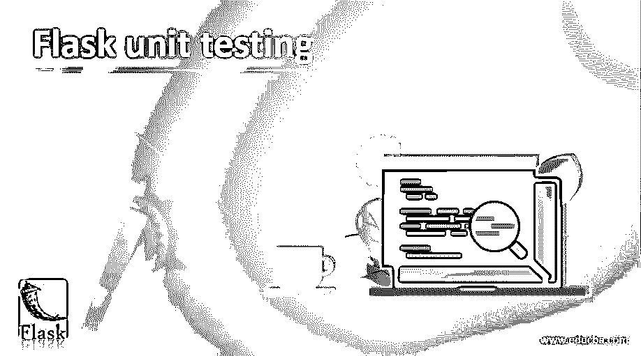
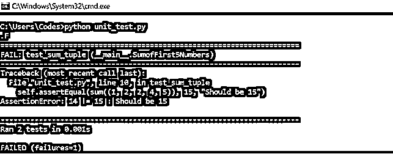
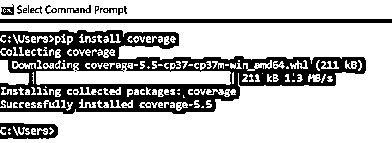

# 烧瓶单元测试

> 原文：<https://www.educba.com/flask-unit-testing/>




## 烧瓶单元测试简介

烧瓶单元测试被定义为一种测试包含一个或多个一起编程的模块的源代码的各个部分的方法，该方法负责使用过程、操作过程以及与要测试的数据相关联的数据，以确定它们是否适合使用。这些测试由[软件开发人员](https://www.educba.com/career-as-a-software-developers/)运行，以确保为特定任务编写的代码部分在满足设计要求和行为的同时完成相同的任务。这些测试通常是针对单个功能或过程的自动化测试。

### 如何在 Flask 中执行单元测试？

为了执行单元测试，人们必须理解，如果一个模块不包含单元测试用例，那么应用程序要么不能正常运行，要么没有按照编码标准进行维护。简而言之，如果单元测试不可用，就会产生负面的影响。人们总是认为，需要创建一个环境，使维护变得容易，并使将一部分代码的较小模块导入另一个应用程序变得容易。

<small>网页开发、编程语言、软件测试&其他</small>

下面是我们在开发单元测试框架甚至执行单元测试时需要记住的几点:

*   通过创建助手类，可以快速生成单元测试用例。
*   单元测试的反馈需要迅速。
*   在环境中添加测试用例应该是容易的。
*   只需一条命令，就可以执行单元测试用例。
*   路径覆盖的反馈是可视化提供的。

现在，我们将看看最常用的 python 单元测试框架，如下所述:

*   **unittest** :这个内置框架是基于 python 中的 xUnit 框架。
*   **测试**:该模块用于构建单元测试用例。

除了这两个之外，还有更多种类的单元测试工具。尽管如此，为了保证文章的长度，我们将把讨论限制在 unittest 上，这是最广泛使用的情况。尽管如此，对于信息，我们有像 doctest，nose，evidence，subunit，test tools 等工具。，因为每个人都有自己的专长，所以适合每个人的情况。在接下来的几个段落中，我们将理解在 Flask 中执行单元测试的过程。

#### 1.存储单元测试

尽管可以灵活地将单元测试用例文件存储在系统的任何位置，但是作为一种标准实践，它总是被要求将单元测试存储在项目中可用的“tests”目录中。它与待测试文件的存储级别相同。例如，在下面的树中，我们看到“tests”文件夹与要测试的组件位于同一个位置，在“tests”文件夹中，所有的单元测试都存在。

项目
初始化 _。py
users . py
ABC
def
XYZ
测试
test _ ABC . py
test _ def . py】t8

#### 2.基本单元测试文件的创建

一旦我们遵循了存储单元用例的步骤，甚至在我们开始编写单元测试用例之前，对我们来说，构建一个能够顺利编写测试用例的环境是非常重要的。这个环境由“助手”功能组成，帮助编写单元测试用例。这个单元测试用例文件由一个类组成，在该类中，定义了各种方法，用于测试代码组件。我们需要包括一些强制性的单元用例方法，如 setup()，它在任何单元测试用例运行之前被调用。名为 teardown()的方法在单元测试用例执行完成后执行。

#### 3.单元测试的运行

现在我们已经创建了基本的单元测试文件，让我们试着运行刚刚创建的文件。这是为了确保我们在开始构建更多功能以促进更多覆盖之前，对所创建的环境进行一些健全性运行检查。运行相同操作的命令是 python <python file="" name.py="">。需要记住的一点是使用 flask 应用程序的顶层文件夹。我们可能需要导入 app、db 之类的对象，因此需要指定一个容易发现的位置，python 解释器可以很容易地找到它。</python>

#### 4.增加了更多的帮助函数，以方便更多的单元测试开发

现在，根据功能类型的要求，我们将测试添加的帮助器功能，它检查所需的功能，然后返回肯定或否定的确认。

#### 5.代码覆盖率

为了获得决定覆盖率的 Flask 函数，我们推荐使用名为 coverage 的模块，它可以通过执行 pip install coverage 来安装。为了运行相应的覆盖率命令，我们使用覆盖率运行<python file="" name="">，一旦收集了数据，我们将通过执行覆盖率报告<python file="" name="">来运行报告命令</python></python>

### 烧瓶单元测试示例

下面举几个例子

#### 示例#1

设置单元测试用例来检查前 5 个数字的总和:

**语法**

```
import unittest
class SumofFirst5Numbers(unittest.TestCase):
def test_sum(self):
self.assertEqual(sum([1, 2, 3, 4, 5]), 15, "Should be 6")
def test_sum_tuple(self):
self.assertEqual(sum((1, 2, 2, 4, 5)), 10, "Should be 6")
if __name__ == '__main__':
unittest.main()
```

**输出:**




这里，一个案例通过了，另一个失败了，因为提供的数字之和不是 15。

#### 实施例 2

覆盖模块的安装:

**语法**

`pip install coverage`

**输出:**




### 结论

在 Flask 中进行单元测试的要求同样重要，因为在 Flask 应用程序中有各种各样的活动部件，并且每个部件都应该为应用程序的和谐运行执行它们的任务。在本文中，我们已经了解了在 Flask 中执行单元测试的各种方法。剩下的工作留给读者，让他们根据这里创建的基线开始试验吧！

### 推荐文章

这是烧瓶单元测试指南。这里我们讨论如何在 Flask 中执行单元测试，以及例子和输出。您也可以看看以下文章，了解更多信息–

1.  [烧瓶形状](https://www.educba.com/flask-wtforms/)
2.  [烧瓶缓存](https://www.educba.com/flask-cache/)
3.  [烧瓶版本](https://www.educba.com/flask-version/)
4.  [烧瓶会话](https://www.educba.com/flask-session/)


