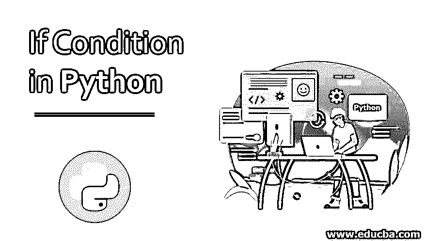

# Python 中的 If 条件

> 原文：<https://www.educba.com/if-condition-in-python/>




## Python 中 If 条件简介

正如我们所知，编程与生活规律没有太大的不同。我们总是遵守一定的规则，条件只是其中之一。当编程开始变得更加复杂时，新的特性出现了。假设我们有两个数字。最初，当我们编程时，我们对这两个数字进行算术运算，在你所选择的编程语言中，借助算术运算符，得到加减乘除。我们将从 Python 中 If 条件的基本结构开始。

现在，如果我们想确定哪个数字比另一个大呢？然后，我们当然需要以条件语句的形式，在关系运算符的帮助下，将某种决策能力整合到程序中。

<small>网页开发、编程语言、软件测试&其他</small>

**语法:**

```
if <expr>:
    <statement>
```

让我们看看语法的参数，如下所示。

*   最重要的部分是“if”关键字，它帮助我们识别一个表达式是一个条件语句。
*   这表示条件，满足该条件将执行下面的语句。expr 基本上是一个产生布尔值的 Python 语句。(对或错)。只有当 expr 的布尔值为真时，才会执行特定 expr 的语句。
*   **语句:**这是 if 语句的最后一部分，如果 expr 为真，程序必须沿着这条路径运行。

**Note:** The colon (:) following the condition, i.e. expr, is a must for Python. The statement must be properly indented.

### Python 中 If 条件的处理及实例

让我们展示一些用 Python 编写 if 语句的例子，并解释它们的工作原理:

#### 1.当使用关系运算符的条件为真时

**代码:**

```
num1 = 4
num2 = 8
if(num1<num2):
    print("Inside if condition")
```

**输出:**


条件 num1(4) < num2(8)为真，表达式的值变为真，因此执行 print 语句。

#### 2.当使用关系运算符的条件为假时

**代码:**

```
num1 = 4
num2 = 8
if(num1>num2):
    print("Inside if condition")
```

当条件为假时，将不打印任何内容。条件 num1(4) > num2(8)为假，表达式的值变为假，因此不执行 print 语句。

#### 3.当条件为真时，在条件中传递非零值

**代码:**

```
num1 = 1
num2 = 0
if(num1):
    print("Inside if condition")
```

**输出:**


num1 不为零，即 1；因此，表达式的值变为 True，从而执行 print 语句。

#### 4.当条件为假时，在条件中传递零或无值

**代码:**

```
num1 = 1
num2 = 0
if(num2):
    print("Inside if condition")
```

当条件变为假时，不打印任何内容。Num2 为零，即 0，因此表达式的值变为 false，因此不执行 print 语句。

#### 5.当条件为真时，使用 OR 逻辑运算符

**代码:**

```
num1 = 1
num2 = 0
if(num1 or num2):
    print("Inside if condition")
```

**输出:**


表达式(num1 或 num2)变为真；因此，执行 print 语句。

#### 6.当条件为假时，使用 AND 逻辑运算符

**代码:**

```
num1 = 1
num2 = 0
if(num1 and num2):
    print("Inside if condition")
```

当条件变为假时，不打印任何内容。表达式(num1 和 num2)变为假；因此，不执行 print 语句。

#### 7.当在数组中查找对象时条件为真时

**代码:**

```
array1 = [1.5,"hi",3,True] 
if("hi" in array1):
    print("Inside if condition")
```

**输出:**


当数组 1 中存在元素“hi”时，表达式(数组 1 中的“hi”)变为真；因此，执行 print 语句。

#### 8.当在数组中找不到对象时条件为假

**代码:**

```
array1 = [1.5,"hi",3,True] 
if(5 in array1):
    print("Inside if condition")
```

当条件变为假时，不打印任何内容。表达式(array1 中的 5)变为假，因为 array1 中不存在元素 5；因此，不执行 print 语句。

#### 9.在字符串中查找子字符串时，如果条件为真

**代码:**

```
if("py" in "python"):
    print("Inside if condition")
```

**输出:**


当 array1 中存在元素“hi”时，表达式(“python”中的“py”)变为 True 因此，执行 print 语句。

前面我们已经提到了条件后面的冒号和缩进是非常重要的。

让我们来看一个例子，当我们废除它们时会发生什么。

**a .不带冒号**

**代码:**

```
if("py" in "python")
print("Inside if condition")
```

显示编译时错误，当程序仍在执行时，显示以下错误。

**输出:**


**b .无缩进**

**代码:**

```
if("py" in "python"):
print("Inside if condition")
```

**输出:**


### 推荐文章

这是 Python 中 If 条件的指南。这里我们讨论 Python 中 If 条件的引入和工作原理，以及代码实现。您也可以浏览我们推荐的文章，了解更多信息——

1.  [Python 中的字符串数组](https://www.educba.com/string-array-in-python/)
2.  [Python 查找字符串](https://www.educba.com/python-find-string/)
3.  [Python 中嵌套的 IF 语句](https://www.educba.com/nested-if-statement-in-python/)
4.  [Python 正则表达式测试器](https://www.educba.com/python-regex-tester/)


