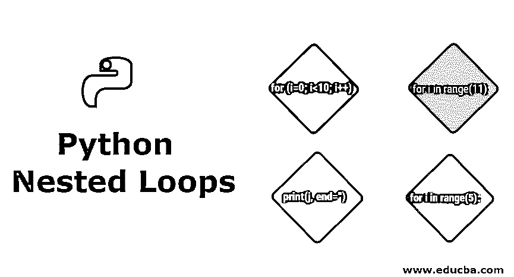
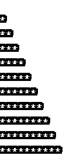
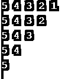

# Python 嵌套循环

> 原文：<https://www.educba.com/python-nested-loops/>

## Python 嵌套循环简介

欢迎学习 Python 学习课程的另一章——嵌套循环。嵌套循环是一种很好的循环方式，它在每种编程语言中都证明了自己的价值。今天，我们将特别关注 Python 类型、语法和例子。那么，我们开始吧。

### 嵌套循环

在具体学习 Python 之前，最好先简单地了解一下嵌套循环。如果一个循环存在于另一个循环的体内，则称之为嵌套循环。这意味着我们要多次执行内部循环代码。外部循环控制内部循环将经历多少次迭代。嵌套 for 循环的一个基本示例是:

<small>网页开发、编程语言、软件测试&其他</small>

`for (i=0; i<10; i++)
{
for (j=0; j<10; j++)
{
//This code will execute 100 times.
}
//This code will execute 10 times.
}`

这里需要注意的是，任何类型的循环都可以嵌套在另一个循环中。例如，while 循环可以嵌套在 For 循环中，反之亦然。

### Python 嵌套循环

让我们更多地讨论 python 中的嵌套循环。

#### 1)嵌套 for 循环语法

Python 中嵌套 for 循环的基本语法是:

`for [iterating_variable_1] in [sequence_1]: #Outer Loop
for [iterating_variable_2] in [iterating_variable_1/sequence_2]: #Inner Loop
[code to execute]`

**举例:**

`for i in range(11):               #line 1
for j in range(i):            #line 2
print('*', end='')        #line 3
print('')                     #line 4`

#### 输出:

**执行流程**

我们来试着理解一下上面程序的执行流程。在程序中，我们使用了两个迭代变量 I 和 j 来打印星星的图案。

编译器从第 1 行开始。它遇到一个 for 循环和一个 range 函数。Python 的 range 函数输出一个可迭代的整数数组，范围从 0 到参数中指定的数字。参数号不包含在数组中。在我们的例子中，它将生成一个数组[0，1，2，3，4，5，6，7，8，9，10]。现在，编译器知道它必须执行下一组语句 10 次。

当它移动到第 2 行时，会遇到另一个 for 循环和 range 函数。请注意，此范围函数的参数是迭代变量 I 的计算值。因此，它会根据 I 的值动态生成一个数组。当 i=0 时，数组为空。当 i=1 时，数组为[0]。当 i=2 时，数组为[0，1]以此类推。

因此，第 3 行执行的次数直接取决于 I 的值。请注意部分 end='' inline 3。这是为了防止 Python 在每个星号后打印一个换行符。我们只希望在外部循环的每次迭代结束时有一个换行符。因此，我们在代码的第 4 行明确地打印了一个换行符。

现在，让我们仔细检查一下嵌套 for 循环的每一次迭代。

**外环迭代 1**

`I = 0, j = [], output is a blank line.`

**外环迭代 2**

`I = 1, j = [0], output = *`

**外循环迭代 3**

`I = 2, j = [0, 1], output = **`

**外环迭代 4**

`I = 3, j = [0, 1, 2], output = ***`

。
。
。

**外循环迭代 10 次**

`I = 9, j = [0, 1, 2, 3, 4, 5, 6, 7, 8], output = *********`

**外循环迭代 11 次**

`I = 10, j = [0, 1, 2, 3, 4, 5, 6, 7, 8, 9], output = **********`

#### 2)嵌套 while 循环

**语法**

Python 中嵌套 while 循环的语法是:

`while (expression_1):             #Outer loop
[code to execute]          #Optional
while (expression_2):      #Inner loop
[code to execute]`

与 for 循环不同，while 循环没有预编译的可迭代序列。While 循环一直执行代码，直到表达式的计算结果为 true。因此，开发人员必须时刻记住更新迭代变量/表达式，否则循环将进入无限执行模式。

**例子**

`i=1                        #line 1
while(i<=5):               #line 2
j=5                    #line 3
while(j>=i):           #line 4
print(j, end=' ')  #line 5
j-=1               #line 6
i+=1                   #line 7
print()                #line 8`

**输出:**

**执行流程**

代码的第 1 行将外部循环的迭代变量设置为初始值。下一行是外部 while 循环的开始。它有一个表达式 I <=5。在每次迭代之后，该表达式被评估为真值。只有当条件为真时，执行才会进入循环。一旦条件变为假，循环就终止。

由于 I 的初始值为 1，所以第 2 行的条件为真。因此，编译器移到第 3 行，将我们的内部循环的迭代变量 j 设置为 5。第 4 行同样有一个 while 循环，其中有一个计算结果为 true 的表达式。因此，编译器执行第 5 行和第 6 行。然后，它返回到第 4 行并评估条件。如果条件为真，它再次进入第 5 行和第 6 行。如果条件为假，循环终止，接下来要执行的行是第 7 行和第 8 行。外环也是如此。

第 6 行和第 7 行非常重要，因为它们更新了我们迭代变量。如果没有它们，程序流将进入无限执行模式，因为 [while 循环](https://www.educba.com/while-loop-in-python/)表达式将总是导致真值。

### 我应该中断，继续还是通过

和几乎所有其他编程语言一样，Python 有中断和继续的概念。这些[关键字](https://www.educba.com/python-keywords/)帮助终止任何循环或跳过循环的特定迭代。Python 还有另一个关键词——pass。让我们看看这些。

#### 1)休息

break 关键字指示编译器跳出循环并终止其执行。

**例子**

`for i in range(5):
for j in range(5):
if i == j:
break
print(j, end='')
print('')`

**输出:**

如果 I 和 j 的值相等，上面的程序会中断内部 for 循环。它不会执行循环的进一步迭代。这可以通过 continue 语句进一步理解。

#### 2)继续

continue 关键字指示编译器跳过循环的当前迭代，继续下一次迭代。

**例子**

`for i in range(5):
for j in range(5):
if i == j:
continue
print(j, end='')
print('')`

**输出:**

注意，同一个程序，但是用 continue 语句代替 break 语句，并不终止循环执行。它只跳过当前迭代。

#### 3)通过

Python 中的 [pass 关键字](https://www.educba.com/pass-keyword-in-python/)很有意思。它只是意味着什么也不做。当语法上需要代码块，但您不希望执行任何命令时，可以使用它。它只是作为一个占位符。

**例子**

`for i in range(5):
for j in range(5):
if i == j:
#I am not sure what to do when i equals j, so for now I will pass.
pass
print(j, end='')
print('')`

**输出:**

### 结论

从战略上讲，循环对于学习用最少的代码行执行任务非常重要。这只是循环的基本介绍。建议多打打闹闹，发挥创意，进一步发掘循环的潜力。

### 推荐文章

这是 Python 嵌套循环的指南。这里我们详细讨论 Python 嵌套循环的语法、例子、输出和执行流程。您也可以阅读以下文章，了解更多信息——

1.  [Python 框架](https://www.educba.com/python-frameworks/)
2.  [安装 Python](https://www.educba.com/install-python/)
3.  [Python 中的循环](https://www.educba.com/loops-in-python/)
4.  [Java 中的嵌套循环](https://www.educba.com/nested-loop-in-java/)

