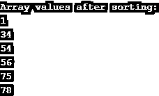
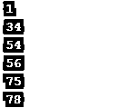
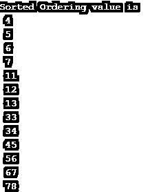

# Python 中的排序算法

> 原文：<https://www.educba.com/sorting-algorithms-in-python/>


## Python 中排序算法的介绍

对任何和所有系统中的数据进行排序是一个有效的特性，它有助于将表/数据库保持在有组织和结构化的格式中。它是根据给定的要求以特定的模式或顺序排列检索到的数据的过程。在 python 中，这是使用各种排序算法实现的，比如冒泡排序、选择排序、插入排序、合并排序、堆排序和基数排序方法。

### Python 中的 6 大排序算法

以下是 python 的不同排序算法:

<small>网页开发、编程语言、软件测试&其他</small>

#### 1.冒泡排序

[冒泡排序是最常用的排序技术之一](https://www.educba.com/bubble-sort-algorithm/)；从前两对元素开始，它涉及通过比较每对相邻的元素来对一系列元素进行排序。因此，当一个错位的顺序被建立，然后交换元素发生。直到输入集合中的最后一个元素，上述过程可感知地继续，为了优化算法，我们要求在它完成排序后停止它。我们怎么可能知道我们已经完成了排序？这可以在所有给定项目都正常时确定。因此，每当交换变量时，可以维护一个标志来确定排序过程的重新执行。当不需要其他交换时，该标志应设置为 false。

**代码:**

```
def bubble_Sort(array): 
    length = len(array) 
    # loop through each and every element which are keyed  
    # loop through each and every element which are keyed  
    for iterator_1 in range(length): 
        #loop through next element
        for iterator_2 in range(0, length-iterator_1-1): 

            # From 0 to n-i-1 the array value needs to be looped upon
            # when a element greater than the next element then the collected element needs to be swapped.
            if array[iterator_2] > array[iterator_2 + 1] : 
                array[iterator_2], array[iterator_2 + 1] = array[iterator_2 + 1], array[iterator_2] 

# Driver code to test above 
array = [75,34,54,56,78,1] 

bubble_Sort(array) 

print ("Array values after sorting:") 
for i in range(len(array)): 
    print ("%d" %array[i]) 
```

**输出:**




#### 2.选择排序

选择排序是最基本的排序技术之一。这种技术包括从未排序的集合中找到最小的元素，并将该元素定位在未排序的集合的开头。通过在集合中的所有元素上循环这些操作，可以获得完全排序的集合。该算法分离了挂钩于两个不同部分的密钥列表。内部列表或预订列表倾向于已经被排序，这涉及从最左边的元素到最右边的元素，以及驻留在列表中间的待排序的未完成项目的子列表的生成。起初，已排序的子列表是未填充的，未排序的子列表是完整的键列表。

**代码:**

```
import sys 
Array = [63, 75, 13, 2, 441] 

# loop through each and every element in the array
for element1 in range(len(Array)): 

    # To determine the least element in the remaining list
    minimum_idx = element1 
    for element2 in range(element1+1, len(Array)): 
        if Array[minimum_idx] > Array[element2]: 
            min_idx = element2 

    # swap the determined least element with the  previous element in the list       
    Array[element1], Array[minimum_idx] = Array[minimum_idx], Array[element1] 

# main code
print ("Array after getting sorted by selection sort") 
for i in range(len(Array)): 
    print("%d" %Array[i]), 
```

**输出:**


#### 3.插入排序

在插入排序中，排序机制是通过一次用一个项目构建一个排序数组来实现的。以连续的方式比较数组的元素，然后以特定的顺序重新排列。数组的组成部分按顺序与每个元素进行比较，然后按特定顺序同时排序。这里使用的类比非常类似于排列一组卡片。

**代码:**

```
def insertion_Sort(array): 

    # pass through through 1 to len(array) 
    for temp_element1 in range(1, len(array)): 

        key = array[temp_element1] 

        # Move elements of array[0..i-1], that are 
        # greater than key, to one position ahead 
        # of their current position 
        temp_element2 = temp_element1 -1
        while temp_element2 >= 0 and key < array[temp_element2] : 
                array[temp_element2 + 1] = array[temp_element2] 
                temp_element2 -= 1
        array[temp_element2 + 1] = key 

# Driver code to test above 
array = [75,34,54,56,78,1] 
insertion_Sort(array) 
for i in range(len(array)): 
    print ("% d" % array[i]) 
```

**输出:**




#### 4.合并排序

[合并排序的工作原理是](https://www.educba.com/merge-sort-in-data-structure/)分治算法。这里，给定的输入被拼接成两半，拼接的两半被排序，然后被合并。在 python 感知中，merge()函数用于实现合并过程。插入排序的算法如下:

*   所提到的阵列需要被分成两个不同的部分，并且为此确定阵列的中值。
*   合并排序应用于拆分的前半部分。
*   然后后半部分也暴露在同样的情况下。
*   最后，在分类之后，分离的两半被合并。

**代码:**

```
def merge_Sort(array): 
    if len(array) >1: 
        mid = len(array)//2 #determining the mid of the array
        divide = array[:mid] # Dividing the array elements  
        split = array[mid:] # splitting the array into 2 halves 

        merge_Sort(divide) # first half of the sorting
        merge_Sort(split) # second half of the sorting

        i = j = k = 0

        # Copy data to temp arrayays divide[] and split[] 
        while i < len(divide) and j < len(split): 
            if divide[i] < split[j]: 
                array[k] = divide[i] 
                i+=1
            else: 
                array[k] = split[j] 
                j+=1
            k+=1

        # Checking if any element was left 
        while i < len(divide): 
            array[k] = divide[i] 
            i+=1
            k+=1

        while j < len(split): 
            array[k] = split[j] 
            j+=1
            k+=1

# Code to print the list 
def printdivideist(array): 
    for i in range(len(array)):         
        print(array[i],end=" ") 
    print() 

# driver code to test the above code 
if __name__ == '__main__': 
    array = [12, 2, 93, 65, 76, 27]  
    print ("Given arrayay is", end="\n")  
    printdivideist(array) 
    merge_Sort(array) 
    print("Sorted arrayay is: ", end="\n") 
    printdivideist(array) 
```

**输出:**

**

** 

#### 5.堆排序

堆排序是选择排序技术的一种形式。它涉及到将给定的输入分离为已排序和未排序的元素。然后，该算法在非排序区域上以这样的方式循环，使得在每次循环中，最大值将被推入排序区域。这个过程将在未排序区域中的所有元素上继续。

从给定的输入列表中创建一个最大堆。然后，最后一个值与第一个值反复交换，并且取值范围相对减少 1。这个过程一直进行到范围缩小到 1。

**代码:**

```
def heap_sort(Ordering, number, i): 
    largest = i # Initialize largest as root 
    left= 2 * i + 1     # left = 2*i + 1 
    right= 2 * i + 2     # right = 2*i + 2 

    # to verify the left child of root is greater than the root
    if left< number and Ordering[i] < Ordering[left]: 
        largest = left

     # to verify the right child of root is greaterightthan the root
    if right< number  and Ordering[largest] < Ordering[right]: 
        largest = right

    # swap roots on neccesity 
    if largest != i: 
        Ordering[i],Ordering[largest] = Ordering[largest],Ordering[i] # swap 

        # Heapify the root. 
        heap_sort(Ordering, number, largest) 

# main function for Ordering sorting
def heapSort(Ordering): 
    number = len(Ordering) 

    # max heap build process. 
    for i in range(number, -1, -1): 
        heap_sort(Ordering, number, i) 

    # extract of all the elements in the given heap
    for i in range(number-1, 0, -1): 
        Ordering[i], Ordering[0] = Ordering[0], Ordering[i] # swap 
        heap_sort(Ordering, i, 0) 

# main section of the code
Ordering = [ 12, 11, 13, 5, 6, 7 ,56 ,45 ,67 ,78 ,34 ,4 ,33] 
heapSort(Ordering) 
number = len(Ordering) 
print ( "Sorted Ordering value is" ) 
for i in range( number): 
    print ( " %d " %Ordering[i]) 
```

**输出:**




#### 6.基数排序

基数排序是一种不比较输入元素的排序技术。这是通过根据涉及一个以上数字的元素的基数值生成桶来实现的；该技术适用于元素中的所有数字。它也被称为桶排序。这种分类技术在它们适合的环境中往往太快了。

**代码:**

```
def radix_sort(The_list, base=10):
    if The_list == []:
        return

    def Input_factory(numeral, base):
        def Input(The_list, index):
            return ((The_list[index]//(base**numeral)) % base)
        return Input
    greatest = max(The_list)
    exponent = 0
    while base**exponent <= greatest:
        The_list = sort_count(The_list, base - 1, Input_factory(exponent, base))
        exponent = exponent + 1
    return The_list

def sort_count(The_list, greatest, Input):
    count = [0]*(greatest + 1)	
    for i in range(len(The_list)):
        count[Input(The_list, i)] = count[Input(The_list, i)] + 1

    # to determine the last index for each of the element
    count[0] = count[0] - 1 
   # zero-based indexing decrement 
    for i in range(1, greatest + 1):
        count[i] = count[i] + count[i - 1]

    output_value = [None]*len(The_list)
    for i in range(len(The_list) - 1, -1, -1):
        output_value[count[Input(The_list, i)]] = The_list[i]
        count[Input(The_list, i)] = count[Input(The_list, i)] - 1

    return output_value

The_list = input('Enter the list of (nonnegative) numbers: ').split()
The_list = [int(x) for x in The_list]
sorted_list = radix_sort(The_list)
print( ' Radix oriented sorted output :  ' , end='')
print(sorted_list) 
```

**输出:**


### 结论

在一段时间内，有许多算法被设计用来对输入集进行排序。它们的设计宗旨是在分拣过程中实现更好的技术和优化的执行。上面讨论了一些最关键的问题。从 python 的角度来看，这种语言对于设计这些算法来说是一种非常灵活和稳定的语言。

### 推荐文章

这是 Python 中排序算法的指南。在这里，我们讨论 python 中的简介和 6 大排序算法及其代码实现。你也可以看看下面的文章来了解更多-

1.  [路由算法](https://www.educba.com/routing-algorithms/)
2.  [数据结构中的冒泡排序](https://www.educba.com/bubble-sort-in-data-structure/)
3.  [数据结构中的选择排序](https://www.educba.com/selection-sort-in-data-structure/)
4.  [在数据结构中插入排序](https://www.educba.com/insertion-sort-in-data-structure/)


