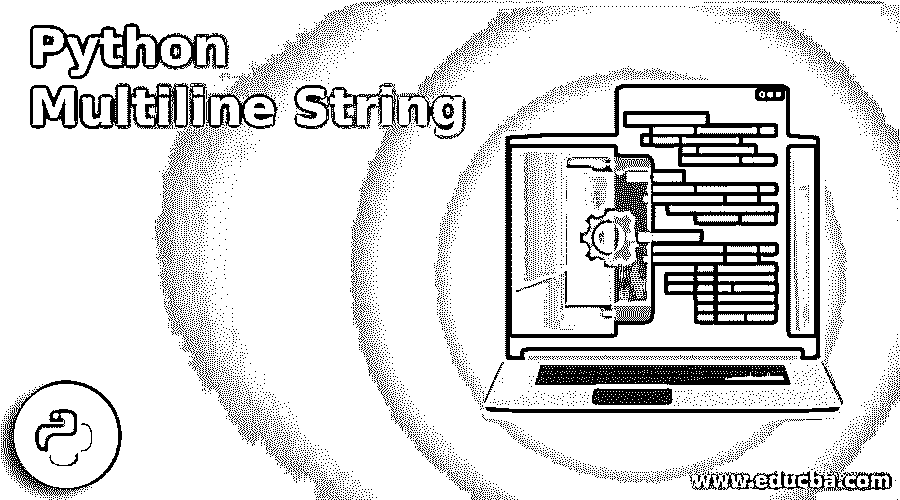
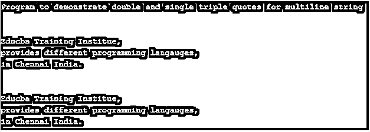

# Python 多行字符串

> 原文：<https://www.educba.com/python-multiline-string/>




## Python 多行字符串介绍

在 Python 中，字符串是一个字符序列，为了声明字符串，我们使用单引号来声明单行字符串。在 Python 中的这个多行字符串是用三重引号定义的，比如" " " " " "。因此，这些三重引号之间的任何字符串或任何文字都被视为字符串。在 Python 程序中，多行字符串主要用于指定描述程序工作的注释。在 Python 中，多行字符串是表示字符串的最推荐方式。在 Python 中，当我们在不止一行中使用字符串时，如果它们有换行符，那么我们使用三重引号，否则有不同的方法来表示没有换行符的字符串。

### Python 多行字符串的使用示例

在本文中，我们将看到如何在 Python 中声明或定义多行字符串。我们应该注意，如果我们在 Python 程序中使用一个主要用于声明程序中的注释的长字符串，并且这个长字符串带有一个换行符，我们可以使用三重引号(" " " " ")或三个单引号(' ')来声明它。如果我们试图声明一个没有换行符的长字符串，那么我们不能使用三重引号，而是有不同的方法来声明这样一个字符串。

<small>网页开发、编程语言、软件测试&其他</small>

首先，我们将通过例子来看看如何使用三重引号在 Python 中声明一个具有换行符的多行字符串。

**举例:**

假设我们想在程序中声明一个长字符串。然后让我们看看如何用单引号和双双引号来声明它。

```
print("Program to demonstrate double and single triple quotes for multiline string")
print("\n")
double_qt = """Educba Training Institue,
provides different programming langauges,
in Chennai India."""
print(double_qt)
print("\n")
single_qt = '''Educba Training Institue,
provides different programming langauges,
in Chennai India.'''
print(single_qt)
```

**输出:**




在上面的程序中，我们可以看到如何使用双引号和单引号声明一个多行字符串。在上面的程序中，我们已经写好了换行符中的每一行。

现在我们将使用不同的方法来声明 Python 中的多行字符串。让我们看看它们中的每一个及其示例。因此，声明多行字符串的不同方法如下:

#### 1.使用括号

这是在 Python 中声明多行字符串的另一种方式，当字符串中没有换行符时，使用括号声明多行字符串。让我们看看下面的例子:

**举例:**

```
print("Program to demonstrate to declaring multiline string using brackets")
print("\n")
brkt_str = ("EDUCBA is a leading global provider of skill based online education."
"EDUCBA is currently catering more than 500,000+ learners across 40+ countries.")
print(brkt_str)
```

**输出:**


在上面的程序中，我们可以看到我们使用括号来声明一个多行字符串。在这里，我们可以注意到，在输出中，它将打印不带换行符的字符串，因为给定的字符串中没有换行符。因此，我们使用括号将一个字符串分成多行。

#### 2.使用反斜杠(\)

在这个选项中，我们对 Python 中的多行字符串使用反斜杠(\)，该字符串在给定的字符串中不包含换行符。使用反斜杠的选项用于声明字符串以打印多行。让我们在下面的例子中演示一下。

**举例:**

```
print("Program to demonstrate multiline string using backslash")
print("\n")
bck_str = "Educba Training Institue." \
    "This institute is highly recommended for online programming courses and " \
    "this course also provide certificates."
print("The multiline string is given as follows:")
print("\n")
print(bck_str)
```

**输出:**


在上面的程序中，我们可以看到每个字符串的末尾都有反斜杠(\)，而多行字符串的最后一个字符串没有反斜杠。因此，我们可以看到给定的字符串没有任何换行符，因此使用反斜杠我们可以打印多行字符串。

#### 3.使用 join()

在这个选项中，我们使用 Python 的 string join()函数来拆分用于打印多行字符串的多个字符串。所以在上面的两个选项中，当我们使用括号或反斜杠时，有一个条件来检查空格，因为如果我们有很长的字符串，那么当我们使用这两个选项时，如果我们错过了空格将会很困难，但是这个问题可以通过使用 string join()方法来解决。下面让我们用一个例子来演示一下。

**举例:**

```
print("Program to demonstrate multiline string using join()")
print("\n")
jn_str = ' '.join(("Educba Training Institue",
    "This institute is highly recommended for online programming courses and",
    "this course also provide certificates."))
print("The given string is as follows:")
print("\n")
print(jn_str)
```

**输出:**


在上面的程序中，我们可以看到我们正在使用 join()函数的字符串。在这里，我们可以注意到我们将多行字符串传递给了这个函数。因此，它使用 join()函数打印多行字符串，我们可以注意到，我们使用了空格，然后对它使用 join()函数。因此，当我们使用长字符串时，这很容易，并且当我们在 Python 中加入字符串的()函数时，不需要在字符串中进行空格检查。

### 结论

在本文中，我们得出结论，Python 中的多行字符串是打印多行字符串。在本文中，我们看到了一个多行字符串，它主要用于打印程序中指定的注释。这可以使用三重引号来完成，例如单引号和双三重引号。在本文中，我们看到当字符串有换行符时，我们必须使用三重引号，如果没有换行符，那么我们讨论了声明多行字符串的各种方法，如在 Python 中使用括号、反斜杠和字符串的 join()函数。

### 推荐文章

这是 Python 多行字符串的指南。在这里，我们还将讨论 python 多行字符串的介绍和工作方式，以及一个不同的示例及其代码实现。您也可以看看以下文章，了解更多信息–

1.  [Python wait()](https://www.educba.com/python-wait/)
2.  [Python StopIteration](https://www.educba.com/python-stopiteration/)
3.  [Python 名称错误](https://www.educba.com/python-nameerror/)
4.  [Python Unicode Error](https://www.educba.com/python-unicode-error/)