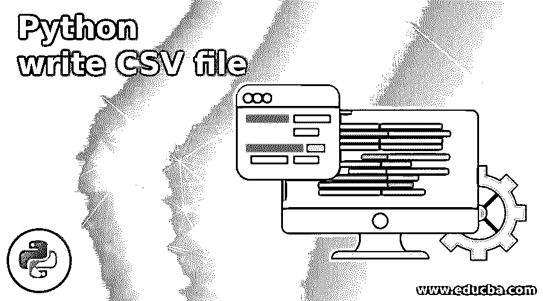
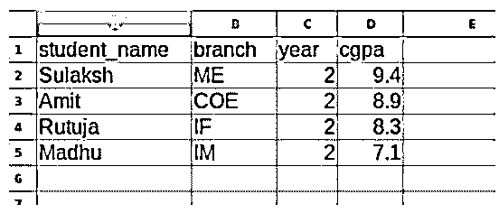

# Python 写 CSV 文件

> 原文：<https://www.educba.com/python-write-csv-file/>




## Python 写 CSV 文件简介。

Python 编程语言允许开发人员访问 CSV 文件，开发人员可以在其中执行读取和写入文件等操作。CSV 库负责允许开发人员执行这些操作。基本上，当我们必须处理文件输入输出函数，特别是 CSV 文件时，python 提供了 CSV 库，其中包含许多处理文件的函数。

**语法:**

<small>网页开发、编程语言、软件测试&其他</small>

下面给出的是 Python 写 CSV 文件的语法:

 `csv.writer(csvfile, dialect='excel', **fmtparams)` 

语法以 csv 关键字开始，后跟函数编写器，函数编写器负责打开并编写文件。现在，在写之前，我们阅读文件，并确定我们的需求。提到的语法将读取我们传入的文件，这在读取或写入文件之前很重要。

**参数:**

*   csvfile 是对象，它是我们想要操作的文件。
*   方言是一个可选参数，它定义了我们想要一个 excel 生成的 csv 文件。
*   我们可以有不同类型的文件。最后，fmtparams 是一个格式化参数，它负责在需要时覆盖由方言维护的规范。

### 如何使用各种方法用 Python 写 CSV 文件？

我们将使用 python csv 库演示 CSV 函数在 python 中的工作。

#### 示例#1

我们的第一个例子是打开一个 CSV 文件并写几行的代码。

**代码:**

```
import csv
with open('start.csv', 'w') as csvfile:
    startwriter = csv.writer(csvfile, delimiter=' ',
                            quotechar='|', quoting=csv.QUOTE_MINIMAL)
    startwriter.writerow(['Start'] * 2 + ['working example of csv write'])
    startwriter.writerow(['starting', 'this is an example', 'just a simple working example']) 
```

**说明:**

*   我从导入 python 的 csv 库开始，然后打开函数来访问 start.csv 文件。如果文件不存在，代码将使用提到的名称和类型创建一个新文件。
*   然后我们有 startwriter，在这里我们用写权限访问文件，并传递文件名和其他参数。
*   接下来，我们有第一个语句，它将写 Start 两次，然后是下一个句子。
*   最后，最后一条语句与我们已经讨论过的一样，唯一的区别是它添加了|符号。

成功编译和执行后，必须写入 csv 文件的输出必须如下所示:

开始| CSV 写的工作示例|

开始|这是一个示例| |只是一个简单的工作示例|

**输出:**


正如我们所料，这些声明已经打印在一个 csv 文件中。

#### 实施例 2

接下来，我们将从 csv 库中实现 csv.writer 函数，并将三行引号写入 csv 文件。我们将打开一个空的 csv 文件，然后写入数据。

**代码:**

```
import csv
row_list = [
    ["SN", "Name", "Quotes"],
    [1, "Linus Torvalds", "Talk is cheap. Show me the code."],
    [2, "Martin Fowler", "Any fool can write code that a computer can understand. Good programmers write code that humans can understand."],
    [3, "Anonymous", "The most important property of a program is whether it accomplishes the intention of its user."]
]
with open('quotes.csv', 'w') as file:
    writer = csv.writer(file, quoting=csv.QUOTE_NONNUMERIC, delimiter=';')
    writer.writerows(row_list) 
```

**说明:**

*   与其他示例类似，我们从导入 CSV 库开始。然后，我们为输入定义了行格式的数据集。然后，我们将数据写入空的 csv 文件中。
*   然后我们有一个 open 函数，在这里我们传递了带有' w' right 的 csv 文件，意思是可写的，作为一个文件。然后我们有我们的 writer，它保存了带有重要参数的文件。最后，我们有 writerows 函数，它将把我们传递到 writer 文件中的行列表写入。该程序的输出将是一个带引号的 csv 文件，并在其中写入这些引号。

**输出:**


#### 实施例 3

**代码:**

```
import csv  
newdict =[{'branch': 'ME', 'cgpa': '9.4', 'student_name': 'Sulaksh', 'year': '2'},  
         {'branch': 'COE', 'cgpa': '8.9', 'student_name': 'Amit', 'year': '2'},  
         {'branch': 'IF', 'cgpa': '8.3', 'student_name': 'Rutuja', 'year': '2'},   
         {'branch': 'IM', 'cgpa': '7.1', 'student_name': 'Madhu', 'year': '2'}]  

fields = ['student_name', 'branch', 'year', 'cgpa']  
filename = "uni_records.csv"
with open(filename, 'w') as csvfile:  
    writer = csv.DictWriter(csvfile, fieldnames = fields)  
    writer.writeheader()  
    writer.writerows(newdict) 
```

**说明:**

*   像其他例子一样，我们从导入 csv 开始，然后我们声明了一个新的 dictionary 数据类型，并填充了一些要插入的句子。然后我们有了 csv 文件的头，它被命名为 fields，该文件有四个列名。接下来是为文件定义一个名称，最后，我们用 open 函数访问文件。
*   我们将文件名作为 csvfile 传递，将字段作为字段名传递。然后，我们的 writer 编写文件头，最后，我们的字典被写入文件中。
*   成功执行后，代码的输出将是一个名为 uni_records.csv 的 csv 文件，它将保存我们在字典中传递的数据。

**输出:**




正如预期的那样，我们的代码已经执行，并且使用我们想要的数据创建了一个新的 csv 文件。我们所有的例子都像预期的那样成功地工作。有多种方式和方法来实现 csv 的 writer 功能，根据我们对项目的需求，我们可以实现它。

### 结论

CSV writer 是 python 的 CSV 库的一个常用功能。csv 库允许我们对一个 csv 文件进行多种访问和操作，writer 就是其中之一。我们简单地访问文件，并将想要的数据写入文件。如果文件不存在，将会创建一个。

### 推荐文章

这是一个用 Python 写 CSV 文件的指南。这里我们讨论一下 Python 写 CSV 的介绍以及如何用各种方法写 CSV 文件。您也可以看看以下文章，了解更多信息–

1.  [Python 排序列表](https://www.educba.com/python-sort-list/)
2.  [Python 中的快速排序](https://www.educba.com/quick-sort-in-python/)
3.  [Python 并发](https://www.educba.com/python-concurrency/)
4.  [Python argparse](https://www.educba.com/python-argparse/)