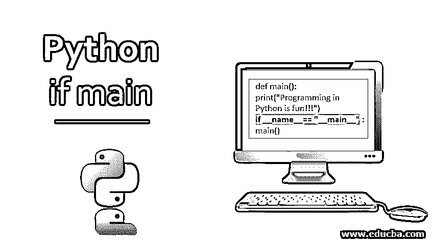
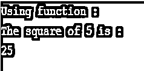
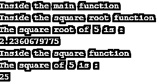

# Python if main

> 原文：<https://www.educba.com/python-if-main/>




## Python If Main 简介

我们编写的任何程序的唯一目的都是让程序顺利执行。Python 中的 main 函数充当任何程序的执行点。一个程序只有在从 main 函数执行时才会被执行，而当它作为一个模块导入时就不会被执行。定义 Python 的 main 函数并不是强制性的，但是为了程序的可读性更好，这样做是一个很好的实践。main 函数由下面的关键字 main()表示。让我们看看 Python main 函数的语法和基本示例。

### Python 执行模式

我们主要通过两种方式告诉 Python 解释器执行程序:

<small>网页开发、编程语言、软件测试&其他</small>

1.  直接执行 Python 文件。
2.  将外部 Python 文件作为包导入，然后使用该文件中的函数。

当我们想直接执行 Python 脚本时，Python 会将“__main__”赋给 __name__，如下例所示。

条件 if 语句在计算结果为 True 时，意味着 Python 脚本将直接执行。因此，条件 if 语句是在所有其他函数和类都已定义之后写在最后的。__name__ 变量的作用是检查文件是直接运行还是导入。

#### 通过将必要的代码从一个 Python 文件导入到另一个文件来执行

**语法:**

```
module1.py
def function1():
  // function1 definition
if __name__ == "__main__":
  function1()
import module1
module1.function1()
```

**例题** **代号:**

```
# module1.py
import numpy as np
def get_square(number):
  square = np.square(number)
  return square
if __name__ == "__main__":
  get_square(5)
import module1
module1.get_square(5)
```

在上面的例子中，我们定义了一个函数 get_square，它接受一个数字作为参数，并返回该数字的平方。我们已经将该文件保存为 module1.py。

我们通过将 module1 脚本作为模块导入，在主函数中使用 get_square 函数。

### 编写主函数的最佳实践

以下是用 Python 编写主函数时要考虑的最佳实践:–

#### 1.只要我们觉得有必要，我们就必须使用函数和类

由于 Python 是一种面向对象的编程语言，我们必须充分利用它以及不同类和函数下的不同功能。这有助于提高代码的可重用性和可读性。这样，代码的执行也受到控制。

**代码:**

```
import numpy as np
def get_square(number):
    print("The square of {} is :".format(number))
    square = np.square(number)
    return square
print("Using function :")
square=get_square(5)
print(square)
```

**输出:**




#### 2.我们必须使用变量“__name__”来控制代码的执行

当与条件 if 语句一起使用时，变量 __name__ 的计算结果为 True，则只执行接下来的语句。这样，代码的执行流程得到了更好的处理。

**代码:**

```
def main():
    print("Programming in Python is fun!!!")
    if __name__== "__main__" :
main()
```

**输出:**


在上面的例子中，有一个名为 main()的函数。在主函数中，我们有一个打印函数。之后，我们有一个条件 if 语句，它检查 __name__ 的值是否等于字符串“__main__”。一旦条件被评估为真，它就执行 main()函数，因此打印语句“用 Python 编程很有趣！！!"会被处决。

#### 3.我们必须使用主函数

即使没有被显式调用，在 main 函数中编写的代码也会被执行。它是每个执行过程的起点。通常应该执行的公共代码段必须放在 main 函数中。这样，首先执行主函数语句，然后执行其余语句。

**代码:**

```
import numpy as np
def get_square(number):
    print("Inside the first function")
    print("The square of {} is :".format(number))
    square = np.square(number)
    return square
def main(number):
  print("Inside the main function")
  square_root = np.sqrt(number)
  print("The square root of {} is {}".format(number,square_root))
  square = get_square(number)
  print(square)
if __name__ == "__main__":
    main(5)
```

**输出:**


#### 4.我们必须从主函数中调用其他函数

对于要在 main 函数中执行的大块代码，最好将它们放在单独的函数中，并从 main 函数中显式调用它们。它增加了程序的健壮性和可读性。

**代码:**

```
import numpy as np
def get_square(number):
  print("Inside the square function")
  print("The square of {} is :".format(number))
  square = np.square(number)
  return square
def get_square_root(number):
  print("Inside the square root function")
  print("The square root of {} is :".format(number))
  square_root = np.sqrt(number)
  return square_root
def main(number):
  print("Inside the main function")
  square_root = get_square_root(number)
  print(square_root)
  square = get_square(number)
  print(square)
if __name__ == "__main__":
  main(5) 
```

**输出:**




### 结论

该是结束这篇文章的时候了。在本文中，我们已经了解了 Python 中 if main 函数的基本概念。我们已经看了语法并讨论了与之相关的不同例子。下次你用 Python 写代码的时候，一定要记住这些概念。

### 推荐文章

这是 Python if main 的指南。这里我们讨论 Python 解释器执行程序的两种方式，以及各自的例子。您也可以看看以下文章，了解更多信息–

1.  [Python 子流程](https://www.educba.com/python-subprocess/)
2.  [Python 设置函数](https://www.educba.com/python-set-function/)
3.  [Python 列表函数](https://www.educba.com/python-list-functions/)
4.  [Python 倒计时定时器](https://www.educba.com/python-countdown-timer/)