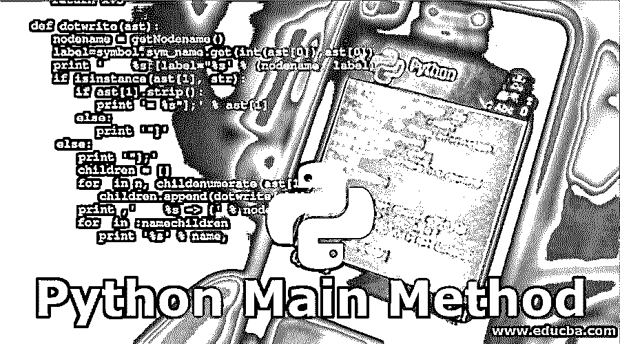
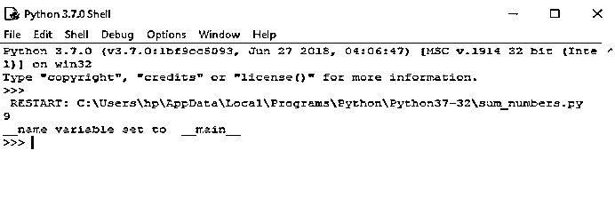

# Python 主方法

> 原文：<https://www.educba.com/python-main-method/>




## Python 主函数介绍

一般来说，所有的编程语言都有一个 main()函数作为预定义的函数/方法，向编译器指示这是执行流的开始。Python 语言是一个例外，因为它是以串行方式执行的，默认情况下，代码的第一行将是起点。尽管 main()函数不是一个强制元素，但是如果程序员希望使用 main 方法来对代码的其他部分进行排序，他总是可以创建一个用户定义的方法，该方法的操作类似于 python 中的其他方法。

### 如何声明 Python Main 函数？

main 方法的定义方式类似于 python 中定义的其他函数。

<small>网页开发、编程语言、软件测试&其他</small>

#### 1.基本主要功能

```
print('Introduction to main() function')
def main():
    print("This is main function")
print('Outside main function')
```

**输出:demo.py**

>>>

= = = RESTART:C:/Users/HP/AppData/Local/Programs/Python/Python 37-32/demo . py = = =

main()函数介绍

#### 2.外部主要功能

>>>

**解释:** Python 解释器从顶部开始执行一个 Python 文件。首先，它将打印第一条打印语句，即 main()函数介绍。它找到 main()方法定义，因为它仅仅是一个定义，而不是一个函数调用，所以它绕过它，执行跟在它后面的下一个 print 语句。

**注意:**在 python 中，不一定要把‘main’方法命名为 main()。它可以用任何有效的标识符名称来定义，如 main1()、main()等。

main()的执行需要对 __name__ 变量有一个简单的了解。

#### 3.关于 __name__ 变量的简介

__name__ variable 是一个包含字符串的特殊隐式变量，字符串的值取决于代码的执行方式。

基本上，python 解释器执行代码和 _ _ name _ this populates _ value 有两种方式。

a.最常见的方法是将文件作为 python 脚本执行

在这种情况下，__name__ 将包含字符串“__main__”

b.通过将必要的代码从一个 python 文件导入到另一个文件。

在这种情况下 __name__ 将包含导入的模块名

__name__ 变量有助于检查 python 文件是直接运行还是从其他文件导入。

### Python Main 方法的示例

以下是 python main 方法的一些示例:

#### 1.Sum 函数:文件保存为 sum_numbers.py

**Python 文件:sum_numbers.py**

```
def sum(a,b):
    return (a+b)
print(sum(3,6))
print("__name variable set to ",__name__)
```

上面的程序是主程序，不是从其他 python 文件导入的，因此 __name__ 变量的值被设置为 __main__ 如下面的输出所示:

**输出:sum_numbers.py**




#### 2.从另一个文件导入 python 文件时

该文件保存为 sum.py

**Python 文件:sum.py**

```
import sum_numbers
print(sum_numbers.sum(10.25,9.05))
print("value of __name__:",__name__)
```

**说明:**

*   Sum_numbers 文件被导入到程序文件' sum.py '中，因此首先执行该文件中的所有语句。

i.e 打印(sum(3.6))至 9

print("__name 变量设置为"，__name__)由于这是从 sum_numbers 导入的，因此 __name__ 设置为 sum_numbers

*   print(sum_numbers.sum(10.25，9.05)) à3

print("value of __name__:"，__name__) à sum.py 是此处的主文件，因此 __name__ 被设置为 __main__。

**输出:sum.py**


为了避免语句从导入的文件‘sum _ numbers’中执行，我们可以使用 if 条件语句。

下面的代码示例可以说明这一点:

上面的 sum_numbers.py python 文件可以修改如下:

**Python 文件:sum_numbers.py**

```
def sum(a,b):
    return (a+b)
if __name__=='__main__':
    print(sum(3,6))
print("__name variable set to ",__name__)
```

**Python 文件:sum.py**

```
import sum_numbers
print(sum_numbers.sum(10.25,9.05))
print("value of __name__:",__name__)
```

在这种情况下，由于以下情况，当我们执行 sum.py 时，不会打印导入文件' sum_numbers.py '的输出:

if __name__=='__main__ ':

因为 sum_numbers 是导入的模块而不是主文件，所以这个条件不成立。

**输出:sum.py**


**在 python 程序中使用 main()时需要考虑的要点:**

1.因为 python 是一种面向对象的编程语言，所以我们应该将它的优点融入到我们的程序中。这可以通过将批量逻辑代码放在紧凑的函数和/或类中来实现，以获得更好的代码可重用性、更好的调试、对程序的更好理解和整体代码优化。

这种方法将使我们能够控制代码的执行，而不是让 python 解释器来执行它。

上面的代码示例很好地说明了这一点，我们使用 if 条件来阻止导入文件的输出。

2.使用 __name__ 变量控制代码的执行

```
If __name__=='__main__:
<logic of program>
```

3.创建 main()函数并将您的逻辑放入其中

**Python 文件:demo.py**

```
print("Main function illustration")
def sum(a,b):
    return (a+b)
def main():
    print("Inside main() function")
x=int(input("enter value x"))
y=int((input("enter value y")))
print("sum of values entered is",end=' ')
print(sum(x,y))
if __name__ == "__main__":
    main()
```

*   这里我们已经定义了 sum()和 main()。
*   Sum()将计算两个数的和，
*   在 main()方法中，我们提示用户通过 input()语句输入 x 和 y 的值，然后当 input()返回字符串值时，这些值被转换为整数值。
*   然后在 main 函数内部调用 sum(x，y)，控制将转移到顶部定义的 sum()方法，该方法将返回用户数字的总和。
*   上述所有功能都由 __name__ 变量处理。
*   由于 demo.py 是主程序文件，不会从任何其他 python 文件导入，因此 __name__ 被设置为 string __main__。
*   如果有一些导入语句，那么下面的条件

If __name__ == "__main__ ":

将失败，因为 __name__ 现在将具有导入的模块名称

通过这种方式，我将想要运行的代码放在 main()中，编程逻辑放在“SUM”中，这是从 main()中调用的，并在条件语句中调用 main()。

**输出:demo.py**


### 结论——Python 主方法

好吧，python 中不一定要用 main()方法，代码中有没有完全由程序员决定。但是，使用 main()方法是一个很好的实践，因为借助于 main()函数；我们可以根据需要执行大量的功能，还可以控制执行流程。

### 推荐文章

这是 Python Main 方法的指南。在这里，我们将讨论如何声明 Python 主函数以及示例和输出。您也可以阅读以下文章，了解更多信息——

1.  [Python 内置函数](https://www.educba.com/python-built-in-functions/)
2.  [Python 中的数组](https://www.educba.com/arrays-in-python/)
3.  [Python 中的排序](https://www.educba.com/sorting-in-python/)
4.  [Python 中的继承](https://www.educba.com/inheritance-in-python/)