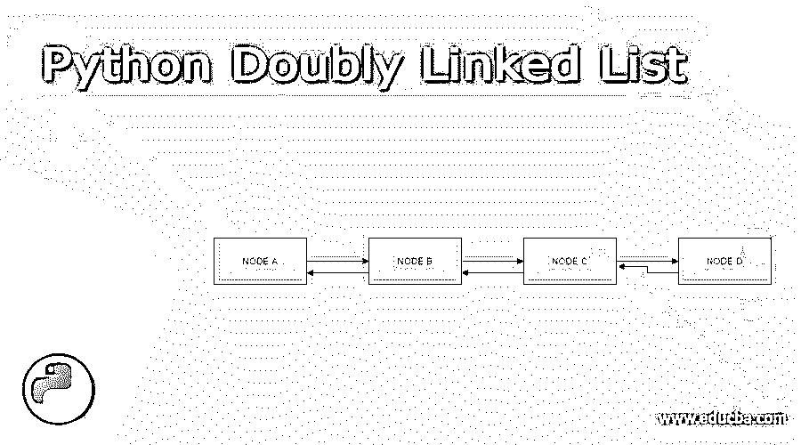

# Python 双向链表

> 原文：<https://www.educba.com/python-doubly-linked-list/>




## Python 双向链表的定义

在 python 中我们也有双向链表，它允许我们双向遍历，因为使用单向链表我们只能向前遍历，但是在双向链表中，我们可以向前和向后双向移动。如果我们讨论一个双向链表，它通常包含三个部分，in 是数据，对前一个节点的引用，最后一个是对下一个节点的引用。但这不是单链表的情况。同样通过使用它，我们可以在两个方向上遍历和搜索元素。在本教程的下一节中，我们将看到如何将链接数据结构实现到 python 中，以便初学者更好地理解它。

**语法:**

<small>网页开发、编程语言、软件测试&其他</small>

正如我们已经知道的，它是用来存储里面的元素，但我们没有任何具体的语法，我们需要按照算法来创建它，为了更好地理解，请参见下面链接的节点类的结构；

**类节点:**

```
def __init__(self, data):
self.item = data
self.nref = None
self.pref = None
```

正如您所看到的，我们在这里创建了一个节点，它包含了节点中包含实际数据的下一个和上一个引用。在下一节中，我们将看到基本的插入操作，这也是一个任何人都可以使用的通用类。

### Python 中双向链表是如何工作的？

现在我们已经知道，双向链接允许我们向前或向后双向移动。但是通过使用单链表，我们只被允许向前单向遍历，因为单链表中不包含前面的指针。但是在双向链表的情况下，我们在节点内部有两个引用，这两个引用也将维护下一个和上一个节点的地址。在这一节我们将借助一个流程图介绍双向链表的基本流程，之后是用 python 实现链表所需的步骤，让我们开始吧；

1)链表中的数据是以节点的形式维护的，它是一种数据结构，用来存储链表中的元素。

2)我们使用了术语节点，其中也包含三个组件，如下所示:

a)数据:这将代表我们希望存储在链接数据结构中的元素。这将作为元素的实际值。

b)下一个引用:这将包含到下一个节点的地址，因为我们可以说是下一个节点的引用。这和我们在单链表中的情况很相似，所以在它的帮助下，我们将能够向前移动。

c)前一个引用:这将包含前一个节点的地址，即前一个节点的引用。这将有助于我们向后搜索和遍历元素。这就是我们可以说的双向链表的优点。

3)现在让我们看一下流程图，这将有助于我们更好地理解它，见下文；

流程图:


如果你能在上面的图表中看到，我们有不同的节点，这些节点依次包含内部变量来 cerate 和访问 Python 中的双向链表。

优点:我们在 python 中使用双向链表有很多优点，我们已经看到了工作 let ' take a loser look in python 中双向链表的一些优点见下文；

1)通过使用它，我们可以双向移动，即向前和向后。因为它在节点内部维护了两个引用。

2)通过向两个方向移动，插入和搜索现在变得容易了。

使用双向链表的缺点:对于双向链表，我们必须维护额外的指针，或者我们可以说是对保存前一个节点地址的内存的引用。所以这是 python 中双向链表的一个缺点或更多的工作。

在 python 中使用双向链表时要记住的几点见下文；

*   在创建它时，我们需要在节点类中有三样东西，即数据、前一个引用和下一个引用。
*   我们可以在链表的任何一端添加、删除元素。在下面的例子中，我们只是增加了它的值。

### 例子

在下面的程序中，我们试图用 python 创建双向链表，这里我们定义了一个函数来添加双向链表中的元素，并尝试使用我们的 print 方法来显示它们。这只是一个基本的例子，向初学者展示了 python 中双向链表的工作和实现。

#### 示例#1

```
# create a class
class Node:
  def __init__(self, actualdata):
    self.actualdata = actualdata
    self.nextRefrence = None
    self.prevRefrence = None
  class doubly_linked_list_demo:
    def __init__(self):
    self.head = None
    def addElement(self, NewVal):
     NewNode = Node(NewVal)
     NewNode.nextRefrence = self.head
     if self.head is not None:
        self.head.prevRefrence = NewNode
     self.head = NewNode
    def showListElement(self, node):
     while (node is not None):
      print(node.actualdata),
      last = node
      node = node.nextRefrence
    myList = doubly_linked_list_demo()
    myList.addElement(10)
    myList.addElement(20)
    myList.addElement(30)
    myList.addElement(40)
    myList.addElement(50)
    myList.addElement(60)
    myList.showListElement(myList.head)
```

**输出:**


### 结论

正如我们在本教程中看到的 python 中双向链表的工作方式，我们在搜索元素时也有一个优势。此外，这是非常容易使用和实施只需要了解其内部工作第一，这可以很容易地由开发人员处理。

### 推荐文章

这是一个 Python 双向链表的指南。这里我们讨论定义，语法，双向链表在 Python 中是如何工作的？代码实现示例。您也可以看看以下文章，了解更多信息–

1.  [Python 中的 Shell 排序](https://www.educba.com/shell-sort-in-python/)
2.  [Python 中的插入排序](https://www.educba.com/insertion-sort-in-python/)
3.  [Python 中的排序字符串](https://www.educba.com/sort-string-in-python/)
4.  [Python 字符串包含](https://www.educba.com/python-string-contains/)