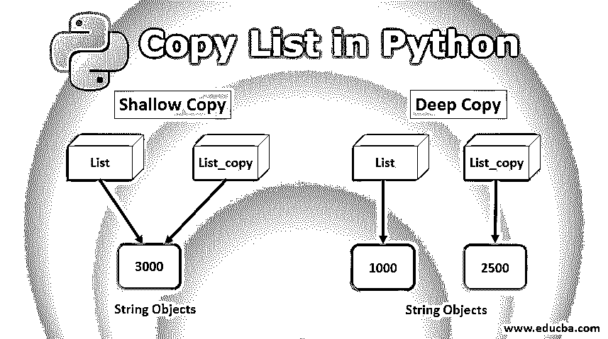

# 用 Python 复制列表

> 原文：<https://www.educba.com/copy-list-in-python/>




## Python 中的复制列表简介

在 python 中，复制列表是在保存多个变量/值的列表上使用的函数。copy 函数的基本操作是将一个已经存在的列表中的元素复制到一个新创建的空列表中。这种复制功能可以通过使用四种类型的逻辑模式来实现，例如使用赋值运算符将现有列表中的值赋值给新列表，这是一种特定于 python 的方法，称为浅层复制，用于多次复制的深层复制，以及使用构造函数进行复制。

### 如何在 Python 中复制 List？

复制列表有四种方式:

<small>网页开发、编程语言、软件测试&其他</small>

#### 1.赋值运算符

**代码:**

```
>>> a = [2,5,4,3,6,1]
>>> print(a)
[2, 5, 4, 3, 6, 1]
>>> b = a
>>> print(b)
[2, 5, 4, 3, 6, 1]
>>> a[0] = 10
>>> print(a)
[10, 5, 4, 3, 6, 1]
>>> print(b)
[10, 5, 4, 3, 6, 1] 
```

**输出:**


**对上面代码的解释:**在上面的例子中，我们创建了一个列表，并把它赋给了变量‘a’。现在我们已经把这个相同的列表赋给了变量 b，现在，如果我们打印列表 b，我们会得到相同的值。现在我们改变了列表的第一个元素‘a’。打印列表“a”以检查更新的值。现在，如果我们打印列表' b '，我们可以看到列表' b '的值也发生了变化。在这种情况下，值不会被复制，两个变量只是引用同一个对象。

#### 2.使用构造函数复制

现在为了避免上述问题，我们可以使用 list 构造函数来复制 list。

**代码:**

```
>>> a = [2,5,4,3,6,1]
>>> print(a)
[2, 5, 4, 3, 6, 1]
>>> b = list(a)
>>> print(b)
[2, 5, 4, 3, 6, 1]
>>> a[0] = 10
>>> print(a)
[10, 5, 4, 3, 6, 1]
>>> print(b) 
```

**输出:**


**对上面代码的解释:****T3】在上面的例子中，我们已经创建了一个列表‘a’，并使用 list 构造函数将它赋给了 list‘b’。如果我们改变列表‘a’的值，列表‘b’的值不会改变；现在，我们可以说列表是复制的。**

#### 3.浅拷贝

浅层拷贝是一个有点类似的赋值操作符。它还创建了一个新对象，该对象存储旧列表的引用，而不是复制项目。为了利用浅层复制，我们必须导入复制模块。

**代码:**

```
>>> import copy
>>> a = [[1,2,3],[4,5,6],[7,8,9]]
>>> print(a)
[[1, 2, 3], [4, 5, 6], [7, 8, 9]]
>>> b = copy.copy(a)
>>> print(b)
[[1, 2, 3], [4, 5, 6], [7, 8, 9]]
>>> a.append(['a','b','c'])
>>> print(a)
[[1, 2, 3], [4, 5, 6], [7, 8, 9], ['a', 'b', 'c']]
>>> print(b)
[[1, 2, 3], [4, 5, 6], [7, 8, 9]]
>>> a[1][2] = 10
>>> print(a)
[[1, 2, 3], [4, 5, 10], [7, 8, 9], ['a', 'b', 'c']]
>>> print(b)
[[1, 2, 3], [4, 5, 10], [7, 8, 9]] 
```

**输出:**


**对上面代码的解释:**在上面的程序中，你可以看到我们已经创建了一个嵌套列表‘a’，然后我们使用 copy 把它赋给了列表‘b’。复制功能。当我们打印列表‘b’时，我们可以看到‘a’的所有值，因为它指向列表‘a’的所有元素。

现在，我们已经将新列表附加到列表“a”中。现在我们打印列表‘b’；我们没有找到附加的新列表。因为它仍然指向旧的列表引用。在复制命令之后，它不会有任何关于新添加的元素[的信息。现在，如果我们试图改变同样存在于列表 b 中的列表元素，您可能也会看到列表 b 中的变化，因为它具有旧的所有引用，除了后来添加的。](https://www.educba.com/copy-command-in-linux/)

#### 4.深层拷贝

同样在深度复制中，我们必须导入复制模块才能使其工作。深度复制创建一个新对象，并递归地将旧列表中存在的嵌套元素的副本添加到新列表中。

**代码:**

```
>>> import copy
>>> a = [[1,2,3],[4,5,6],[7,8,9]]
>>> print(a)
[[1, 2, 3], [4, 5, 6], [7, 8, 9]]
>>> b = copy.deepcopy(a)
>>> print(b)
[[1, 2, 3], [4, 5, 6], [7, 8, 9]]
>>> a.append(['a','b','c'])
>>> print(a)
[[1, 2, 3], [4, 5, 6], [7, 8, 9], ['a', 'b', 'c']]
>>> print(b)
[[1, 2, 3], [4, 5, 6], [7, 8, 9]]
>>> a[1][2] = 10
>>> print(a)
[[1, 2, 3], [4, 5, 10], [7, 8, 9], ['a', 'b', 'c']]
>>> print(b)
[[1, 2, 3], [4, 5, 6], [7, 8, 9]] 
```

**输出:**


**对上面代码的解释:**在上面的程序中，你可以看到我们已经创建了一个列表‘a’，并使用 copy 将列表‘a’复制到列表‘b’中。deepcopy 命令。现在我们打印列表‘b’；我们可以看到列表中的所有元素都被复制了。现在我们可以尝试在列表“a”中添加一个新列表。如果我们打印列表“b ”,我们可以看到新元素的存在。如果我们试图在复制之前改变已经存在的元素，那么该元素也不会被改变到列表‘b’中。因此，如果我们对列表“a”进行任何更改，列表“b”中不会反映任何更改，因为不是引用对象，而是将旧列表的值递归复制到新列表中，并且两个列表都有新的对象 id。

### 结论

这些列表方法在 python 中非常有用。必须使用哪种方法取决于需求或我们正在执行的任务。假设我们有了应该在整个系统中使用的列表，那么我们可以利用浅层拷贝，这样一个变化就可以反映整个系统。

### 推荐文章

这是一个用 Python 复制列表的指南。在这里，我们讨论如何用 python 以四种方式复制列表，并使用各自的例子。您也可以浏览我们的其他相关文章，了解更多信息——

1.  [Python 中的列表方法](https://www.educba.com/list-method-in-python/)
2.  [Python 中的迭代器](https://www.educba.com/iterators-in-python/)
3.  [在 Python 中覆盖](https://www.educba.com/overriding-in-python/)
4.  [Python 中的堆栈](https://www.educba.com/stack-in-python/)