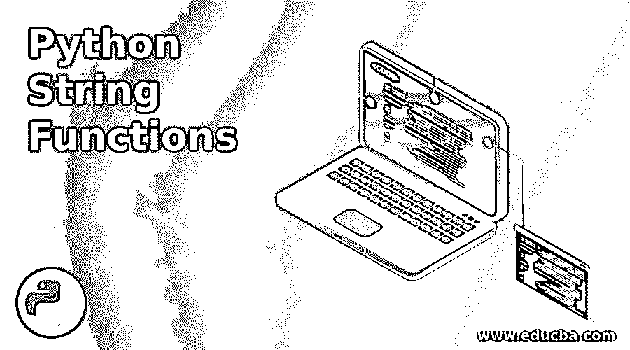

# Python 字符串函数

> 原文：<https://www.educba.com/python-string-functions/>




## Python 字符串函数简介

各种字符串方法，如 center()、count()、find()、format()、index()、isalnum()、lower()、maketrans()、replace()等。包含在 Python 环境中，并作为内置工具提供给用户，以便用户可以操纵文本数据，在文本分析的上下文中，根据需要对字符串执行必要的操作，这些函数被称为 Python 字符串函数。

### Python 字符串函数的数据类型

Python 由以下五种主要数据类型组成:

<small>网页开发、编程语言、软件测试&其他</small>

*   数值型(其子类型为–int、long、float 和 complex)
*   线
*   目录
*   元组
*   词典

**例如:**

**代码:**

`str1 = ‘Hello from EduCBA’
OR
Str2 = “Hello from EduCBA”`

**Note:** Unlike Java or C++, one need not mention the data type when declaring a variable. One can directly assign the value to the variable.

在本文中，我们将仔细研究字符串数据类型及其函数。将字符串值赋给变量时，会用到单引号和双引号。

### Python 字符串函数

下面是提到的 python 字符串函数:

**1。大写():**将字符串的首字母转换为大写。

**举例:**

**代码:**

```
str1 = “hello from EduCBA”
str2 = str1.capitalize()
print(str2)
```

**输出:**

你好，来自 EduCBA

**2。casefold():** 将整个字符串转换成小写。

**举例:**

**代码:**

```
str1 = “HELLO FROM EduCBA”
str2 = str1.casefold()
print(str2)
```

**输出:**

你好，来自 educba

**3。center():** 它将字符串在指定长度的中心对齐。

**举例:**

**代码:**

```
str1 = “EduCBA”
str2 = str1.center(10)
print(str2)
```

**输出:**

EduCBA

也就是说，左边的两个字符的空格留下了一个空白，后面是字符串的六个字符和右边的两个空白字符，总共十个字符。

**4。count():** 返回子字符串在给定字符串中出现的次数。

**举例:**

**代码:**

```
str1 = “Hello from EduCBA. Welcomw to EduCBA”
num = str1.count(“EduCBA”)
print(str2)
```

**输出:**

Two

**5。encode():** 将字符串转换成它的编码版本。

**举例:**

**代码:**

```
str1 = “EduCBA”
str2 = str1.encode()
print(“Hello from”, str2)
```

**输出:**

来自 vfg/7hyt/4 的你好

**6。如果给定的字符串以指定的子字符串结尾，则返回 true。**

**举例:**

**代码:**

```
str1 = “Hello from EduCBA”
str2 = str1.endswith(“CBA”)
print(str2)
```

**输出:**

真实的

7 .**。expandtabs():** 将制表符大小替换为给定的数字字符空格。默认的制表符大小是 8 个字符。

**举例:**

**代码:**

```
str1 = “Hello\tfrom\tEduCBA”
str2 = str1.expandtabs(2)
print(str2)
```

**输出:**

你好，来自 EduCBA

**8。find():** 在主字符串中从左开始搜索指定的子字符串，并返回它在匹配项中的位置；如果不匹配，当没有找到匹配时返回-1。

**举例:**

**代码:**

```
str1 = “Hello from EduCBA”
str2 = str1.find(“EduCBA”)
print(str2)
```

**输出:**

Eleven

**9。format():** 通过使用占位符来帮助格式化字符串。

**举例:**

**代码:**

```
str1 = “EduCBA”
print("Hello from {}.".format(str1))
```

**输出:**

EduCBA 的你好。

10。index(): 通过在主字符串中搜索指定的子字符串来查找子字符串出现的位置，并返回它在找到的匹配项中的位置，否则将引发错误。

**举例:**

**代码:**

```
str1 = “Hello from EduCBA”
str2 = str1.index(“EduCBA”)
print(str2)
```

**输出**:

Eleven

**11。isalnum():** 确定给定字符串中的所有字符是否都是字母数字，即只有字母和数字。如果是，则返回真，否则返回假。如果中间有空格，则返回 false。

**举例:**

**代码:**

```
str1 = “EduCBA123”
str2 = str1.isalnum()
print(str2)
```

**输出:**

真实的

**12。isalpha():** 确定给定字符串中的所有字符是否都是字母。如果是，返回真，否则返回假。如果中间有空格，则返回 false。

**举例:**

**代码:**

```
str1 = “HellofromEduCBA”
str2 = str1.isalpha()
print(str2)
```

**输出:**

真实的

13。isdecimal(): 确定给定字符串中的所有字符是否都是小数。如果是，则返回真，否则返回假。如果中间有空格，则返回 false。

**举例:**

**代码:**

```
str1 = “123456”
str2 = str1.isdecimal()
print(str2)
```

**输出:**

真实的

**14。isidentifier():** 确定字符串是否是有效的标识符。如果是，则返回真，否则返回假。如果中间有空格，则返回 false。

**例 1:**

**代码:**

```
str1 = “EduCBA123”
str2 = str1.isidentifier()
print(str2)
```

**输出:**

真实的

**例 2:**

**代码:**

```
str1 = “EduCBA 123”
str2 = str1.isidentifier()
print(str2)
```

**输出:**

错误的

15。islower(): 确定给定字符串中的所有字符是否都是小写。如果是，则返回真，否则返回假。

**举例:**

**代码:**

```
str1 = “EduCBA”
str2 = str1.islower()
print(str2)
```

**输出:**

错误的

16。isnumeric(): 确定给定字符串中的所有字符是否都是数字，即可能是分数的数字和指数。如果是，则返回真，否则返回假。

**举例:**

**代码:**

```
str1 = “123”
str2 = str1.isnumeric()
print(str2)
```

**输出:**

真实的

**17。isprintable():** 确定给定字符串中的所有字符是否都是可打印的。如果是，则返回真，否则返回假。诸如“\t”或“\n”等字符不可打印。

**例 1:**

**代码:**

```
str1 = “EduCBA123”
str2 = str1.isprintable()
print(str2)
```

**输出:**

真实的

**例 2:**

**代码:**

```
str1 = “\tEduCBA123”
str2 = str1.isprintable()
print(str2)
```

**输出:**

错误的

18。isspace(): 确定给定字符串中的所有字符是否都是空格。如果是，则返回真，否则返回假。

**举例:**

**代码:**

```
str1 = “     “
str2 = str1.isspace ()
print(str2)
```

**输出:**

真实的

**19。istitle():** 确定一个字符串是否遵循一组规则来作为标题。如果是，则返回真，否则返回假。

**举例:**

**代码:**

```
str1 = “Hello From Educba”
str2 = str1.istitle()
print(str2)
```

**输出:**

真实的

20。isupper(): 确定给定字符串中的所有字符是否都是大写的。如果是，则返回真，否则返回假。

**举例:**

**代码:**

```
str1 = “HELLO FROM EDUCBA”
str2 = str1.isupper()
print(str2)
```

**输出:**

真实的

**21。join():** 意味着以迭代的方式连接两个字符串。

**举例:**

**代码:**

```
str1 = “Hello”
str2 = str1.join(“EduCBA”)
print(str2)
```

**输出:**

HelloEHellodHellouHelloCHelloBHelloA

**22。lower():** 意味着将整个字符串转换成小写。

**举例:**

**代码:**

```
str1 = “Hello from EduCBA.”
str2 = str1.lower()
print(str2)
```

**输出:**

educba 的你好。

**23。upper():** 意为将整个字符串转换成大写。

**举例:**

**代码:**

```
str1 = “Hello from EduCBA”
str2 = str1.upper()
print(str2) Output: HELLO FROM EDUCBA 24\. replace(): Meant to replace a substring with another. Example: Code:
```

```
str1 = “Hello from EduCBA!”
str2 = str1.replace(“ from”,” there”)
print(str2)
```

**输出:**

你好，EduCBA！

### 结论

这些是一些常用的重要字符串函数。通过这些方法，人们在处理字符串时可以更容易、更快地开发代码。

### 推荐文章

这是 Python 字符串函数的指南。在这里，我们详细讨论了重要的 python 字符串函数的基本概念。您也可以浏览我们推荐的其他文章，了解更多信息——

1.  [Hive 字符串函数](https://www.educba.com/hive-string-function/)
2.  [Python 命令](https://www.educba.com/python-commands/)
3.  [Python 框架](https://www.educba.com/python-frameworks/)
4.  [Python 字符串连接](https://www.educba.com/python-string-join/)


