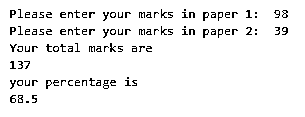

# Python 输入函数

> 原文：<https://www.educba.com/python-input-function/>


## Python 输入函数简介

为了与用户进行交互，无论是检索数据还是显示通知/警告/结果，您都需要一种可重用指令集的形式，通常称为函数。Python 为开发人员提供了下面提到的一组两个内置函数，可用于从键盘等外围设备读取用户输入。

### Python 输入函数

以下是 Python 输入的功能:

<small>网页开发、编程语言、软件测试&其他</small>

*   原始输入(“消息/输出”)
*   输入(“消息/输出”)

#### 1.原始输入(“消息/输出”)

该函数特定于 python 的旧版本，即 python 2.x

它读取用户输入的确切信息，并通过将该信息转换为字符串，将其存储到我们想要的特定变量中。

例如:

**代码:**

```
# Raw_input syntax
g = raw_input("Enter your name : ")
print (g)
```

**输出:**


这个功能是如何工作的？

运行这段代码后，Python 为您提供了一个输入文本的界面。


让我们输入“Python 用户”并点击 Enter。


一旦按下 Enter 键，Python 将使用打印功能打印用户输入的信息。


我们来详细讨论一下这段代码的流程。

Python 按照我们编写代码的顺序执行代码。所以我们一运行这个单元，第一行就被执行了。

**代码:**

```
g = raw_input("Enter your name : ")
```

它将文本“输入您的姓名:”打印到控制台，并提供一个对话框供用户输入信息。

然后，用户输入的信息被转换成一个字符串，并存储在变量“g”中

让我们通过检查变量“g”的类型来验证这一点。

**代码:**

```
type(g)
```

**输出:**


正如所料，输出的类型是“str”

回到我们离开的地方，控件现在可用于下一行

```
`print g`
```

不出所料，这会打印出变量' g '的值。

#### 2.输入(“消息/输出”)

该函数特定于 python 3.x 等较新版本的 python。

在 Python 3.x 中，raw_input()函数已被 input()函数所改变，因此这两个函数之间的唯一区别在于您使用的 Python 版本。

它也有同样的作用。一旦用户输入了信息，输入函数就评估该函数的数据类型，并将其保存到指定的变量中。

让我们试着用同样的例子来理解这一点。

**代码:**

```
#input syntax
g = input("Please enter text")
print (g )
type(g)
```

**输出:**


现在让我们尝试在 Python3.x 中使用 raw_input()函数来理解会发生什么。

**代码:**

```
# Raw_input usage with Python 3.x
g = raw_input("Please enter text")
```

**输出:**


我们一运行这个单元格，Python 就显式抛出上面的错误，指定在 Python 3.x 中没有定义 raw_input()函数。

### 如何用 Input()函数处理数值？

如果您希望用户输入一个数值，那么一旦输入函数将用户输入的信息读取为字符串，您就需要根据需要将其显式转换为整数或浮点数。

让我们用一个例子来讨论同样的问题:

**代码:**

```
##Example to read numerical values
num = input(" Please enter your marks : ")
num = int(num)
type(num)
```

这也可以在一行中完成，比如将输入函数包装在 int 函数中，如下所示:

**代码:**

```
num = int(input(" Please enter your marks : "))
type(num)
```

**输出:**


上面这段代码的操作顺序是:

*   首先，输入函数将使程序暂停，除非用户输入一个值并按 enter 键
*   一旦按下回车键，控制权就会传回给程序
*   用户输入的信息，并被转换成字符串
*   这个字符串被传递给 int()函数，并被转换成一个整数，然后保存到变量“num”
*   然后，type 函数验证变量“num”的数据类型


让我们再讨论一个提供用户输入的两个数字的乘积的例子。

**代码:**

```
num1 = int(input("Please enter num1: "))
num2 = int(input("Please enter num2: "))
print(num1 * num2)
```

假设用户输入 num1 = 2，num 2 = 3；根据上面的输入，输出将是 6。

**输出:**


### 如果你期望的是浮点数而不是整数呢？

如果您想将用户输入转换为 float，那么您需要做的就是使用 float()函数和 input()函数，如下所示:

**代码:**

```
mks1 = int(input("Please enter your marks in paper 1: "))
mks2 = int(input("Please enter your marks in paper 2: "))
print("Your total marks are")
print(mks1 + mks2)
print("your percentage is")
print((mks1+mks2)*100/200)
```

**输出:**




### 如果用户输入了无效的输入，即字符而不是数字，该怎么办？

假设用户输入 num1 = 3，num 2 = e

在这种情况下，Python 会抛出一个关于 int()函数的错误。


### 结论

要在 python 中读取用户指定的信息，您可以在较新版本的 python(如 Python 3.x)中使用 input()函数，在较旧版本的 Python(如 Python 2.x)中使用 raw_input()函数。不同之处仅在于 Python 版本中使用了 input() &raw_input()函数将用户指定的输入转换为字符串，然后保存到所需的变量中。如果您想和 input()函数一起读取数值，可以使用 int()或 float()函数

### 推荐文章

这是一个 Python 输入函数的指南。在这里，我们讨论 Python 输入函数及其示例和代码实现的简要概述。您也可以浏览我们推荐的其他文章，了解更多信息——

1.  [Python 的优势](https://www.educba.com/advantages-of-python/)
2.  [Python 中的递归函数](https://www.educba.com/recursive-function-in-python/)
3.  [Python 范围函数](https://www.educba.com/python-range-function/)
4.  [Python 设置函数](https://www.educba.com/python-set-function/)


