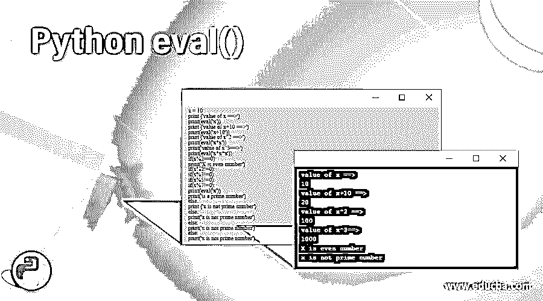
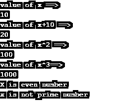
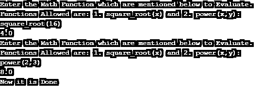

# Python eval()

> 原文：<https://www.educba.com/python-eval/>




## Python eval()简介

Eval()函数是 Python 编程语言的内置函数。eval()方法/函数解析传递给方法的表达式参数，并使用程序/程序语句运行 python(python 代码)的表达式。通俗地说，就是在程序中运行 python 编程代码(实际上是作为参数传递的)的 evaluation()方法。我们也可以说 eval()函数像 Python 代码表达式一样对“字符串”求值，然后字符串作为整数返回。

**语法:**

<small>网页开发、编程语言、软件测试&其他</small>

```
eval(expression, globals=None, locals=None)
```

**说明:**

Eval()函数通常需要 3 个参数，但是第 2 个<sup>第 2 个</sup>和第 3 个<sup>第 3 个</sup>参数项是可选的/没有第 1 个<sup>第 1 个</sup>参数重要。这 3 个参数是表达式、全局变量和局部变量。

*   **表达式参数:**这是与 Python 表达式一样被解析和评估的字符串。
*   **Globals 参数(dictionary 参数):**这个参数是一个字典，这个参数也是可选的。即使我们没有在 eval()函数中指定这个参数，也不会发生任何事情。
*   **Locals 参数(映射对象):**这个 Locals 参数是一个正在映射的对象 globals 参数的 dict 或 dictionary 通常是 Python 编程语言中最好的和标准的映射类型。

### Python Eval 函数如何与示例一起工作

Eval()函数/方法将在对表达式求值后返回值/结果。eval 函数通过解析字符串值来工作，该字符串值也作为 python 表达式进行计算。

#### 示例#1

在下面的语法示例中，创建了一个变量“x ”,并为其赋值“10”。然后使用 eval()函数生成一个打印语句来显示 x 的值。然后在那之后，“x+10 的值。== > "将被打印；之后，通过使用 eval()函数将 x 值和“10”值相加。然后“x^2==>的价值”将被打印。然后，通过在 eval()函数中将 x 值与 x 本身的值相乘，可以打印出 x 值的平方，即“10”的平方。然后，将使用 print()函数打印“x^3==>的价值”。然后使用 eval()函数将 x 的值乘以 x 的值 3 次，然后将打印 x 的值的立方。

现在 IF 和 ELSE 条件准备用 x 的值做质数逻辑程序，我们都知道质数是唯一被数‘1’和数本身整除的数。在下面的程序中，首先是 if，如果值 x 被值 2 整除，解释器转到下一个 IF 条件，检查值 x 是否被值 3 整除。假设 x 的值除以 3 不会剩下余数 0。在这种情况下，python 解释器转到下一个 IF 条件，检查 x 值是否除以值 7，并检查 x 值除以 7 是否得到 0，但这里 x 值没有被整除。因此，Python 编程语言的解释器转到 ELSE 条件。在 ELSE 条件中，print 语句将显示为“x 不是质数”。

在每个 if 语句中，如果 IF 条件为假，那么 python 的解释器将转到 ELSE 条件的语句，其中的编程将被打印/解释等..但是程序里面的 ELSE 条件也是一次一行地被解释。

**代码:**

```
x = 10
print ('value of x ==>')
print(eval('x'))
print ('value of x+10 ==>')
print(eval('x+10'))
print ('value of x^2 ==>')
print(eval('x*x'))
print('value of x^3==>')
print(eval('x*x*x'))
if(x%2==0):
	print('X is even number')
if(x%2!=0):
	if(x%3!=0):
		if(x%5!=0):
			if(x%7!=0):
				print(eval('x'))
				print('is a prime number')
			else:
				print ('x is not prime number')
		else:
			print('x is not prime number')
	else:
		print('x is not prime number')
else:
	print('x is not prime number')
```

**输出:**




#### 实施例 2

在下面的编程代码示例中，引入了数学库，并使用*符号导入了所有的数学函数。然后用初始化值“1”进行 for 循环，每次从值“1”递增“1”直到值“3”。然后在 for 循环中，使用输入函数创建一个 func1 变量，其字符串值为“输入下面提到的数学函数进行计算”，然后解释器转到下一行并打印“允许的函数有:1。平方根(x)和 2。Power(x，y)"然后转到下一行，打印/解释剩余的 python 代码。

现在我们进入尝试，除了概念。这些就像 IF 和 ELSE 条件一样。如果“try”有正确的参数，那么尝试正确运行并退出程序，否则 except 概念就会出现。Try，except concept 将非常有助于处理 eval()函数的错误和用法。try 中的语句将打印 eval()函数，该函数具有数学函数“平方根”以及 x 和 y 值的幂，这些值将由用户手动声明。如果输入不包含上述数学函数所需的任何输入，结果将被打印出来，循环将再次运行并再次要求输入，否则您可以只输入 except 概念。在那里，您将打印 ext1 值，解释器从 except 概念中脱离出来。然后，print 语句将像这样打印“现在完成了”。

**代码:**

```
from math import *
for lm in range(1, 3):
    func1 = input("Enter the Math Function which are mentioned below to Evaluate.\nFunctions Allowed are: 1\. square_root(x) and 2\. power(x,y):\n")
    try:
        print(eval(func1, {'square_root': sqrt, 'power': pow}))
    except Exception as ex1:
        print(ex1)
    break
print('Now it is Done')
```

**输出:**




### 推荐文章

这是 Python eval()的指南。在这里，我们讨论 python eval()函数的介绍和工作原理，以及不同的例子和它的代码实现。您也可以阅读以下文章，了解更多信息——

1.  [Python 绝对值](https://www.educba.com/python-absolute-value/)
2.  [Python 关键词](https://www.educba.com/python-keywords/)
3.  [Python 排序数组](https://www.educba.com/python-sort-array/)
4.  [Python argparse](https://www.educba.com/python-argparse/)


