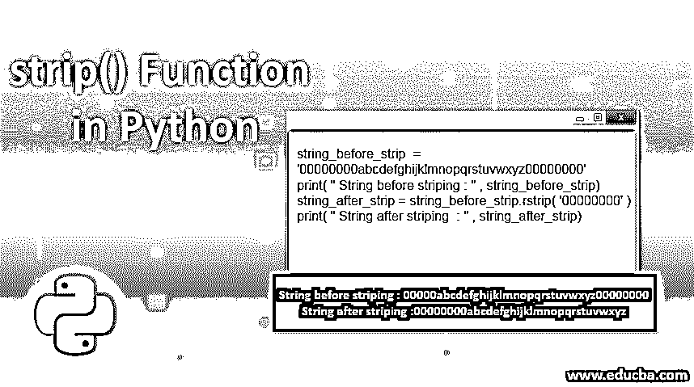

# Python 中的 strip 函数

> 原文：<https://www.educba.com/strip-function-in-python/>




## Python 中的 strip 函数简介

Python strip 函数用于以去除前导和尾随字符的方式剥离字符串。它是 python 中的内置函数。在去掉主要的和杂乱的字符后，在这个过程中将返回一个新的字符串。

**语法:**

<small>网页开发、编程语言、软件测试&其他</small>

```
string.strip([chars])
```

我们需要去除的字符的格式可以在 strip 函数中决定。当必须删除除空白以外的任何内容时，可以在“字符”位置提到它们。确切地说，需要分离的字符放在上面语法的“chars”位置。保留字带用于表示功能带。这个去废函数属于缺省库。因此它可以在没有任何库的情况下被调用。

### Python strip 函数是如何工作的？

strip 函数可以捕捉其中的大量参数。当 strip 函数没有传递任何参数时，strip 函数将删除并返回字符串前后的空格。如上所述，当 stripping 的字符匹配给定的字符串时，指定的字符将从共享字符串中删除。在没有找到匹配的情况下，不会对字符串进行任何更改。当 strip 函数中提到的字符串确实与左边要剥离的字符串匹配时，则停止移除字符串左边的前导字符。类似地，当 strip 函数中提到的字符串与右边要剥离的字符串匹配时，则停止移除字符串右边的前导字符。

此外，当剥离过程仅需要在给定管柱的一侧进行时，则为此目的使用两种不同的方法。它们是 String.rstrip()和 String.lstrip()方法。 [rstrip()方法](https://www.educba.com/python-rstrip/)用于剥离字符串右侧的给定字符集，而 lstrip()方法用于剥离给定字符串左侧的单词。

### Python 中 strip()函数的示例

下面是提到的例子:

#### 示例#1

下面的例子是用来剥离一个给定的字符串。

**代码:**

```
string_before_strip  = '00000000abcdefghijklmnopqrstuvwxyz00000000'
print( " String before striping : " , string_before_strip)
string_after_strip = string_before_strip.strip( '00000000' )
print( " String after striping  : " , string_after_strip)
```

**输出:**


**解释:**在上面的程序中，一个以零结尾和开头的字符串值被用作样本。一组零“00000000”作为字符串的剥离值传递。剥离过程前后的字符串值打印在控制台中。从派生的输出中，可以清楚地注意到所有的前导零和尾随零都已被成功删除，确切的实际字符串被单独打印在控制台中。

#### 实施例 2

下面的例子是用来剥离一个给定的字符串。

**代码:**

```
string_before_strip  = '00000000abcdefghijklmnopqrstuvwxyz00000000'
print( " String before striping : " , string_before_strip)
string_after_strip = string_before_strip.rstrip( '00000000' )
print( " String after striping  : " , string_after_strip)
```

**输出:**


**说明:**这里，在这个例子中，一个带有尾随和前导零的字符串值被用作样本。一组零“00000000”作为字符串的剥离值传递。剥离过程前后的字符串值打印在控制台中。这里没有使用普通的 strip()函数，而是使用了 rstrip()函数，这意味着去除所提到的字符串中的尾随零或右侧零。同样，在输出中可以注意到，所有尾随零都被成功删除，剩余的字符串被打印出来。

#### 实施例 3

下面的例子是用来剥离一个给定的字符串。

**代码:**

```
string_before_strip  = '00000000abcdefghijklmnopqrstuvwxyz00000000'
print( " String before striping : " , string_before_strip)
string_after_strip = string_before_strip.lstrip( '00000000' )
print( " String after striping  : " , string_after_strip)
```

**输出:**


**解释:**这里，在这个例子中，一个具有尾随和前导零的字符串值被用作样本。一组零“00000000”作为字符串的剥离值传递。剥离过程前后的字符串值打印在控制台中。这里没有使用普通的 strip()函数，而是使用了 l strip()函数，这意味着去掉前面提到的字符串中的前导零或左边的零。同样，在输出中可以注意到，所有左侧的零都被成功删除，剩余的字符串被打印出来。

#### 实施例 4

下面的例子是用来剥离一个给定的字符串。

**代码:**

```
string_before_strip  = '  00000000abcdefghijklmnopqrstuvwxyz00000000  '
print( " String before striping : " , string_before_strip)
string_after_strip = string_before_strip.strip()
print( " String after striping  : " , string_after_strip)
```

**输出:**


**解释:**这里，在这个例子中，还额外使用了一个字符串值，该字符串值有尾随零和前导零，并且在其顶部有前导空格和尾随空格。没有参数作为字符串的剥离值传递。剥离过程前后的字符串值打印在控制台中。正如我们所注意到的，strip 函数中参数的缺失实际上删除了前面提到的字符串中的前导和尾随空格。

#### 实施例 5

下面的例子是用来剥离一个给定的字符串。

**代码:**

```
string_before_strip  = '00000000abcdefghijklmnopqrstuvwxyz00000000'
print( " String before striping : " , string_before_strip)
string_after_strip = string_before_strip.strip('1234')
print( " String after striping  : " , string_after_strip)
```

**输出:**


**解释:**这里，在这个例子中，还额外使用了一个字符串值，该字符串值有尾随零和前导零，并且在其顶部有前导空格和尾随空格。一组整数作为剥离值传递。剥离过程前后的字符串值打印在控制台中。由于值条与实际的字符串值不匹配，因此不会对输入字符串进行任何更改。

### 推荐文章

这是 Python 中 strip()函数的指南。这里我们讨论 Python 中 strip()函数的简要概述及其示例和代码实现。您也可以浏览我们推荐的其他文章，了解更多信息——

1.  [Python 中的递归函数](https://www.educba.com/recursive-function-in-python/)
2.  [Python 范围函数](https://www.educba.com/python-range-function/)
3.  [Python 设置函数](https://www.educba.com/python-set-function/)
4.  [Python 格式()函数](https://www.educba.com/python-format-function/)


