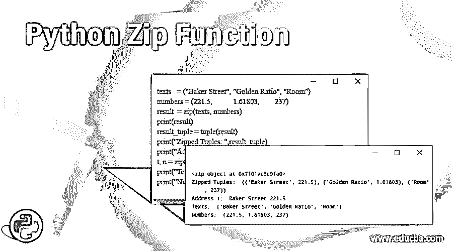

# Python Zip 函数

> 原文：<https://www.educba.com/python-zip-function/>




## Python Zip 函数简介

Zip 函数与 Python 中的 Lambda 函数和 Map 函数完全相反。基于 iterables 的 Zip 函数聚合。zip 对象是通过 zip()函数返回的，它是一个遍历结果的迭代器，无论是列表、元组还是任何可返回的对象。这是第一项和第二项的每个传递迭代器在每个传递迭代器中配对在一起的地方。假设传递的迭代器的长度不同，如果迭代器决定新的迭代器具有最少的项，则长度不同。用简单的术语来说，第 i <sup>个</sup>元素与每个可迭代参数序列的第 i <sup>个</sup>元组相关联。

### Zip 函数的语法

下面是 zip()函数的语法:

<small>网页开发、编程语言、软件测试&其他</small>

```
zip(*iterables)
```

#### 因素

zip 函数有两个参数:

*   **函数**:测试可迭代集合的元素是否基于。
*   **Iterable** :要过滤的 Iterable 可以是集合、元组、列表或任何迭代器的容器。

### 实现 Python Zip 函数的示例

下面是实现 Python zip()函数的例子:

#### 示例#1

考虑一个程序，它接收学生的名字和与分数相关的数字。

**代码:**

```
name = [ "Hemanth", "Anjum", "Ramya", "Saira" ]
id_no = [ 111, 92, 137, 103 ]
score = [ 40, 50, 60, 70 ]
# Mapping values using zip()
mapping = zip(name, id_no, score)
# A set of values print after conversion
mapping = set(mapping)
# resultant values are printed
print ("The zipped values are : ",end="")
print (mapping)
```

**输出:**


**说明:**在上面的代码中，要相互关联的列表是声明的。学生的姓名、身份证号和分数都是变量。通过使用 zip 函数可以知道关联链接。这个 zip 函数返回 iterable 值。iterable 或 object 值再次转换为列表并显示。

#### 实施例 2

考虑一个程序，它接收学生的名字和与分数相关的数字。

**代码:**

```
coordinate_plane = ['x', 'y', 'z']
val = [13, 14, 15]
res = zip(coordinate_plane, val)
res_list = list(res)
print(res_list)
c, v =  zip(*res_list)
print('c =', c)
print('v =', v)
```

**输出:**


#### 实施例 3

压缩值是这样的。

**代码:**

```
texts   = ("Baker Street", "Golden Ratio", "Room")
numbers = (221.5,           1.61803,        237)
result  = zip(texts, numbers)
print(result)
result_tuple = tuple(result)
print("Zipped Tuples: ",result_tuple)
print("Äddress 1: ",result_tuple[0][0], result_tuple[0][1])
t, n = zip(*result_tuple)
print("Texts: ",t)
print("Numbers: ",n)
```

**输出:**


**解释:**定义了两个 iterables。他们可以是任何东西。例如，元组或列表。这里，元组用在第一个文本中，用在第二个数字中。贝克街，黄金比例，房间都有各自的号码。通过将两个元组压缩在一起，这些数字会自动对齐并相互匹配。为了压缩这两个文件，我们使用了 zip 函数。当您打印 zipped 函数时，它返回一个 iterable 来将其转换为普通格式，我们使用 Tuple，它以 Tuple 形式打印结果。例如，如果通过使用索引来请求，则返回每个地址及其微粒。我们已经创建并打印了三个聚合元组。让我们假设我们有一个元组列表，我们希望解压缩以获得单独的 iterables。搜索一个名为 unzipped 的函数，这个函数可能并不存在，但是有一个 unzip 操作符，这是一个星号。所以，在你传递了聚集的元组之后，每个元组都有元素，并打印在结果中。

**Note:** The return value of zip() is not a list. It is a filter object (<zip object at 0x7ff5135f8fa0>). Which is an iterator over the results? This is highly favorable, especially working with large collections of data. We can, however, turn this into a tuple or a list by passing the zip to the list or tuple constructor.

### 用 Zip 函数解压值

使用相同的 zip 函数完成数据提取。列表前面使用星号( ***** )，表示解压缩后的值。数字列表和字符串列表也可以使用 zip 函数解压缩。

**代码:**

```
numList = [1558, 1884, 1111]
strList = ['one', 'two', 'three']
A_output = zip(numList, strList)
print(A_output)
a, b = zip(*A_output )
print('numList = ', a)
print('strlist = ', b)
```

**输出:**


**说明:**声明两位数链表和字符串链表。首先使用 zip 函数压缩这些列表，压缩后打印位置处的 Iterable 值或对象。压缩后的值使用星号(*)解压缩，该星号位于压缩后的结果值之前。输出显示了这两个列表，它们各自独立。

### 结论

Python 中的 Zip 函数是一个内置函数。它返回一个 zip 对象，通常称为 iterable。取 iterables 可以为零或更多。Python zip 函数甚至用于解压缩值。多个 iterables 查找；字典遍历是 Python 中 zip 函数最常见的用例。

### 推荐文章

这是一个 Python Zip 函数的指南。在这里，我们讨论语法、参数、使用正确语法实现的示例以及相应的示例代码。您也可以浏览我们的其他相关文章，了解更多信息——

1.  [Python 读取 CSV 文件](https://www.educba.com/python-read-csv-file/)
2.  [Python 字符串连接](https://www.educba.com/python-string-join/)
3.  [Python 打印表格](https://www.educba.com/python-print-table/)
4.  [Python 返回值](https://www.educba.com/python-return-value/)


