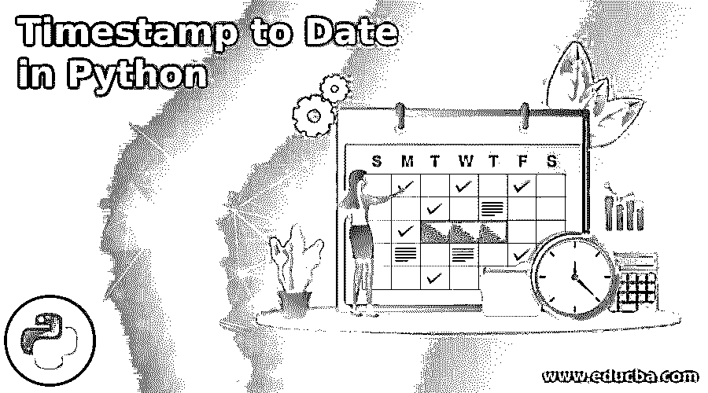

# Python 中迄今为止的时间戳

> 原文：<https://www.educba.com/timestamp-to-date-in-python/>




## Python 中的时间戳简介

到目前为止的时间戳是使用 python 将编码的数值转换成数据。时间戳是信息的编码或加密序列，并将其转换为日期和时间。python 使用安装的模块或方法将时间戳转换为日期。这是一种使用 python 编程语言将数字信息转换成日期的方法。python 语言安装了一个使用方法将时间戳更改为日期的功能。这是 python 技术中一种转换，用于保持和维护应用程序信息。

### Python 中时间戳的语法

下面给出了提到的语法:

<small>网页开发、编程语言、软件测试&其他</small>

时间戳从 UTC 的 1970 年 1 月 1 日开始转换。

timestamp to date 方法的基本语法如下:

```
fromtimestamp()
```

“fromtimestamp”方法有助于转换成日期和日期时间。值的对象保持在方法内部。

带有值的时间戳的基本语法如下:

```
fromtimestamp(timestamp value)
```

或者

```
fromtimestamp(timestamp value, tz = none)
```

“fromtimestamp”方法有助于转换成日期。“时间戳值”是要转换为日期的信息序列。“tz”指定时间戳的时区。该功能是可选的。

使用 python 语言的时间戳的语法如下:

```
datetime.fromtimestamp(timestamp value)
```

或者

```
datetime.fromtimestamp(timestamp object)
```

“日期时间”是一个 python 模块，用于转换成日期、日期时间、时间戳等。“fromtimestamp”方法有助于转换成日期。“时间戳值”是要转换为日期的信息的编码序列。python 默认安装了 datetime 模块。您不需要安装第三方软件进行转换。datetime 在“fromtimestamp”方法中使用对象或值。

时间戳到日期转换的语法如下所示:

```
datetime.fromtimestamp(objtmstmp).strftime('%d - %m - %y')
```

“datetime”是一个要转换成日期的 python 模块。“strftime”函数根据要求显示唯一的日期。该函数按照要求的格式使用日期、月份和时间。

### Python 中如何把时间戳转换成日期？

安装 python 软件或者使用在线 IDE 进行编码。

以下链接有助于下载 python 软件。

**网站链接:**【https://www.python.org/ T2】

使用创建一个 python 文件。py 扩展名。然后，开始写 python 代码。

**文件名:** main.py

导入“datetime”文件，开始将时间戳转换为日期。

```
from datetime import datetime
```

创建一个对象并初始化时间戳的值。

**objtmstmp = 14590157322**

使用“fromtimestamp()”方法放置数据或对象。

```
objectdate = datetime.fromtimestamp(objtmstmp)
```

或者

```
objectdate = datetime.fromtimestamp(14590157322)
```

时间戳转换后打印日期。

```
print(" date" , objectdate)
```

如果需要日期类型，则打印 python 的日期类型。

```
print("type of date object =", type(objectdate))
```

在 python 中结合时间戳的工作流程。

```
from datetime import datetime
objtmstmp = 14590157322
objectdate = datetime.fromtimestamp (objtmstmp)
print ("timestamp to date conversion.")
print (" date" , objectdate)
print ("type of date object =", type (objectdate))
```

### Python 中迄今为止的时间戳示例

以下是 Python 中迄今为止的时间戳示例:

#### 示例#1

1970 年示例和输出的时间戳到日期的转换。

**代码:**

```
from datetime import datetime
objtmstmp = 100043
objectdate = datetime.fromtimestamp (objtmstmp)
print ("timestamp to date conversion.")
print (" date" , objectdate)
print ("type of date object =", type (objectdate))
```

**输出:**


#### 实施例 2

2000 年示例和输出的时间戳到日期的转换。

**代码:**

```
from datetime import datetime
objtmstmp = 1000000000
objectdate = datetime.fromtimestamp (objtmstmp)
print ("timestamp to date conversion.")
print (" date" , objectdate)
print ("type of date object =", type (objectdate))
```

**输出:**


#### 实施例 3

时间戳到日期转换在 1970 年的例子和输出。

**代码:**

```
from datetime import datetime
objtmstmp = 2500000000
objectdate = datetime.fromtimestamp (objtmstmp)
print ("timestamp to date conversion.")
print (" date" , objectdate)
print ("type of date object =", type (objectdate))
```

**输出:**


#### 实施例 4

时间戳到日期转换为四位数的值的例子和输出。

**代码:**

```
from datetime import datetime
objtmstmp = 1000
objectdate = datetime.fromtimestamp (objtmstmp)
print ("timestamp to date conversion.")
print (" date" , objectdate)
print ("type of date object =", type (objectdate))
```

**输出:**


#### 实施例 5

时间戳到日期转换为一个五位数的值并输出。

**代码:**

```
from datetime import datetime
objtmstmp = 10005
objectdate = datetime.fromtimestamp (objtmstmp)
print ("timestamp to date conversion.")
print (" date" , objectdate)
print ("type of date object =", type (objectdate))
```

**输出:**


#### 实施例 6

将时间戳转换为日期并输出。

**代码:**

```
from datetime import datetime
objtmstmp = 1000641
objectdate = datetime.fromtimestamp (objtmstmp)
print ("timestamp to date conversion.")
print (" date" , objectdate)
print ("type of date object =", type (objectdate))
```

**输出:**


#### 实施例 7

时间戳到日期转换成月份的例子和输出。

**代码:**

```
from datetime import datetime
objtmstmp = 10006416
objectdate = datetime.fromtimestamp (objtmstmp)
print ("timestamp to date conversion.")
print (" date" , objectdate)
print ("type of date object =", type (objectdate))
```

**输出:**


#### 实施例 8

时间戳到日期转换为当前日期的例子和输出。

**代码:**

```
import datetime;
print ("Display current time")
current_time = datetime.datetime.now()
print ("current time:-", current_time)
print ("Display timestamp")
time_stamp = current_time.timestamp()
print ("timestamp:-", time_stamp)
```

**输出:**


#### 实施例 9

时间戳到日期转换为当前日期的例子和输出。

**代码:**

```
from datetime import datetime
objtmstmp = 1500000
objectdate = datetime.fromtimestamp(objtmstmp).strftime('%d - %m - %y')
print ("timestamp to date conversion.")
print (" date (date - month - year):" , objectdate)
objectdate = datetime.fromtimestamp(objtmstmp).strftime('%y - %d - %m')
print ("timestamp to date conversion.")
print (" date (year - date - month):" , objectdate)
objectdate = datetime.fromtimestamp(objtmstmp).strftime('%m - %d - %y')
print ("timestamp to date conversion.")
print (" date (month - date - year ):" , objectdate)
```

**输出:**


### 结论

它有助于毫不费力地在数据库中保存日期和时间。web 应用程序使用最小代码显示时间戳值的日期。到目前为止的时间戳将日期和时间一起存储，没有任何复杂的内容。它用于更新、搜索日期和时间，没有冗长的代码。

### 推荐文章

这是一个到目前为止 Python 中时间戳的指南。这里我们讨论一下入门，如何在 python 中把时间戳转换成日期？还有例子。您也可以看看以下文章，了解更多信息–

1.  [Python 中的 Shell 排序](https://www.educba.com/shell-sort-in-python/)
2.  [Python 中的插入排序](https://www.educba.com/insertion-sort-in-python/)
3.  [Python 中的烧瓶](https://www.educba.com/flask-in-python/)
4.  [Python 列表扩展](https://www.educba.com/python-list-extend/)


