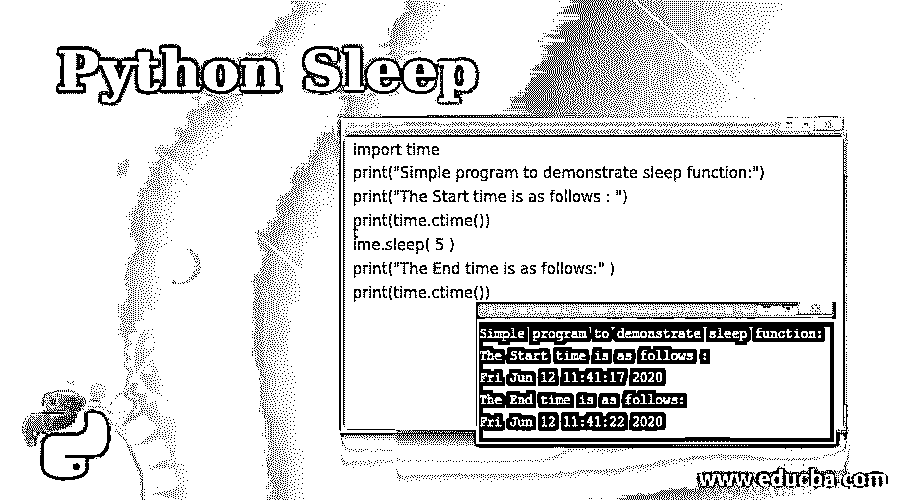

# 巨蟒睡眠

> 原文：<https://www.educba.com/python-sleep/>




## Python 睡眠函数介绍

在本文中，我们将看到 Python 中时间模块提供的最常用的函数之一是 sleep()函数。time 模块的 sleep()函数用于暂停或中止当前代码或线程的执行，暂停次数以秒为单位。sleep()函数将一个参数作为以秒为单位的时间，为了精确起见，可以用浮点来指定。这个 sleep()函数用在类似戏剧性字符串打印的应用程序中，也用在多线程处理中。

### Python 中 sleep()函数的工作原理

在本节中，我们将看到 Python 时间方法 sleep()。sleep()函数在浮点数中以秒为单位暂停代码或线程执行指定的次数，该浮点数可用于为参数指定准确的睡眠时间。让我们在下面的章节中介绍这个函数的语法和例子。

<small>网页开发、编程语言、软件测试&其他</small>

**语法:**

`time.sleep(ts)`

#### Python 中 sleep()函数的参数

**ts:** 该参数用于指定执行应该暂停的时间，以秒为单位。

这个 sleep()函数将不返回任何内容，因为它只是用来将函数或代码或线程挂起指定的时间(以秒为单位)。

### 用 Python 实现 sleep()函数的例子

以下是 Python 中 sleep()函数的示例:

#### 示例#1

**代码:**

```
import time
print("Simple program to demonstrate sleep function:")
print("The Start time is as follows : ")
print(time.ctime())
time.sleep( 5 )
print("The End time is as follows:" )
print(time.ctime())
```

**输出:**


**说明:**在上面的程序中，我们可以看到，首先我们需要导入时间模块来使用 sleep()函数，因为它是 Python 中时间模块的函数。我们可以看到第一个开始时间是使用时间模块的 ctime()函数显示的，它显示当前时间。然后我们看到了使用 sleep()函数停止执行时显示的结束时间，然后显示了使用 sleep()函数停止执行线程时的当前时间。

让我们看看 sleep()函数的用法或 sleep()的应用程序。首先，我们将看到 sleep()函数可用于打印单词，每次打印一个字母，以获得更好的用户界面。让我们在下面的例子中演示一下。

#### 实施例 2

打印给定消息或字符串的生动方式。

**代码:**

```
import time 
print("Program to demonstrate sleep() function used for printing words letter by letter:")
strn = "Educba"
print("The given word is as follows:")
print(strn)
for i in range(0, len(strn)): 
	print(strn[i], end ="") 
	time.sleep(0.3) 
```

**输出:**


**解释:**在上面的程序中，我们看到我们有一个字符串在这个程序中定义为“Educba”，所以我们正在尝试使用 sleep()函数一个字母一个字母地打印这个单词。在这里，我们将时间指定为 0.3 秒。这意味着每 0.3 秒后，使用 for 循环打印每个字母，起始范围为给定字符串长度的 0 索引，直到给定字符串长度的结尾，并使用 sleep 函数。为了看到视觉效果，我们必须在本地 Python 编辑器中执行上面的程序。

现在让我们看看 sleep()函数的另一种用法，它对多线程很重要，因为 sleep()函数用于停止当前线程的执行，这仅在多线程处理过程中完成。让我们看看如何使用时间方法 sleep()在 Python 中演示这一点。

#### 实施例 3

**代码:**

```
import time
from threading import Thread
class Worker(Thread):
    def run(self):
        for x in range(0, 12):
            print(x)
            time.sleep(1)
class Waiter(Thread):
    def run(self):
        for x in range(100, 103):
            print(x)
            time.sleep(5)
print("Starting Worker Thread will start from :")
Worker().start()
print("Starting Waiter Thread will stop at:")
Waiter().start()
print("Done") 
```

**输出:**


**说明:**在上面的程序中，我们从“threading”中导入了模块 time 和 thread 模块。在这段代码中，我们可以看到我们创建了两个类，一个用于启动工作线程，另一个用于停止工作线程的执行，其中 sleep()函数用于指定停止线程执行的时间。在 worker 类中，我们定义了 for 循环，该循环将每秒打印从 0 到 12 的数字。在 waiter 类中，我们在 sleep()函数中指定了“5 ”,在每 5 个数字之后，它将在下一个线程中打印接下来的 5 个数字，线程范围指定为从 100 到 103。因此，当数字范围从 0 到 12 时，将有 3 个线程被创建，每个线程有 5 个数字，除了第三个线程只有两个数字。这个过程是在执行上述程序后看到的，截图如上图。

### 结论

在本文中，我们得出结论，我们已经通过示例了解了 Python 的 sleep()函数的语法和工作方式。在本文中，我们看到了可以从哪个模块定义 sleep()函数。因此我们看到我们需要导入一个提供各种方法的时间模块，而 sleep()函数是 Python 中时间模块最流行的方法。在本文中，我们看到了一个演示 sleep()函数的简单示例，它将秒数指定为一个参数。最后，我们看到了 sleep()函数应用程序，它用于戏剧性的打印和多线程。

### 推荐文章

这是 Python 睡眠指南。在这里，我们讨论 Python Sleep 方法及其示例的简要概述，以及它的代码实现。您也可以浏览我们推荐的其他文章，了解更多信息——

1.  [Python 编程的优势](https://www.educba.com/advantages-of-python/)
2.  [Python 中的递归函数是什么？](https://www.educba.com/recursive-function-in-python/)
3.  [Python 范围函数介绍](https://www.educba.com/python-range-function/)
4.  [Python 集合函数的 7 大方法](https://www.educba.com/python-set-function/)


