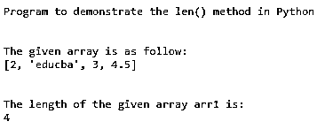
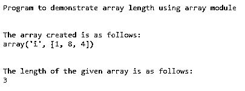

# Python 数组长度

> 原文：<https://www.educba.com/python-array-length/>


## Python 数组长度介绍

在本文中，Python 中的数组长度被定义为由一组元素或项目组成的数组，这些元素或项目也可以被视为给定数组中的项目列表。以及使用各种方法或函数作为给定数组中的元素或项目的总数来计算的数组长度，例如 len()方法，该方法将以数组长度的形式返回给定数组的元素总数，其中它总是比整数格式的最高数组索引大 1，该最高数组索引从 0 而不是 1 开始索引，这被称为数组长度。

### Python 数组长度的处理

在 python 中，数组被定义为项目或元素的集合或列表，在本文中，我们将讨论数组的长度。在 Python 中，使用 len()函数计算数组的长度，该函数返回由给定数组中存在的元素或项目的数量组成的整数值，在 Python 中称为数组长度。数组的长度用于定义数组的容量，以存储已定义数组中的项目。不同的编程语言如 Javascripts 或 PHP array 都类似于 list，但在 Python 中，array 和 list 是不同的。

<small>网页开发、编程语言、软件测试&其他</small>

在下一节中，我们将看到如何使用 Python 编程语言计算给定数组的数组长度。在 Python 中，使用 len()方法计算数组长度，在下面的程序中让我们演示一下。

让我们看看 python 中 len()方法的语法:

**语法:**

```
len( given_arr_name )
```

在上面的语法中，我们可以看到我们已经传递了需要计算数组长度的数组名。该函数返回一个整数值，该值等于数组中作为参数传递给该函数的元素总数。

### Python 数组长度的示例

以下是使用 Python 计算数组长度的不同示例:

#### 示例#1

**代码:**

```
print("Program to demonstrate the len() method in Python")
print("\n")
arr1 =  [2,'educba', 3, 4.5]
print("The given array is as follow:")
print(arr1)
print("\n")
print("The length of the given array arr1 is: ")
print(len(arr1))
```

**输出:**




在上面的程序中，我们可以看到我们用方括号声明了数组，也称为 Python 列表。在名为 arr1 的给定列表或数组中，我们有不同数据类型的不同元素，如 integer、string、float 等。在上面的程序中，我们试图通过将数组 arr1 传递给 len()方法来打印它的长度。此方法返回给定数组中存在的元素数量。在屏幕截图中，我们可以看到输出显示 len()方法的输出为 4，这意味着在打印声明的整个数组之前，给定数组中存在 4 个元素。

在 Python 中，数组有助于通过显式声明数组名称和数组大小或长度来减少代码的整体大小，这可以很容易地在数组和 Python 中保存任意数量的元素，有一个名为 array 的模块，可以导入该模块来处理数组及其长度或大小。

在 Python 中，它提供了一个名为 array 的模块，其中保存了不同的方法，声明 array 也很容易。在下一节中，让我们看看如何使用一个数组模块来声明数组并使用 len()函数找到它的长度。下面的程序演示了如何使用数组模块计算数组长度。

#### 实施例 2

**代码:**

```
import array as arr1
print("Program to demonstrate array length using array module")
print("\n")
a=arr1.array('i', [1, 8, 4] )
print("The array created is as follows:")
print(a)
print("\n")
print("The length of the given array is as follows:")
print(len(a))
```

**输出:**




在上面的程序中，我们可以看到，首先，我们导入了数组模块，然后我们使用数组对象 arr1 来定义数组。我们可以在第 6 行中看到，我们正在定义数组，其中“I”表示整数数据类型，我们可以使用“d”表示浮点，等等。然后我们打印使用 arr1 对象创建的数组，然后我们使用 len()函数，将创建的数组传递给存储在变量“a”中的函数。当我们打印 len()函数的结果时，它返回给定数组中元素数量的整数值。从上面的截图中，我们可以看到给定数组的长度是 3，因为在上面的程序中给定数组中有 3 个项目。

在 Python 中，数组长度是一个概念，可以用在各种应用程序中，我们希望存储相同数据类型的数据，也可以在数组中存储任意数量的项，还可以通过使用数组的索引来访问数组的任意元素。在 Python 中，数组长度可以用于定义数组容量，这意味着当我们知道要定义的固定数据时，或者如果用户无法找到为数组声明的数据容量，那么我们可以使用这个数组长度概念来找到给定或声明的数组中存在的元素数量。

### 结论

在本文中，我们得出结论，在 Python 中数组和列表数据结构是两回事。因此，在本文中，我们看到了用于查找给定数组中出现的项目总数的数组长度的定义。在这里，我们还看到了如何在 Python 程序中使用 len()函数计算数组长度。在这篇文章中，我们也看到了 len()函数是如何在 Python 的数组模块中使用的。在这篇文章中，我们看到了它是如何被演示的，我们也给出了例子。我们可以得出结论，数组长度是一个寻找给定或声明数组的数组大小的概念。

### 推荐文章

这是 Python 数组长度的指南。在这里，我们讨论 python 中 len()的工作原理，以计算给定数组中出现的项目总数，并给出示例及其代码实现。您也可以看看以下文章，了解更多信息–

1.  [Python 排序列表](https://www.educba.com/python-sort-list/)
2.  [Python 数组函数](https://www.educba.com/python-array-functions/)
3.  [Python 排序数组](https://www.educba.com/python-sort-array/)
4.  [Python 中的字符串数组](https://www.educba.com/string-array-in-python/)


