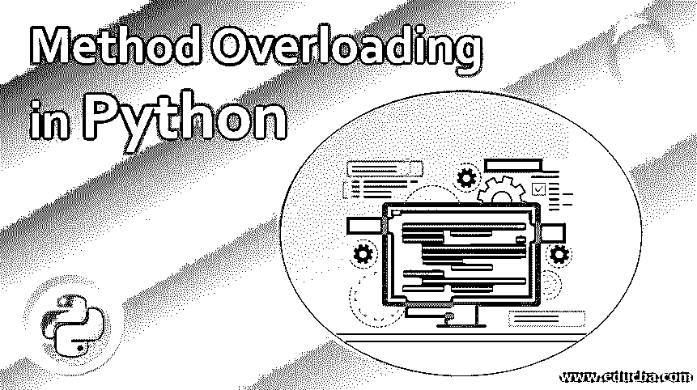
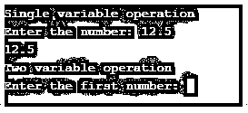
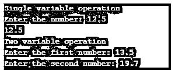
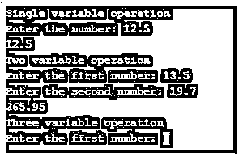
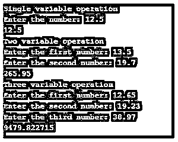

# Python 中的方法重载

> 原文：<https://www.educba.com/method-overloading-in-python/>

## Python 中的方法重载介绍

方法重载是 Python 提供的一种独特的方法。使用这个特性，一个方法可以以多种方式调用的方式来定义。每次调用一个方法时，它取决于用户如何调用该方法，即在该方法中传递多少和什么参数。因此，调用该方法时可以不使用参数，也可以使用单个或多个参数。Python 提供的这种功能在 Python 中被称为方法重载。该功能允许以用户定义的方式控制方法的使用。

**语法:**

<small>网页开发、编程语言、软件测试&其他</small>

`class class_name:
def method_name(self, name = None)
# method code
# Create object instance
object_variable = class_name()
# Call the method
object_variable.method_name()
# Call the method with a single parameter
object_variable.method_name(parameter)
# Call the method with multiple parameters
object_variable.method_name(parameter1, parameter2 )`

### Python 中的方法重载是如何工作的？

如前所述，[方法重载指的是](https://www.educba.com/method-overloading-in-c-plus-plus/)通过传递可变数量的参数，单个方法可以以多种方式使用。例如，我们可能想要返回指定参数的乘积。参数的数量可以是两个或三个，或者只有一个参数。

### Python 中方法重载的例子

以下是 Python 中方法重载的示例:

#### 示例#1

**代码:**

`# Define the class
class multiply:
# Define the method
def mult_num(self, n1 = None, n2 = None, n3 = None):
if n1 != None and n2 != None and n3 != None:
print(n1 * n2 * n3)
elif n1 != None and n2 != None:
print(n1 * n2)
else:
print(n1)
# Creating object as an instance of class
object_multiply = multiply()
# Sinlge variable method execution
object_multiply.mult_num(20)
# Two variable method execution
object_multiply.mult_num(20, 30)
# Three variable method execution
object_multiply.mult_num(20, 30, 40)`

**输出:**

在上面的程序中，我们有类乘。该类有一个名为 mult_num 的方法。该方法以三个数字作为参数。使用 if-elif-else 语句，检查任何数字是否等于零。当只有一个数字作为参数传递时，程序只是打印这个数字。当两个数作为参数传递时，程序返回这两个数的乘积，当三个数作为参数传递时，程序返回三个数的乘积。因此，我们发现一个程序正以用户要求的方式被使用。在任何情况下，这个方法都能正确地完成它的工作。

在上面的程序代码中，参数作为硬编码值传递，因此，我们得到如下所示的输出。

#### 实施例 2

我们将稍微修改上面的程序代码，从某种意义上说，我们从用户那里获取输入。

**代码:**

`# Define the class
class multiply:
# Define the method
def mult_num(self, n1 = None, n2 = None, n3 = None):
if n1 != None and n2 != None and n3 != None:
print(n1 * n2 * n3)
elif n1 != None and n2 != None:
print(n1 * n2)
else:
print(n1)
# Creating object as an instance of class
object_multiply = multiply()
# Sinlge variable method execution
print("Single variable operation")
object_multiply.mult_num(float(input("Enter the number: ")))
# Two variable method execution
print("Two variable operation")
object_multiply.mult_num(float(input("Enter the first number: ")), float(input("Enter the second number: ")))
# Three variable method execution
print("Three variable operation")
object_multiply.mult_num(float(input("Enter the first number: ")), float(input("Enter the second number: ")), float(input("Enter the third number: ")))`

**输出:**

我们可以看到这些输入参数不再是硬编码的。它们可以动态传递。输入变量的默认数据类型是一个字符串，所以我们需要先把它转换成一个数字。因此，我们使用 float 函数进行类型转换。让我们看看程序代码在执行时是如何工作的。

最初，执行单变量操作。我们将 12.5 作为输入传递，并得到与输出相同的数字。然后我们转到“两个变量操作”，如下图所示。

在“两个变量操作”中，我们指定第一个数字为 13.5，第二个数字为 19.7，如下图所示。

浏览下面的截图，我们得到了作为输入参数传递的两个十进制数的乘积。乘积为 265.95。一旦执行了两个变量的操作，我们就转移到“三个变量的操作”，如下图所示。

最后，我们可以看到程序代码返回三个变量的乘积，这可以在输出的底部看到。

通过上面的程序，我们看到了[方法重载的概念在 Python 中是如何工作的](https://www.educba.com/method-overloading-in-php/)。我们主要做的是创建一个对象，并将其分配给这个类。作为操作符的类对象对类中定义的方法进行操作。对象根据需求来调节功能的使用。

通过上面的两个例子，我们处理了数字数据。现在，我们来看一个通过字符串变量示例演示方法重载概念的程序。

#### 实施例 3

程序代码如下所示。浏览代码，看看每个组件是如何工作的。

**代码:**

`class Name:
def name_declare(self, name1 = None, name2 = None):
if name1 is not None and name2 is not None:
print("Hello, I am " + name1 + " " + name2+".")
elif name1 is not None:
print("Hello, I am " + name1 + ".")
else:
print("Hi, How are you doing?")
object_name = Name()
# method execution by passing both name and surname.
object_name.name_declare("John", "Maurice")
# method execution by passing just name.
object_name.name_declare("Matthews")
# method execution by not passing any parameter.
object_name.name_declare()`

当 Python 中的上述程序代码被执行时，我们得到如下截图所示的输出。

### 结论

方法重载是 Python 提供的一种非常重要的方法。该方法在需要基于条件使用和执行某些参数的复杂情况下非常有用。必须适当使用该方法，以避免错误使用任何参数。

### 推荐文章

这是 Python 中方法重载的指南。在这里我们讨论介绍，方法重载在 Python 中是如何工作的？还有例子。您也可以看看以下文章，了解更多信息–

1.  [Java 中的重载和覆盖](https://www.educba.com/overloading-and-overriding-in-java/)
2.  [Python 开关语句](https://www.educba.com/python-switch-statement/)
3.  [Java 中的重载](https://www.educba.com/overloading-in-java/)
4.  [c#中的方法重载](https://www.educba.com/method-overloading-in-c-sharp/)

