# Python 中的模式

> 原文：<https://www.educba.com/patterns-in-python/>

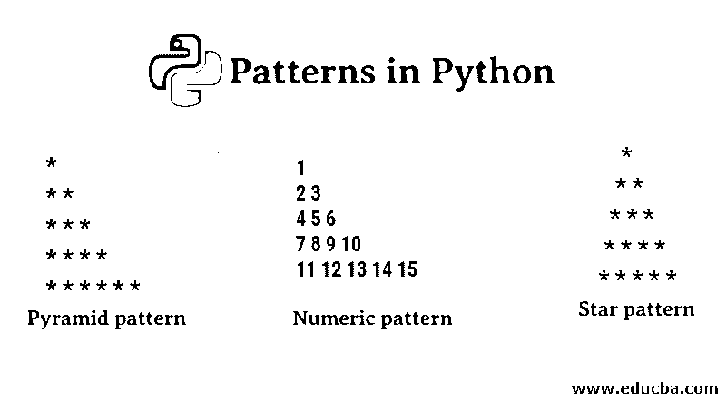


## Python 中的模式介绍

在 python 语言中，我们可以通过使用 For 循环来创建模式。在这里，我们可以对它们进行循环操作，这样，我们就可以打印出语句，以便得到一个独特的模式，比如星形、数字和字符模式。我们可以使用市场上任何一款 [python 编译器](https://www.educba.com/best-compiler-for-python/)来执行程序。

### 模式和示例的类型

让我们首先尝试创建最有趣的，星形模式。我们可以使用两个 for 循环；外部 for 循环可用于处理许多行，而内部 for 循环可用于处理许多列。

<small>网页开发、编程语言、软件测试&其他</small>

#### 类型 1。星形图案

打印星星金字塔图案的程序。

##### 示例#1

在本例中，我们将在第一行打印一颗星，在第二行打印两颗星，并以类似的方式继续这样做，直到我们到达第五行。

**代码:**

```
#Python Program for printing pyramid pattern using stars

for i in range(0, 5):
    for j in range(0, i+1):
        print("* ",end="")
    print() 
```

**输出:**

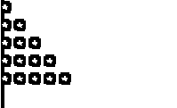


**Note: **The end parameter in python is used to end a print statement with any char or string using the end parameter.

##### 示例 2

现在让我们试着将上面的金字塔旋转 180 度，这样我们就可以得到不同风格的星形图案**。**在本例中，我们以同样的方式开始打印星星，但从右侧或左侧最后一列开始，或从右侧第一列开始，或从第 0 行第 4 <sup>列开始，或从第 1 <sup>第 1</sup>行第 5 <sup>列开始。</sup></sup>

**代码:**

```
#Python Program for printing pyramid pattern using stars
a = 8
for i in range(0, 5):
    for j in range(0, a):
        print(end=" ")
    a = a - 2
    for j in range(0, i+1):
        print("* ", end="")
    print() 
```

**输出:**

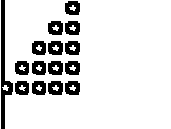


##### 实施例 3

现在让我们看看如何使用星星打印一个三角形:在这个程序中，我们还将询问范围，这将决定这个三角形可以延伸的高度 t。这里我们运行 3 个 for 循环，其中第一个 for 循环用于循环列，另外两个 for 循环(子循环)用于循环行。

**代码:**

 `**输出:**


##### 实施例 4

现在让我们看看另一个程序，之后我们将结束恒星模式的说明。上面的程序与第二个程序有一点不同，即 b)，这里我们试图在第一行打印一颗星，然后在第二行打印 3 颗星，在第三行打印 5 颗星，以此类推，因此我们在循环的第二个结束时将“l”计数增加 2。

**代码:**

```
# Python Pyramid pattern using a star pattern

k = 16
l = 1
for i in range(0, 5):
    for j in range(0, k):
        print(end=" ")
    k = k - 4
    for j in range(0, l):
        print("* ", end="")
    l = l + 2
    print() 
```

**输出:**


#### 类型 2。数字模式

现在我们将讨论一些数字模式的例子。

##### 示例#1

我们现在将尝试打印数字的金字塔图案。所以它会是这样的:在第一行，你会看到数字 1，在第二行，它将由数字 2 和 3 组成，第三行将由数字 4，5 和 6 组成，系列将像这样继续。

**代码:**

```
# Python Numeric Pattern Example 1

k = 1
for i in range(0, 5):
    for j in range(0, i+1):
        print(k, end=" ")
        k = k + 1
    print() 
```

**输出:**


##### 实施例 2

现在让我们试着用另一种风格在数字上印出金字塔图案。这里我们将尝试在第一行打印数字 1，在第二行打印数字 1 和 2，在第三行打印数字 1，2 和 3，就这样继续下去。

**代码:**

```
# Python Numeric Pattern Example 2

for i in range(0, 5):
    num = 1
    for j in range(0, i+1):
        print(num, end=" ")
        num = num + 1
    print() 
```

**输出:**


##### 实施例 3

这是另一个 python 程序以模式的形式打印数字的例子。在这里，我们试图通过使用两个 for 循环，并在内部 for 循环中将 number 变量的值增加 1，在外部 for 循环中将变量 inc 的值增加 2，来以行号的平方结束行。

**代码:**

```
# Python Numeric Pattern Example 3

numb = 1
inc = 1
for i in range(0, 5):
    for j in range(0, inc):
        print(numb, end=" ")
        numb = numb + 1
    print()
    inc = inc + 2 
```

**输出:**


还有其他各种各样的例子，我将在这里简单介绍一下。

##### 实施例 4

在这个程序中，我们将打印给定行号的相同数字，并且前一行的值将比当前行号少一个。通过使用外部和内部 for 循环，并在范围 10(赋值)内运行外部循环，内部循环在外部 for 循环的指定范围内运行，可以实现这一结果。

**代码:**

 `**输出:**

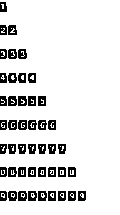


##### 实施例 5

在本例中，我们将尝试查看数字，并按列打印出来。第一列将从指定的值范围开始，如(1，2，3，4 和 5)，第二列将从第二行开始，第三列将从第三行开始，并一直持续到循环结束。

**代码:**

```
># Python Numeric Pattern Example 5

last_num = 6
for row in range(1, last_num):
    for column in range(row, 0, -1):
        print(column, end=' ')
    print("") 
```

**输出:**

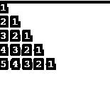


##### 实施例 6

它类似于前面的程序，但是这里我们取数字的平方。

**代码:**

```
# Python Numeric Pattern Example 6

last_num = 9
for i in range(1, last_num):
    for j in range(-1+i, -1, -1):
        print(format(2**j, "4d"), end=' ')
    print("") 
```

**输出:**

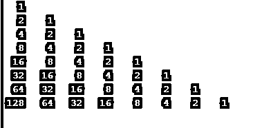


##### 实施例 7

它类似于以前的程序。

**代码:**

```
# Python Numeric Pattern Example 7

last_num = 9
for i in range(1, last_num):
    for i in range(0, i, 1):
        print(format(2**i, "4d"), end=' ')
    for i in range(-1+i, -1, -1):
        print(format(2**i, "4d"), end=' ')
    print("") 
```

**输出:**


##### 实施例 8

在这里，我们将尝试以直角三角形模式按相反的顺序打印数字。

**代码:**

```
# Python Numeric Pattern Example 8

stop = 2
start = 1

current_num = stop
for row in range(2, 6):
    for col in range(start, stop):
        current_num -= 1
        print (current_num, end=' ')
    print("")
    start = stop
    stop +=row
    current_num = stop 
```

**输出:**

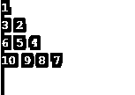


#### 类型 3。字符模式

现在我们将看到一些字符模式的例子。

##### 示例#1

在这里，我们将尝试显示字母的金字塔模式。大写字母 A 的 ASCII 值从 65 开始，这意味着大写字母 Z 的 ASCII 值将是 90。在这个例子中，我们将数值 65 转换成大写字母 A，因此在循环中迭代以增加“值”变量。

**代码:**

```
Source Code:
# Python Character Pattern Example 1

value = 65
for i in range(0, 5):
    for j in range(0, i+1):
        ch = chr(value)
        print(ch, end=" ")
        value = value + 1
    print() 
```

**输出:**

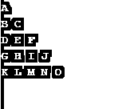


##### 实施例 2

这里我们将重复字符的行数。这里有一个简单的例子来说明我们如何做到这一点。

**代码:**

```
# Python Character Pattern Example 2

value = 65
for i in range(0, 5):
    for j in range(0, i+1):
        ch = chr(value)
        print(ch, end=" ")
    value = value + 1
    print() 
```

**输出:**

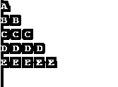


##### 实施例 3

这将与示例 a)类似，除了我们用比前一行多 2 个值来结束行号。为了实现这一点，我们加入了另一个名为“inc”的变量，并在外部 for 循环中将它递增 2。

**代码:**

```
# Python Character Pattern Example 3

value = 65
inc = 1

for i in range(0, 5):
    for j in range(0, inc):
        ch = chr(value)
        print(ch, end=" ")
        value = value + 1
    inc = inc + 2
    print() 
```

**输出:**

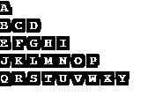


##### 实施例 4

这个例子和 a)类似，但是我们把图案旋转了 180 度。

**代码:**

```
# Python Character Pattern Example 4

decrement = 8
counter = 64
value = 65
for i in range(0, 5):
    for k in range(0, decrement):
        print(end=" ")
    for j in range(0, i+1):
        counter = counter + 1
    value = counter
    temp = value
    for j in range(0, i+1):
        ch = chr(value)
        print(ch, end=" ")
        value = value - 1
    value = temp
    decrement = decrement - 2
    print() 
```

**输出:**

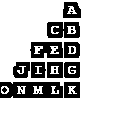


现在，你已经看到了这么多例子，让我们试着画出一些有趣的模式。

##### 实施例 5

在这个程序中，我们将尝试使用任何值(可以是数字、字符等)打印正方形图案。)下面是它的样子。

**代码:**

```
# Python Program to Print Square Star Pattern

square_side = int(input("Please enter the square dimension  : "))

print("Square Pattern") 

for i in range(square_side):
    for i in range(square_side):
        print("$", end = '  ')
    print() 
```

**输出:**

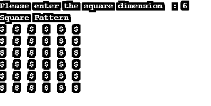


##### 实施例 6

我们有一个非常相似的例子，但是我们用*替换了$以得到如下的结果。

**代码:**

```
# Python Program to Print Square Star Pattern

square_side = int(input("Please Enter dimension of square  : "))

print("Star Square  Pattern") 

for i in range(square_side):
    for i in range(square_side):
        print('*', end = '  ')
    print() 
```

**输出:**

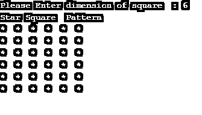


### 结论

本文介绍了使用 python 打印模式的多个例子，包括星形模式、数字模式和字符模式。我们也简单解释了这个程序是用来做什么的，以及它背后的工作。一旦理解了这些并在您自己的 python 环境中编译，您应该会对 python 中的模式创建问题感到轻松；我们的文章涵盖了广泛的例子。

### 推荐文章

这是 Python 中的模式指南。在这里，我们讨论了 python 中 3 种不同类型的模式及其示例和输出。您也可以浏览我们推荐的文章，了解更多信息——

1.  [Python 是什么](https://www.educba.com/what-is-python/)
2.  [Python 运算符](https://www.educba.com/python-operators/)
3.  [Java 中的星型模式](https://www.educba.com/star-patterns-in-java/)
4.  [c#中的模式](https://www.educba.com/patterns-in-c-sharp/)


``