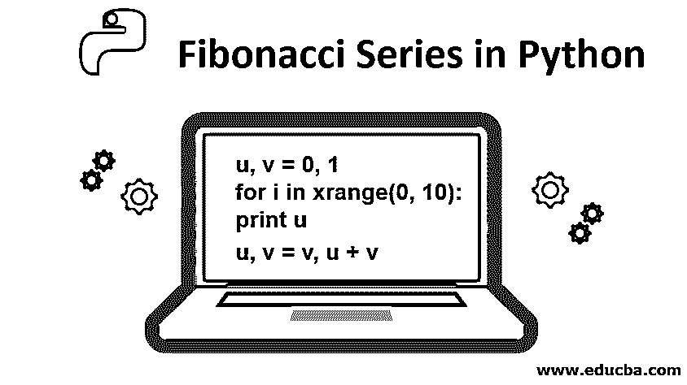
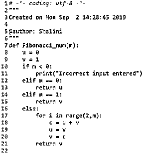
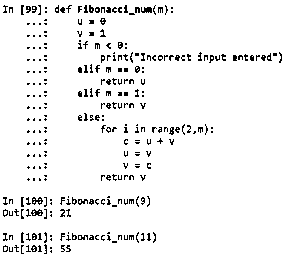
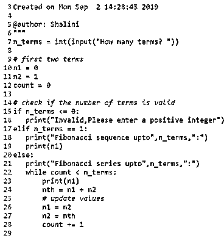
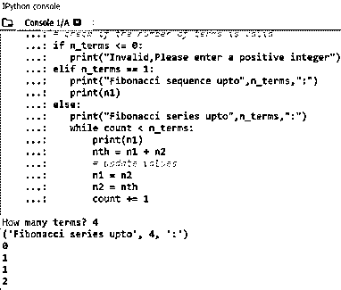
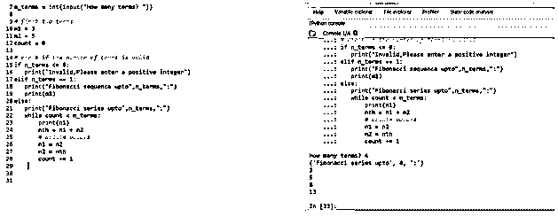
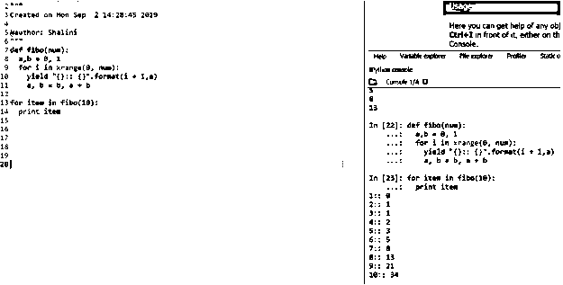
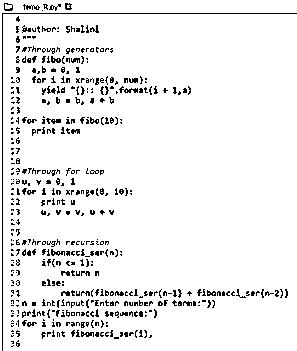

# Python 中的斐波那契数列

> 原文：<https://www.educba.com/fibonacci-series-in-python/>




## Python 中的斐波那契数列简介

斐波纳契数列可以解释为一个数字序列，其中的数字可以由前面两个数字相加而成。它从 1 开始，可以上升到任意有限数的序列。它是 1，1，2，3，5，8，13，21，..等等。因为 python 是基于面向对象的概念设计的，所以可以使用多个条件语句来设计斐波那契数列的逻辑。实现斐波纳契数列的三种常用方法是“使用 [python 生成器](https://www.educba.com/python-generators/)”、“使用递归”和“使用 for 循环”。

**例如:**

<small>网页开发、编程语言、软件测试&其他</small>

0, 1, 1, 2, 3, 5, 8, 13, 21, 34, 55, 89 ..等等

所以这里 0+1 =1

1+1 = 2

1+2 = 3

2+3 = 5

3+5 = 8

5+8 = 13

8+ 13 = 21 等等。

看了上面的内容，你会对我们正在谈论的事情有一定的了解。

然而，就数学规则而言，它可以写成:


其中第 n 个数字是第(n-1)位和第(n-2)位的数字之和。当涉及到实现斐波那契数列时，可能有许多编码语言可以完成。

然而，Python 是现在广泛使用的语言。让我们来看看斐波那契数列通过 Python 的实现。人们应该了解基本的条件语句，如循环、if-else、while 循环等。，然后继续这里的操作。如果没有，如果你能修改它，然后继续接下来的内容，那就太好了。出于演示的目的，我使用 spyder，这是 Python 编程语言的 IDE。人们也可以使用任何其他 IDE 或 Ipython 笔记本来执行 [Python 程序](https://www.educba.com/python-sets/)。

### Python 中的斐波那契数列

我们来看看斐波那契数和数列的实现考虑 1 <sup>st</sup> 斐波那契的两个元素是 0 和 1:

然而，你可以根据自己的需要调整斐波那契函数，但是先看基础的，然后再慢慢看其他的。

#### 寻找第 n 个斐波那契数的 Python 代码

**代码 1:**

```
def Fibonacci_num(m): 
    u = 0
    v = 1
    if m < 0: 
        print("Incorrect input entered") 
    elif m == 0: 
        return u 
    elif m == 1: 
        return v
    else: 
        for i in range(2,m): 
            c = u + v 
            u = v
            v = c 
        return v
```

**代码 2:**




**输出:**




可以看出，在第 9 个<sup>位</sup>的斐波那契数是 21，在第 11 个<sup>位</sup>的斐波那契数是 55。

*   这里“fibonacci_num”是一个定义的函数，它负责在某些条件的帮助下找到 fibonacci 数。这个函数可以通过指定任何位置来调用。

现在让我们看看如何打印系列，直到提到的位置:

**代码:**




**输出:**




人们可以注意到斐波那契数列的开始被定义为 0 和 1。

*   如果有人想定义自己的起始项，也可以通过调整 n1 和 n2 以同样的方式完成。这是一个例子:

假设我们希望起始项是:n1 = 3，n2 = 5




所以在这里，您的第 4 个<sup>个</sup>期限位置(用户输入)将根据您的起始期限决定。

### 生成斐波那契数列的方法

下面是生成斐波那契数列的三种方法:

#### 1.通过发电机

**代码:**

```
def fibo(num):
  a,b = 0, 1
  for i in xrange(0, num):
    yield "{}:: {}".format(i + 1,a)
    a, b = b, a + b
for item in fibo(10):
  print item
```

**输出:**




这个方法被称为“生成器”，因为函数 xrange 是 0 和 num 之间的数字的生成器，yield 是格式化输出的生成器。

下面是 xrange 为您做的事情:


这里斐波纳契数列已经被定义为函数的形式，其中 for 循环、xrange 和 yield 函数负责输出。

#### 2.直通 for 循环

**代码:**

```
u, v = 0, 1
for i in xrange(0, 10):
    print u
    u, v = v, u + v
```

**输出:**


可以看到，一个简单的 for 循环被用来打印 0 到 10 之间的斐波那契数列。在 for 循环中，变量被赋予了新的值。u 和 v 是斐波那契数列的默认初始值，分别设置为 0 和 1。

当循环继续运行时，新的 u 值是旧的 v 值，而新的 v 值是 u 和 v 的旧值之和，这一直持续到范围值结束。

#### 3.通过递归

**代码:**

```
#Through recursion
def fibonacci_ser(m):
    if(m <= 1):
        return m
    else:
        return(fibonacci_ser(m-1) + fibonacci_ser(m-2))
m = int(input("Enter number of terms:"))
print("Fibonacci sequence:")
for i in range(m):
    print fibonacci_ser(i),
```

**输出:**


*   函数“fibonacci_ser”调用自身来打印 fibonacci 数列。
*   因此这种方法被命名为“递归”。

**以下步骤:**

1.  这里要求用户输入斐波纳契数列需要打印的位置。
2.  数字通过函数“fibonacci_ser”传递。
3.  检查所提供的长度是否小于 1。如果是，立即给出结果。
4.  然而，如果长度大于 1，则使用长度小于 1 和 2 的参数对“fibonacci_ser”进行递归调用，即 fibonacci_ser(m-1)和 fibonacci_ser(m-2)。
5.  因此，递归给出期望的输出并打印出来。

*   因此，简而言之，我们讨论了显示[斐波纳契数列](https://www.educba.com/fibonacci-series-in-javascript/)的三种方式。
*   通过 for 循环、生成器和递归。

### 总结了所有三个 Python 代码

下面是三段 python 代码:

#### 1.通过发电机

**代码:**

```
def fibo(num):
  a,b = 0, 1
  for i in xrange(0, num):
    yield "{}:: {}".format(i + 1,a)
    a, b = b, a + b
for item in fibo(10):
  print item
```

#### 2.直通 for 循环

**代码:**

```
u, v = 0, 1
for i in xrange(0, 10):
    print u
    u, v = v, u + v
```

#### 3.通过递归

**代码:**

```
def fibonacci_ser(n):
    if(n <= 1):
        return n
    else:
        return(fibonacci_ser(n-1) + fibonacci_ser(n-2))
n = int(input("Enter number of terms:"))
print("Fibonacci sequence:")
for i in range(n):
    print fibonacci_ser(i),
```

以上总结的都是程序；一个人需要练习才能很好地掌握一切。

**输出:**




### 结论

浏览以上斐波纳契数列的内容，你会对斐波纳契数列有一个清晰的理解，特别是 python。一旦你熟悉了斐波纳契数列的逻辑，生成另一个数列，使用其他数字和各种方法对你来说将是轻而易举的事情。逻辑方法是在这方面取得成功的唯一途径。

### 推荐文章

这是用 Python 写的斐波那契数列指南。这里我们讨论斐波纳契数和数列，专门用于 python，生成另一个数列，处理其他数，以及各种方法。您也可以浏览我们的其他相关文章，了解更多信息——

1.  [Python 中的数学函数](https://www.educba.com/math-functions-in-python/)
2.  [Python 中的阶乘](https://www.educba.com/factorial-in-python/)
3.  [Python 中的封装](https://www.educba.com/encapsulation-in-python/)
4.  [Java 中的 Fibonacci 数列](https://www.educba.com/fibonacci-series-in-java/)


