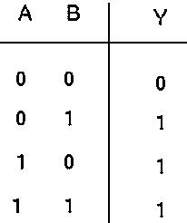
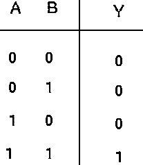

# Python 中的闰年程序

> 原文：<https://www.educba.com/leap-year-program-in-python/>


## Python 中闰年程序介绍

如果一年能被 4 整除，则该年被认为是闰年，以 00(世纪年)结尾的年份除外。如果世纪年能被 400 整除，那么它就是闰年。然而，不能被 400 整除也不能被 100 整除的年份不是闰年。

**举例:**

<small>网页开发、编程语言、软件测试&其他</small>

*   2004 年是闰年。
*   2020 年是闰年。
*   1900 年不是闰年。
*   2013 年不是闰年。

### Python 中闰年的例子

以下是 python 中不同的闰年示例:

#### 示例 1–使用 Elif 的

 ****代码:**

```
input_year = int(input("Enter the Year to be checked: "))
if (input_year%400 == 0):
          print("%d is a Leap Year" %input_year)
elif (input_year%100 == 0):
          print("%d is Not the Leap Year" %input_year)
elif (input_year%4 == 0):
          print("%d is a Leap Year" %input_year)
else:
          print("%d is Not the Leap Year" %input_year)
```

**输出:**


**说明:**

*   首先，用户将输入他选择的年份，这需要检查闰年。根据算法，如果一年能被 400 整除，那一年就是闰年。所以第一个 if 语句是“(输入年份%400 == 0)”。
*   现在，当年份不能被 400 整除时，将执行第二个 If 语句，即“(input_year%100 == 0)”。如果“(输入年份%100 == 0)”评估为真。这意味着这是一个世纪年，但不是闰年。
*   现在，当上述两个语句都不满足 True 时，第三个语句将被求值为“input_year%4 == 0”。如果这满足，那么这一年是闰年，否则不是闰年。

#### 示例 2–使用嵌套 If

**代码:**

```
input_year = int(input("Enter the Year to be checked: "))
if(input_year%4 == 0):
    if(input_year%100 == 0):
        if(input_year%400 == 0):
            print("%d is Leap Year" %input_year)
        else:
            print("%d is Not the Leap Year" %input_year)
    else:
        print("%d is Leap Year" %input_year)
else:
    print("%d is Not the Leap Year" %input_year)
```

**输出:**


**说明:**

*   用户需要输入他/她想要检查闰年的年份。将检查第一个条件“(输入年份%4 == 0)”。如果它实现了，那么它将在嵌套的 if-else 语句中。否则，如果条件“(input_year%4 == 0)”的计算结果为 False，则该年立即不是闰年。
*   现在“(输入年份%4 == 0)”得到评估。条件“(input_year%4 == 0)”被选中用于世纪年。当条件“(input_year%100 == 0)”的计算结果为假时，即余数来表示年份不是世纪年，那么这就是闰年。
*   条件“(输入年份%100 == 0)”当评估为真时，即余数为零。然后，进一步嵌套 if 语句来检查 400 的整除性。现在“(输入年份%400 == 0)”得到评估。当一年能被 400 整除时，那一年就是闰年。否则，不是闰年。

#### 示例 3–使用条件语句

**代码:**

```
input_year = int(input("Enter the Year to be checked: "))
if (( input_year%400 == 0)or (( input_year%4 == 0 ) and ( input_year%100 != 0))):
    print("%d is Leap Year" %input_year)
else:
    print("%d is Not the Leap Year" %input_year)
```

**输出:**


**说明:**

*   输入年份，希望检查闰年/非闰年。条件(input_year%400 == 0)或这意味着任何能被 400 整除的年份，无疑都是闰年。条件((输入年份%4 == 0)和(输入年份%100！= 0)).从逻辑上来说，能被 4 整除而不能被 100 整除的一年是闰年。
*   首先将评估条件“(输入年份%4 == 0)”。当结果为真时，则条件"(input_year%100！= 0)”将被计算。条件”(input_year%100！= 0)”就是评估 year 是不是世纪年。因此，可以推断，如果非世纪年能被 4 整除，那么它就是闰年。

这里是“或”和“与”的条件表，供参考。

**或:**




**和**:




然后结果会相应地打印出来。

#### 示例 4–使用函数

**代码:**

```
#function defined 
def LeapYearCheck(input_year): 
    if (input_year % 4) == 0: 
        if (input_year % 100) == 0: 
            if (input_year % 400) == 0: 
                return True
            else: 
                return False
        else: 
             return True
    else: 
        return False  
# Driver Code  
input_year = int(input("Enter the Year to be checked: "))
if(LeapYearCheck(input_year)): 
    print("Leap Year") 
else: 
    print("Not a Leap Year")
```

**输出:**


**说明:**

*   这种方法类似于方法 2；只是方法 2 的步骤(上面提到的)是以函数的形式封闭起来的。每次需要检查闰年/非闰年时，都会调用该函数。
*   用 python 为任何任务编写函数都是很好的练习。因为它有助于代码的模块化，从而增强代码的可读性。

### 结论

这里我们看到了寻找闰年的逻辑及其在 Python 中的各种实现方式。这里我们列出了四种主要方法:人们也可以尝试许多其他方法。做同一件事总有许多方法。这里只是检查年份，所以速度不是很重要。然而，如果逻辑很复杂，速度确实很重要。

### 推荐文章

这是一个用 Python 编写的闰年程序指南。这里我们讨论 Python 中闰年程序及其代码实现的顶级例子。您也可以浏览我们的其他相关文章，了解更多信息——

1.  [Python 中的子字符串](https://www.educba.com/python-substring/)
2.  [Python 中的字符串数组](https://www.educba.com/string-array-in-python/)
3.  [Python 全局变量](https://www.educba.com/python-global-variable/)
4.  [Java 中的闰年程序](https://www.educba.com/leap-year-program-in-java/)


**