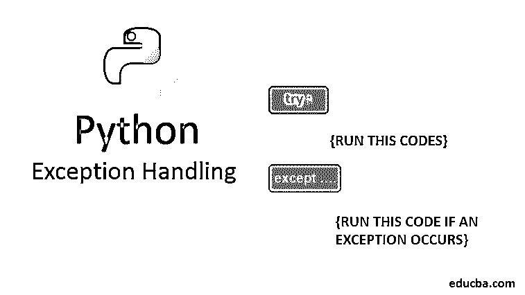

# Python 异常处理

> 原文：<https://www.educba.com/python-exception-handling/>

**

** 

## Python 异常处理简介

与大多数其他面向对象的编程语言一样，Python 提供了一种机制来处理程序代码执行过程中可能产生的所有错误，该机制提供了一组健壮而有效的方法，以最合适的方式处理每个错误，在技术上通过关键字(如 try 和 except)来实现，这种机制被称为 Python 异常处理。

**语法:**

<small>网页开发、编程语言、软件测试&其他</small>

```
try:
Executes when suspicious code is executed    
except Exception1:
   Executed when exception 1 is raised
except Exception2:
   executed when exception 2 is raised
else:
   If there is no exception then execute this block.
```

### 标准例外列表

*   **异常:**所有异常基类
*   **StopIteration:** 当迭代器的[的下一个方法没有指向对象时，引发该异常](https://www.educba.com/iterator-in-java/)
*   **SystemExit:** 通过 sys.exit()函数提升。
*   **StandardError:** 除了 StopIteration 和 SystemExit，它充当所有内置函数的基类。
*   **算术错误:**对于所有的数字错误，这些异常充当基类。
*   **OverflowError:** 如果计算超过数值类型的最大可能值，则会引发此错误。
*   **floating pointer error:**浮点操作失败会触发此错误
*   **ZeroDivisionError:** 当代码中出现被零除的情况时引发
*   **AssertionError:** 当 assert 语句失败时，则触发该错误
*   **AttributeError:** 当赋值或属性引用失败时，就会引发此错误
*   **EOFErroR:** 当没有来自任何函数的更多输入并且到达文件结尾时引发
*   **ImportError:** 在导入申报失败时引发。
*   **KeyboardInterrupt:** 当程序执行中断时触发
*   所有的查找错误都属于这个基类
*   **索引错误:**未找到索引时引发
*   **KeyError:** 当字典没有保存提到的键值时引发
*   **NameError:** 因程序中缺少本地或全局标识符而引发
*   **unboundlocalrerror:**使用未赋值的局部变量时引发。
*   **EnvironmentError:** 发生在 python 外部的面向环境的错误的基类
*   **IOError:** 在输入/输出过程不成功时引发
*   **语法错误:**这个异常处理所有面向 python 语法的错误
*   **IndentationError:** 不正确的缩进会导致这类错误
*   **SystemError:** 这发生在解释器没有按预期工作的情况下，但是这个错误并没有使 python 程序停止执行
*   **SystemExit:** 当 python 解释器使用 sys.exit()函数时，就会导致这个异常。如果处理不当，这会导致代码异常终止。
*   **TypeError:** 当一个操作对于一个特定的数据类型无效时，那么就会提示这个错误
*   **ValueError:** 当一个函数拥有一个有效的类型参数，但是为该类型的参数指定了一个不正确的值
*   **RuntimeError:** 如果不满足上述任何一个类别，则会引发此错误
*   当一个想要在继承类中实现的抽象方法实际上没有被实现时引发。整理和管理这些异常是由 except 块执行的过程，它被插入到每个 try 块的末尾。

### Python 中的异常处理过程

*   除了有多个例外的条款
*   除了没有提到例外的条款
*   除了带参数的子句

下面我们将讨论 Python 中的异常处理过程。

#### 1.带有多个例外的 Except 子句

这允许在一个 except 子句中声明多个 except 语句，并且所有这些声明的异常都可以从这个 except 子句中引发。

**语法:**

```
try:
Code block1
except(Exception1[, Exception2[,...ExceptionN]]]):
Executes when one among the exception happens
else: executed when no exception is raised
```

#### 2.没有例外的 Except 子句

try 块触发的所有异常都可以在这里处理。

**语法:**

```
try:
Code block1
except:
   Executes if any type of exception happens
else:
   If there is no exception then execute this block.
```

#### 3.带参数的 Except 子句

异常的实际原因将保存在参数值中

**语法:**

```
try:
   Code block1
except ExceptionType, Argument:
   Argument value is printed here
```

#### 4.异常处理程序

**语法:**

```
try:
   fh = open("testfile1", "w")
   try:
      fh.write("Exception handeling") 
   finally:
      print "Going to close the file"
      fh.close()
except IOError:
   print "Error: can\'t find file or read data"
```

### 结论

每一种编程语言都有在面对一系列意想不到的情况时引发异常的过程，python 是其中之一，它产生了处理这些异常的深刻技术，这使它成为一种强大的基础 meted 编程语言。

### 推荐文章

这是 Python 异常处理的指南。这里我们讨论标准的异常列表和过程以及语法。您也可以浏览我们推荐的其他文章，了解更多信息——

1.  [Python 框架](https://www.educba.com/python-frameworks/)
2.  [Python 编译器](https://www.educba.com/python-compilers/)
3.  [VB.NET 的异常处理](https://www.educba.com/exception-handling-in-vb-dot-net/)
4.  [Java 中的异常处理](https://www.educba.com/exception-handling-in-java/)


