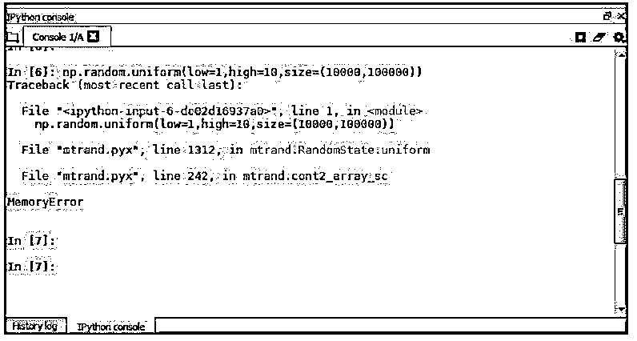
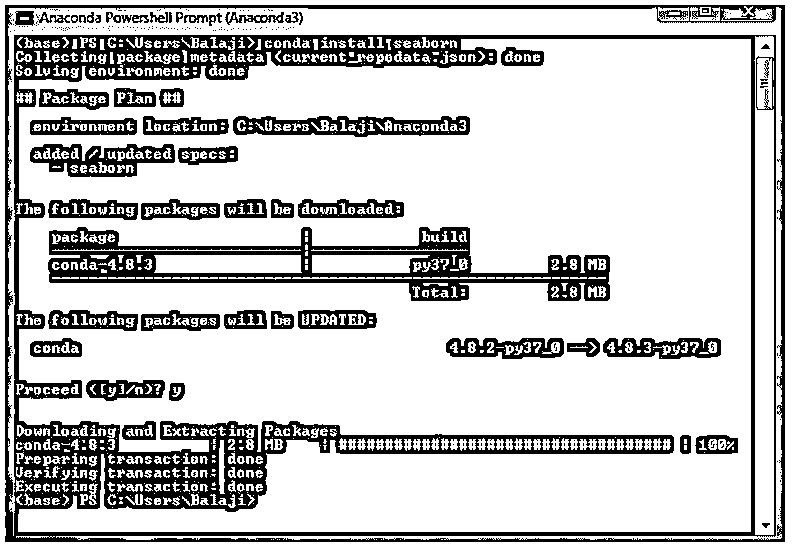
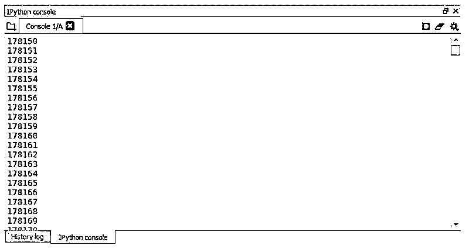
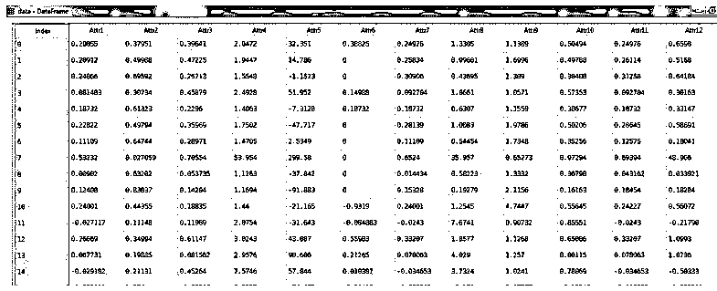

# Python 内存错误

> 原文：<https://www.educba.com/python-memory-error/>


## Python 内存错误介绍

内存错误是 python 中的一种错误，当我们正在使用的 RAM 的内存无法支持我们代码的执行时会发生这种错误，因为 RAM 的内存较小，而我们正在执行的代码需要的内存多于我们现有 RAM 的内存，这通常发生在大量数据被输入内存时，以及程序在处理数据时内存不足时。

### Python 内存错误的语法

当执行生成或使用大量数据的操作时，会导致内存错误。

<small>网页开发、编程语言、软件测试&其他</small>

**举例:**

**代码:**

```
## Numpy operation which return random unique values
import numpy as np
np.random.uniform(low=1,high=10,size=(10000,100000))
```

**输出:**




同一个函数，让我们看看名字错误。

**代码:**

```
## Functions which return values
def calc_sum(x,y):
op = x + y
return(op)
```

生成范围从低值 1 到最高值 10、大小从 10000 到 100000 的随机数的 numpy 操作将向我们抛出一个内存错误，因为 RAM 无法支持生成如此大量的数据。

### 内存错误是如何工作的？

最常见的情况是，当程序创建任意数量的对象，并且 ram 的内存用完时，就会出现内存错误。在研究机器学习算法时，大多数大型数据集似乎都会产生内存错误。python 编程期间会出现不同类型的内存错误。有时，即使您的 RAM 大小足以处理数据集，您也会遇到内存错误。这是因为您可能有时会使用 Python 版本；如果您的系统采用 64 位版本，32 位将无法工作。在这种情况下，您可以从系统中卸载 32 位 python，并从 Anaconda 网站安装 64 位。当您使用 pip 命令或其他命令安装不同的 python 包时，可能会导致不正确的安装并引发内存错误。

在这种情况下，我们可以在 python 提示符下使用 conda install 命令，并安装这些包来修复内存错误。

**举例:**




当内存管理器使用了我们系统的硬盘空间来存储超过 RAM 容量的数据时，就会出现另一种类型的内存错误。工作时，计算机存储所有的数据，并用尽内存抛出一个内存错误。

### 在 Python 中避免内存错误

python 中最重要的内存错误是在使用大型数据集时发生的。在研究机器学习问题时，我们经常会遇到大型数据集，在执行分类或聚类的 ML 算法时，计算机内存会立即耗尽内存。我们可以通过执行生成器函数来解决这些问题。它可以用作用户定义的函数，在处理大数据集时可以使用。

生成器允许我们有效地将大型数据集分成许多片段，而无需加载完整的数据集。在我们必须处理大量数据的大型项目中，生成器非常有用。生成器是用来返回迭代器的函数。迭代器可以用来循环数据。在 python 中编写一个普通的迭代器函数会循环整个数据集并遍历它。这就是生成器派上用场的地方，它不允许整个数据集循环，因为这会导致内存错误并终止程序。

generator 函数有一个不同于其他函数的特殊特征，在其他函数中，使用了一个名为 yield 的语句来代替返回函数输出的传统 return 语句。

下面给出一个示例生成器函数:

**代码:**

```
def sample_generator():
for i in range(10000000):
yield i
gen_integ= sample_generator()
for i in gen_integ:
print(i)
```

**输出:**




在这个样本生成器函数中，我们已经使用样本生成器函数生成了整数，该函数被赋值给变量 gen_integ，然后该变量被迭代。这允许我们一次迭代一个值，而不是传递整组整数。

在下面给出的示例代码中，我们试图使用生成器函数将一个大数据集读入小块。这种读取将允许我们在有限的大小内处理大量数据，而不会完全耗尽系统内存。

**代码:**

```
def readbits(filename, mode="r", chunk_size=20):
with open(filename, mode) as f:
while True:
data = f.read(chunk_size)
if not data:
break
yield data
def main():
filename = "C://Users//Balaji//Desktop//Test"
for bits in readbits(filename):
print(bits)
```

**输出:**




当我们处理大量对象时，还有一种有用的技术可以用来释放内存。清除未被引用的对象的一个简单方法是使用垃圾收集器或 gc 语句。

**代码:**

```
import gc
gc.collect()
```

导入垃圾收集器和 gc.collect()语句允许我们通过删除用户不引用的对象来释放内存。

还有其他方法可以管理系统 CPU 的内存，我们可以编写代码来限制 CPU 对内存的使用。

**代码:**

```
import resource
def limit_memory(Datasize):
min_, max_ = resource.getrlimit(resource.RLIMIT_AS)
resource.setrlimit(resource.RLIMIT_AS, (Datasize, max_))
```

这使我们能够管理 CPU 的使用，以防止内存错误。

可以用来克服记忆错误的一些其他技术是限制我们正在工作的样本大小，特别是在执行复杂的机器学习算法时。或者我们可以用更多的内存更新我们的系统，或者我们可以使用像 Azure、AWS 等云服务。这为用户提供了强大的计算能力。

另一种方法是使用关系数据库管理技术，其中像 MySQL 这样的开源数据库是免费的。它可以用来存储大量数据；此外，我们可以适应大数据存储服务，以便有效地处理大量数据。

### 结论

详细地说，我们已经看到了 Python 编程语言中出现的内存错误以及克服名称错误的技术。python 内存错误中需要记住的主要内容是操作发生时 RAM 的内存使用情况，有效地使用上述技术将允许我们克服内存错误。

### 推荐文章

这是一个 Python 内存错误的指南。这里我们分别讨论 python 中的介绍、工作和避免内存错误。您也可以看看以下文章，了解更多信息–

1.  [Python IOError](https://www.educba.com/python-ioerror/)
2.  [Python 中的自定义异常](https://www.educba.com/custom-exception-in-python/)
3.  [Python 断言错误](https://www.educba.com/python-assertionerror/)
4.  [Python 对象到字符串](https://www.educba.com/python-object-to-string/)


