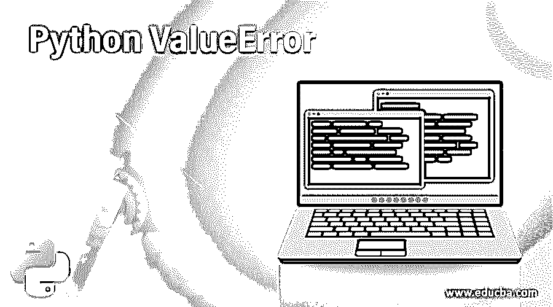

# Python 值错误

> 原文：<https://www.educba.com/python-valueerror/>




## Python 值简介错误

Python 值当您要为其赋值的对象的内容有问题时，会出现错误。这些 Python 值错误是 Python 编程语言中的内置异常。Python 值错误的语法是:

`List = [1,2,….n] [1…n] = list
Print(n)`

<small>网页开发、编程语言、软件测试&其他</small>

**其中，**

*   n 是我们在括号内添加的值的数量。
*   当我们没有将这些值赋给适当的变量时，我们最终会在 Python 中得到一个 ValueError。
*   Python ValueError 在容量获得正确类型但不明智的价值争用时引发。
*   在编写程序时，我们可能会犯某些错误，导致我们试图运行它时出错。python 程序在遇到未处理的错误时结束。

### ValueError 在 Python 中是如何工作的？

现在我们看看这些 ValueErrors 在 Python 中是如何工作的。有时，您可能需要从纲要中卸载组件或质量。你可以把去掉的品质分成因素或另一个新的纲要。在任何情况下，如果缩减组件的数量多于因子的数量，则在任务过程中会出现错误。这个错误是一个 ValueError，在 Python 中有许多要卸载的特性，将被 Python 抛出。例如，想象你有一只狗，你试图把它放在一个鱼缸里。这是一个善意的错误，因为“猎犬”类型的生物肯定不等同于“鱼”类型的生物。然后，设想我们试图将一只大丹犬放入一家拉布拉多宠物酒店。这将是一个关于狗的判断的问题，理由是尽管它们都是“猎犬”类型，拉布拉多宠物酒店不会选择承认一只大丹犬大小的犬科动物。

#### 示例#1

**代码:**

```
List = [1,2,3,4,5]
a,b,c = List
print(a)
print(b)
print(c) 
```

**输出:**


**说明:**在上面的程序中，我们给一个名为 list 的变量赋值。分配的号码必须打印出来。数组中总共有 5 个数字，这里我们只给这些数字分配了 3 个变量。因此，错误发生了，并要求我们为给定值分配更多的变量，因为在代码中没有分配足够的值。

#### 示例 2–在数组中定义一个数组

**代码:**

```
list = [[1,2],[3,4],[5,6],[7,8],9]
a,b,c = list
print(a)
print(b)
print(c) 
```

**输出:**


**解释:**在上面的程序中，我们尝试在一个数组内部赋值一个数组。这里，我们创建一个数字数组，并初始化每个数组的值。同样，我们尝试给这些数组值赋值变量，这里赋值的变量数量比数组值的其余部分要少。因此，输出中会出现错误。

### Python 中如何避免 ValueError？

现在我们看到了上面发生的错误的解决方案，以及如何在 Python 中避免这些异常。避免数值误差的最好方法是协调因子的数量和缩减组件的数量。你也可以用一个圆圈来强调这些组件，并分别打印出来。

#### 示例#1

**代码:**

```
List = [1,2,3,4,5]
a,b,c,d,e = List
print(a)
print(b)
print(c)
print(d)
print(e)
```

**输出:**


在第一个解决方案示例中，我们首先决定如何通过将所有变量分配给各自的数组编号并打印这些数组值所分配到的所有变量来防止简单的数组值异常。因此，问题得到了解决，我们得到了上面的输出。

#### 实施例 2

**代码:**

```
list = [[1,2],[3,4],[5,6],[7,8],9]
a,b,c,d,e = list
print(a)
print(b)
print(c)
print(d)
print(e) 
```

**输出:**


在上面的解决方案中，我们看到当我们在一个数组中声明一个数组时，我们分配了多个值。它可以是整数、字符串等等。因此，与前面的解决方案类似，我们需要分配并打印给定数组列表的所有 5 个值，以避免 ValueError 异常。虽然这里数组中有一个数组，但是代码将子数组视为单个实体并打印输出。

译者或内在能力可以产生隐性豁免。但是在引用的地方，它们有一个“相关值”来显示错误的确切原因。这可能是一个字符串或几个数据的元组(例如，一个错误代码和一个澄清代码的字符串)。相关值通常作为争用传递给特例类的构造函数。

### 结论

在 Python 中，值是存放在特定项目中的数据。在 Python 中经历一个 ValueError 意味着你试图分配激励的文章的实质有问题。这不会被误认为是 Python 中的类型。因此，当容量获得正确类型的争用时，会引发 Python ValueError 然而，这是不太值得的。此外，这种情况不应该用逐步精确的豁免来描述，如指数误差。

### 推荐文章

这是 Python ValueError 的指南。在这里，我们讨论一个介绍，它是如何工作的，以及如何通过例子来避免 python 中的 valueError。您也可以浏览我们的其他相关文章，了解更多信息——

1.  [Python 唯一列表](https://www.educba.com/python-unique-list/)
2.  [Python 多重处理](https://www.educba.com/python-multiprocessing/?source=leftnav)
3.  [Python Getattr](https://www.educba.com/python-getattr/?source=leftnav)
4.  [Python 中的集合模块](https://www.educba.com/collection-module-in-python/?source=leftnav)


