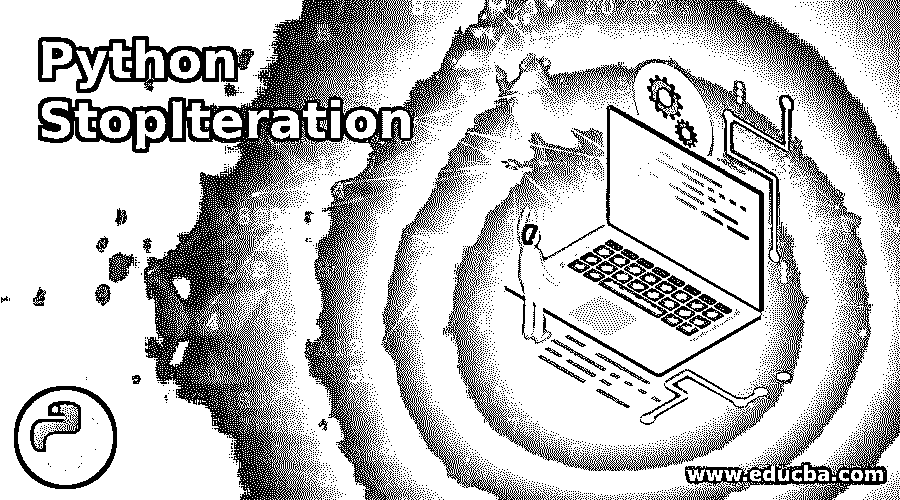

# Python StopIteration

> 原文：<https://www.educba.com/python-stopiteration/>




## Python 停止迭代简介

下面的文章提供了 Python StopIteration 的概要。因为我们都知道 Python 中的“迭代器”和“可迭代”这个主题。迭代器的基本概念是什么？迭代器基本上是一个保存被迭代的值(通常是可数)的对象。Python 中的迭代器使用 __next__()方法来遍历下一个值。为了告诉 __next__()方法不再需要遍历更多的值，使用了 StopIteration 语句。程序员通常在 __next__()方法中编写终止条件，以便在达到指定条件后停止它。

### Python StopIteration 语法

当指定次数的迭代完成后，在迭代器和生成器的情况下，StopIteration 由 next 方法引发(工作方式类似于迭代器，只是它一次生成一系列值，而不是单个值)。如果我们深入了解 Python，引发‘stop iteration’的情况并不认为是错误。它被认为是一个异常，可以通过捕捉类似于 Python 中其他异常的异常来轻松处理。

<small>网页开发、编程语言、软件测试&其他</small>

在 next()方法的 if 和 else 中使用 StopIteration 的一般语法如下:

```
class classname:

def __iter__(self):
…
…     #set of statements
return self;

def __next__(self):

if …. #condition till the loop needs to be executed
….   #set of statements that needs to be performed till the traversing needs to be done
return …

else
raise StopIteration #it will get raised when all the values of iterator are traversed 
```

### 在 Python 中 StopIteration 是如何工作的？

StopIteration 在达到最大限制后停止迭代，或者永远停止移动循环。

要了解 Python 中 StopIteration 的工作原理，需要记住以下要点:

*   它由 next()或 __next__()方法引发，这是 python 中的一个内置方法，用于停止迭代或显示不再有要迭代的项。
*   我们可以通过在 try 块中编写代码来捕捉 StopIteration 异常，并使用“except”关键字捕捉异常，然后使用“print”关键字将其打印在屏幕上。
*   通过引发 StopIteration 返回的值用作异常构造函数的参数，以便执行所需的操作。
*   当循环或任何可迭代对象中不再有元素时，生成器和迭代器中的 next()方法都会引发它。

### Python StopIteration 示例

下面是提到的例子:

#### 示例#1

在 20 之后停止打印数字，或者在迭代器的情况下，打印递增 2 到 20 的数字。

**代码:**

```
class printNum:
  def __iter__(self):
    self.z = 2
    return self

  def __next__(self):
    if self.z <= 20:   #performing the action like printing the value on console till the value reaches 20
      y = self.z
      self.z += 2
      return y
    else:
      raise StopIteration   #raising the StopIteration exception once the value gets              increased from 20

obj = printNum()
value_passed = iter(obj)

for u in value_passed:
  print(u) 
```

**输出:**


**说明:**

*   在上面的示例中，为了遍历这些值，使用了两种方法，即 iter()和 next()。如果我们看到，在 next()方法中，使用 If 和 else 语句来检查迭代以及它们各自的动作(在本例中是打印值)应该何时终止。
*   如果 iterable 值小于或等于 20，它将继续以 2 为增量打印这些值。一旦值大于 20，next()方法就会引发 StopIteration 异常。

#### 实施例 2

在生成器的情况下，查找数字的立方，并在值等于使用 StopIteration 传递的值时停止执行。

**代码:**

```
def values():     #list of integer values with no limits
    x = 1             #initializing the value of integer to 1   
    while True:
        yield x
        x+=  1

def findingcubes():    
    for x in values():      
        yield x * x *x     #finding the cubes of value ‘x’

def func(y, sequence):    

    sequence = iter(sequence) 
    output = [ ]    #creating an output blank array 
    try:
        for x in range(y):   #using the range function of python to use for loop
            output.append(next(sequence))   #appending the output in the array
    except StopIteration:    #catching the exception
        pass
    return output   

print(func(5, findingcubes()))  #passing the value in the method ‘func’ 
```

**输出:**


**说明:**

*   在上面的例子中，我们正在寻找从 1 到函数中传递的数的立方。我们使用 Python 中的生成器一次生成多个值，为了在值达到函数中传递的值时停止执行，会引发 StopIteration 异常。
*   创建了不同的方法来服务于它们各自的目的，例如生成值、查找立方体并通过将它们存储在输出数组中来打印值。程序中使用了基本的 python 函数，如 range、append 等，对于程序员来说，这些函数在学习的初始阶段应该是很清楚的。

### Python 中如何避免 StopIteration 异常？

*   如上所述，在 Python 中 StopIteration 不是一个错误，而是一个异常，用于运行指定迭代次数的 next()方法。Python 中的迭代器使用了两种方法，即 iter()和 next()。
*   当手动调用 next()方法时，next()方法会引发 StopIteration 异常。
*   在 Python 中避免这种异常的最好方法是使用普通的循环或将其用作普通的迭代器，而不是反复编写 next()方法。
*   否则，如果无法在 Python 中避免 StopIteration 异常，我们可以简单地在 next()方法中引发异常，并使用 except 关键字像在 Python 中捕捉普通异常一样捕捉异常。

### 结论

正如本文前面所讨论的，您一定很清楚什么是 StopIteration 异常，以及在 Python 中是在什么情况下引发的。对于新程序员来说，StopIteration 异常可能是一个需要处理的问题，因为它可能在许多情况下出现。但是正确理解它可能出现的场景和避免它的技术可以帮助他们更好地编程。

### 推荐文章

这是 Python StopIteration 的指南。在这里，我们将讨论如何在 python 中使用 StopIteration，以及如何通过编程示例来避免 StopIteration 异常。您也可以看看以下文章，了解更多信息–

1.  [Python 正则表达式测试器](https://www.educba.com/python-regex-tester/)
2.  [Python Rest 服务器](https://www.educba.com/python-rest-server/)
3.  [Python 字符串操作](https://www.educba.com/python-string-operations/)
4.  [Python 计数器](https://www.educba.com/python-counter/)


