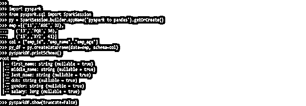

# PySpark 给熊猫

> 原文：<https://www.educba.com/pyspark-to-pandas/>


## 向熊猫介绍 PySpark

Pyspark 到 Pandas 是用来转换数据帧的，我们可以通过使用函数名作为 pandas 来转换数据帧。在转换的时候，我们需要明白 PySpark 的运行速度比 pandas 快。此外，我们可以说 pandas 在单个节点上运行操作，而它在更多的机器上运行。

### PySpark 对熊猫来说是什么？

在 python 中，Spark 中 PySpark 的模块用于通过使用数据帧来提供与 spark 相同类型的数据处理。python 中的 PySpark 提供了同样的处理。它还提供了几种从数据框名称以 PySpark 的形式返回顶部行的方法。Pandas 模块用于分析数据，它将支持三个系列的数据结构、面板和数据框架。当我们包含 PySpark 数据框时，我们还可以将 PySpark 数据框转换为 pandas。我们需要先创建一个数据框，然后将它转换成熊猫。

<small>网页开发、编程语言、软件测试&其他</small>

### 如何将 PySpark 的数据帧转换成 Pandas？

为了进行转换，我们需要使用函数名作为 toPandas()。为了转换，我们需要在我们的系统中安装 PySpark 和 pandas 模块。

*   第一步，我们在系统中安装 pandas 和 PySpark 模块。我们正在使用 pip 命令安装它，如下所示。

```
pip install pandas
```

```
pip install pyspark
```


*   在本步骤中安装完模块后，我们将使用命令名 python 登录 python 服务器。

```
python
```


*   登录到 python 服务器后，在这一步中，我们将导入 PySpark 和 SparkSession 模块。我们使用 import 关键字导入这两个模块。

```
import pyspark

from pyspark.sql import SparkSession
```


*   在导入模块之后，现在在这一步中，我们将为 pandas 创建名为 PySpark 的应用程序。我们将变量名定义为 py_spark，如下所示。

```
py_spark = SparkSession.builder.appName('pyspark to pandas').getOrCreate()
```


*   在创建应用程序之后，现在在这一步中，我们将学生数据名称创建为 stud。我们正在创建具有三行和三个属性的数据，如下所示。

```
stud = [{'stud_id' : '21', 'stud_name' : 'ABC', 'stud_age' : 12},
   {'stud_id' : '23', 'stud_name' : 'PQR', 'stud_age' : 6},
   {'stud_id' : '25', 'stud_name' : 'XYZ', 'stud_age' : 7}]
```


*   在定义了数据框的数据后，我们现在将数据框命名为 panda。

```
panda = py_spark.createDataFrame(stud)
```


*   在创建数据框之后，现在在这一步中，我们通过使用函数名作为 toPandas 来转换数据框。

```
print(panda.toPandas())
```


### 方法和参数

顾名思义，toPandas 方法用于将 spark 的数据帧转换为 panda 的数据帧。我们需要通过集体行动发出同样的警告。toPandas 的方法将从所有工人的所有记录中收集动作，并将其返回给驱动程序，它将把 pyspark 数据帧的结果转换为 panda 的数据帧。

我们也将这种方法用于打印功能。在第二个语法中，我们使用了 PySpark to pandas 方法的 print 函数，如下所示。

**语法:**

```
dataframe.toPandas()
print(dataframe.toPandas())
```

Pandas 代表 panel 数据结构，该数据结构用于以类似 SQL 表的二维格式表示数据。下面是参数说明如下。

*   **数据帧**–数据帧定义了我们在创建数据帧时使用的数据帧的名称。根据我们的数据，我们可以给数据框取任何名称。
*   **Print**–该函数在 toPandas 函数中使用，用于打印在数据框中创建的数据。打印功能正在显示转换后的数据。
*   **to Pandas**–to pandas 的方法用于将数据帧从 PySpark 转换为 pandas。

下面的例子显示了我们如何使用如下的方法和参数。

**代码:**

```
import pyspark
from pyspark.sql import SparkSession
py_spark = SparkSession.builder.appName ('pyspark to pandas').getOrCreate()
stud =[{'stud_id' : '21', 'stud_name' : 'ABC', 'stud_age' : 12},
   			{'stud_id' : '23', 'stud_name' : 'PQR', 'stud_age' : 6},
   			{'stud_id' : '25', 'stud_name' : 'XYZ', 'stud_age' : 7}]
panda = py_spark.createDataFrame( stud)
print (panda.toPandas())
```


### 例子

下面是如下的例子。

#### 示例#1

在下面的示例中，我们将数据框名称创建为 spark。

**代码:**

```
import pyspark
from pyspark.sql import SparkSession
py = SparkSession.builder.appName('pyspark to pandas').getOrCreate()
emp =[{'emp_id' : '11', 'emp_name' : 'ABC', 'emp_age' : 32},
   			{'emp_id' : '13', 'emp_name' : 'PQR', 'emp_age' : 36},
   			{'emp_id' : '15', 'emp_name' : 'XYZ', 'emp_age' : 41}]
spark = py.createDataFrame(emp)
print (spark.toPandas())
```

**输出:**


#### 实施例 2

在下面的例子中，我们定义了数据集的列名。

**代码:**

```
import pyspark
from pyspark.sql import SparkSession
py = SparkSession.builder.appName('pyspark to pandas').getOrCreate()
emp =[('11', 'ABC', 32),
   ('13', 'PQR', 36),
   ('15', 'XYZ', 41)]
col = ["emp_id", "emp_name", "emp_age"]
py_df = py.createDataFrame(data=emp, schema=col)
pysparkDF.printSchema()
pysparkDF.show(truncate=False)
```

**输出:**




### 关键要点

*   在 python 中，toPandas 方法用于转换数据框。在使用 toPandas 方法时，我们使用的是在 pyspark 中创建的数据框。
*   toPandas 方法将收集所有 pyspark 数据帧记录，并将其转换为 Pandas 数据帧。

### 常见问题解答

下面是提到的常见问题:

#### Q1。PySpark 对 python 中的熊猫有什么用？

**答:**基本上这个方法是通过使用指定的方法，将数据帧从 PySpark 转换成 pandas。

#### Q2。PySpark to pandas 方法中的 iterrows 有什么用？

**答:**这个方法通过将 PySpark 的数据帧转换成 panda 的数据帧来将列迭代到 py spark 的数据帧中。

#### Q3。PySpark 中的 toPandas 方法对 python 中的熊猫有什么用？

**答案:**top andas 方法用于将 PySpark 数据帧转换为熊猫的数据帧。

### 结论

PySpark 提供了几种方法，用于将数据框名称中的顶部行返回为 PySpark。Pandas 模块用于数据分析。Pyspark 到 pandas 是用来转换数据帧的，我们可以通过使用函数名作为 to pandas 来将数据帧从 PySpark 转换到 pandas。

### 推荐文章

这是给熊猫的 PySpark 指南。在这里，我们讨论了介绍和如何转换数据帧以及例子和代码实现。您也可以看看以下文章，了解更多信息–

1.  [PySpark 读取 CSV](https://www.educba.com/pyspark-read-csv/)
2.  [PySpark 备忘单](https://www.educba.com/pyspark-cheat-sheet/)
3.  [PySpark 列到列表](https://www.educba.com/pyspark-column-to-list/)
4.  [PySpark vs Python](https://www.educba.com/pyspark-vs-python/)


