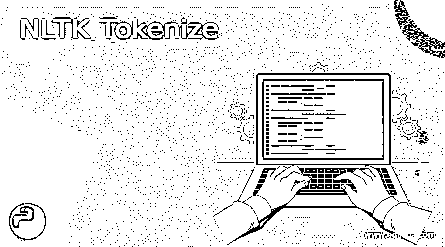

# NLTK 标记化

> 原文：<https://www.educba.com/nltk-tokenize/>




## NLTK 标记化简介

NLTK tokenize 是将一个句子分解成一个叫做 tokens 的单词列表的过程。标记化可以通过几种方式完成。我们可以说 NLTK 标记化是将大量的文本分解成称为标记的更小的块。这些记号对于模式识别非常有价值，并被用作词汇化和词干化的基础。

### 什么是 NLTK Tokenize？

*   标记化还可以用来用非敏感数据替换敏感数据。文本分类、智能聊天机器人和其他应用依赖于自然语言处理。要达到上述目标，理解文本模式是至关重要的。
*   处理数据时，标记化是数据科学家的常见活动。它需要将一个大的文本分解成小的符号。标记化是大多数自然语言处理(NLP)项目的初始阶段，因为它是构建强大模型的基础，有助于更好地理解文本。
*   尽管用 Python 编写 split 来标记化很简单，但在某些情况下效率不高。
*   暂时不要担心词条泛化；相反，可以把它们看作是用 NLP 清理文本数据的步骤。
*   NLP 用于文本分类和垃圾邮件过滤等任务，以及 Keras 和 Tensorflow 等深度学习库。
*   NLTK 标记化句子模块由子模块组成，是自然语言工具包的关键部分。
*   为了将一个语句分割成单词，我们调用方法 word 来标记化。然后，单词标记化结果可以被转换成用于增强应用的数据帧。
*   它也可以是文本清理操作的起点，包括删除标点符号和词干。最后，为了训练和生成预测，机器学习模型需要数字数据。
*   nltk.word tokenize 方法将用于使用 nltk 对单词和句子进行标记。NLTK 标记化是一种将大量数据分解成小块来分析文本特征的方法。
*   NLTK 用于训练机器学习模型，清理自然语言处理中的文本。

### 如何使用 NLTK Tokenize？

使用 NLTK，标记化的单词和短语可以矢量化并转换为数据帧。使用自然语言工具包(NLTK)的标记化需要词干提取和机器学习算法的训练。

<small>网页开发、编程语言、软件测试&其他</small>

自然语言工具包在 Python 库中提供了标记化模块“tokenize”。NLTK“token ize”包中有两种类型的标记化函数。

使用自然语言工具包进行单词标记需要使用自然语言工具包将文本解析为单词。按照以下说明使用 NLTK 标记单词。以下步骤显示了如何使用它，如下所示。

*   导入模块。

```
from nltk.tokenize import word_tokenize
```


*   用文本填充变量。以下示例显示了用文本填充变量。

```
py_word = "Python nltk tokenize steps"
```


*   对于变量，使用“单词标记化”函数。

```
print (word_tokenize(py_word))
```


*   看一下标记化的结果。


要在 python 代码中使用 tokenize，首先，我们需要导入 tokenize 模块；导入后，我们可以在我们的程序中使用这个模块。下面的例子展示了如何将 word_tokenize 模块导入到我们的代码中。

**代码:**

```
from nltk.tokenize import word_tokenize
```


下面的例子展示了如何在我们的代码中使用它。在下面的例子中，第一行，我们已经使用 nltk.tokenize 模块导入了 word_tokenize 模块。

下一行导入模块后，我们要创建 word tokens 的对象；在下一行中创建了对象之后，我们使用 print 方法打印了这个对象。

我们已经创建了名为 py_word 的 word 对象，如下所示。

**代码:**

```
from nltk.tokenize import word_tokenize
py_word = "Python nltk tokenize"
print (word_tokenize(py_word))
```


### NLTK 标记单词

发送了 NLTK tokenize 的一个子模块。句子标记化是 NLTK 标记化模块所必需的。我们需要 NLTK 句子和单词标记来确定这个比例。输出对机器学习很有用。令牌指的是每个组件。

要对句子进行标记，请使用 sent tokenize 函数。它使用 nltk.tokenize.punkt 模块的“PunktSentenceTokenizer”实例。在下面的例子中，我们使用了 word_tokenize 模块。

**代码:**

```
from nltk.tokenize import word_tokenize
py_token = "python nltk tokenize words"
print (word_tokenize(py_token))
```


在上面的例子中，我们可以看到，首先，我们从 nltk.tokenize 导入了模块名 word_tokenize。

导入模块后，我们在句子中提供了多个单词。然后，我们创造了这些词的对象。接下来，我们将单词句子的对象创建为 py_token。然后我们使用 word_tokenize 模块和 print 方法打印对象。

### NLTK 令牌化代码

要运行 NLTK 令牌化代码，我们需要在系统中安装 NLTK。以下示例显示了如何使用 pip 命令安装 NLTK。

```
pip install nltk
```


上面的例子表明 NLTK 已经安装在我们的系统中，表明需求已经得到满足。在下面的例子中，我们创建了单词句子名称的对象 py_token。

下面的例子如下。

**代码:**

```
from nltk.tokenize import sent_tokenize
py_token = "Python nltk tokenize code"
print(sent_tokenize(py_token))
```


### 程序

NLTK 必须安装在我们的系统上才能运行 python 程序。NLTK 模块是一个大型工具包，旨在帮助我们处理 NLP 的许多方面。例如，令牌只不过是根据规则划分的任何东西的一个组件。当任何句子被标记成单词时，例如，如果我们从一个段落中标记句子，每个单词就是一个标记。

以下程序如下。

**代码:**

```
from nltk.tokenize import sent_tokenize, word_tokenize
py_word = "Nltk tokenize program"
print (sent_tokenize(py_word))
print (word_tokenize(py_word))
```


### 结论

NLTK 标记化句子模块由子模块组成，是自然语言工具包的关键部分。它是把一个句子分解成一个单词表，叫做记号。标记化可以通过几种方式完成。

### 推荐文章

这是 NLTK 标记化的指南。在这里，我们还讨论了 NLTK Tokenize 的定义以及如何使用代码实现和程序。您也可以看看以下文章，了解更多信息–

1.  [安装 NLTK](https://www.educba.com/install-nltk/)
2.  [蟒蛇版](https://www.educba.com/anaconda-version/)
3.  [Coq 语言](https://www.educba.com/coq-language/)
4.  [Java Swing GUI Widget 工具包](https://www.educba.com/course/online-java-swing-training/)


