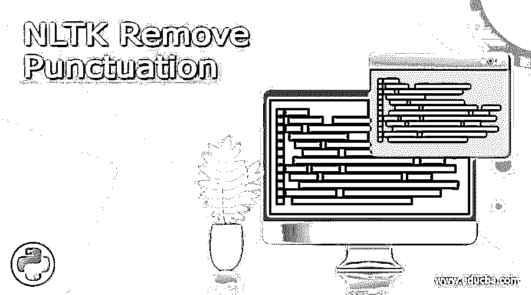

# NLTK 删除标点符号

> 原文：<https://www.educba.com/nltk-remove-punctuation/>




## NLTK 简介删除标点符号

NLTK 删除大量文本数据中的标点符号；我们知道发现和删除无关的单词或字母有多困难。即使在现代文字处理软件的帮助下，手动执行这项任务也是耗时且恼人的。幸运的是，像 python 这样的计算机语言中有强大的文本处理包，让我们可以快速完成这样的任务。所以 NLTK 去掉标点符号在 python 中非常重要。

### NLTK 移除标点符号概述

*   当一个句子被标记化，并且所有标点符号都被移除时，所有标点符号都被从每个单词中移除。
*   去除标点符号是机器学习和数据分析活动中的标准准备步骤。
*   比如创建一个文本分类模型是没有用的；因此，我们在预处理步骤中消除了它。
*   当处理用户生成的文本数据时，例如社交媒体帖子，我们会遇到许多标点符号，这些标点符号可能对手头的任务没有好处；因此，移除它成为必要的预处理工作。

### 如何用 NLTK 去掉标点符号？

在 python 中，有四种方法可以从字符串中删除标点符号。首先，我们可以用字符串去掉标点符号。

<small>网页开发、编程语言、软件测试&其他</small>

#### 1.使用正则表达式删除标点符号

*   python 中的 regex 包允许我们管理、控制和操作各种类型的正则表达式。
*   正则表达式是一串字母，它定义了要搜索的模式。通常，字符串搜索算法使用这些模式对字符串和信号输入进行“查找”或“查找和替换”操作。这是一种源自形式语言理论和理论计算机科学的方法。
*   下面的例子显示了使用正则表达式删除标点符号。

**代码:**

```
import re
py_str = "nltk@%,^remove#!punctualtion"
py_opstr = re.sub(r'[^\w\s]','',py_str)
print ('String: ', py_str)
print ('Without punctuation string: ', py_opstr)
```

**输出:**


#### 2.使用 translate 方法删除字符串中的标点符号

*   在 python 中，字符串函数是删除标点符号的最快方法。要使用翻译功能，我们必须首先导入字符串模块。
*   如果我们不确定翻译功能是做什么的，让我解释一下。translate 方法产生一个字符串，其中一些字符被字典或映射表中的字符替换。
*   以下示例显示了使用 translate 方法从字符串中删除标点符号。

**代码:**

```
import string
py_str = "nltk @%,^ remove #! punctualtion"
py_opstr = py_str.translate (str.maketrans ('', '', string.punctuation))
print ('String: ', py_str)
print ('Without punctuation string: ', py_opstr)
```

**输出:**


#### 3.使用 join 方法删除标点符号

*   join 方法也可以用来删除标点符号。如果我们不熟悉 join 方法，让我简单描述一下。join 方法允许我们以各种方式从 iterable 对象创建字符串。它连接了 iterable 的每个组件。
*   以下示例显示了如何使用 join 方法删除标点符号。

**代码:**

```
import string
py_str = "nltk @%,^ remove #! punctualtion"
exclude = set(string.punctuation)
py_str = ''.join(ch for ch in py_str if ch not in exclude)
print (py_str)
```

**输出:**


#### 4.使用 replace 方法删除标点符号

*   替换方法是一种快速简单的删除标点符号的技术。它给我们一个迭代器的对象。
*   Python 字符串中有许多有用的技术。替换就是这种过程的一个例子。
*   我们可以使用这种方法将字符串中的一个子字符串替换为另一个子字符串。此函数默认清除字符串中的所有特定字符或子字符串。
*   我们可以通过向 replace 方法提供一个计数值作为第三个参数来限制出现的次数。
*   下面的示例显示了如何使用 remove 方法删除标点符号，如下所示。

**代码:**

```
py_str = "nltk @emove punctuation"
print (py_str)
py_ls = py_str.replace ('@', 'r')
print (py_ls)
```

**输出:**


*   我们不能像处理列表一样在过程中改变它们。
*   因此，所有的字符串修改技术都会产生一个新的、修改过的字符串，我们将它保存在一个新的变量中。但是，首先，我们必须列出每一个我们不喜欢并希望去掉的标点符号。
*   对输入字符串调用 replace 方法，我们迭代标点符号。

### NLTK 删除标点符号停用词

*   NLTK 是一个用 python 编写的著名开源 NLP 库，是使用最广泛的 NLP 库之一。它包括大量的数据集、语言和各种其他 NLP 特性。例如，要用 regex 提供令牌模式，我们可以使用 nltk 的 RegexpTokenizer。
*   单词 tokenize 是 nltk 中的一个方法，用于分解单词。最初的任务之一是确定问题。
*   Nltk 的默认标记器根据空格和标点符号保留标点符号和单独的标记。
*   Nltk 停用字词是搜索引擎在索引和检索条目时配置为忽略的广泛使用的字词。
*   我们可以删除 NLTK 中的标点停用词。以下示例显示了如何使用停用字词来删除标点符号，如下所示。

**代码:**

```
from nltk.corpus import stopwords
from nltk.tokenize import word_tokenize
print ("Text:", py_st)
py_nltk = word_tokenize (py_st.lower ())
print ("Tokens:", py_nltk)
py_nltk1 = stopwords.words ('english')
py_nltk2 = [t for t in py_nltk if t not in py_nltk1]
print ("Text without stopwords:", " ".join (py_nltk2))
```

**输出:**


### NLTK 删除标点符号的示例

下面是从 NLTK 中删除标点符号的不同示例:

#### 示例#1

下面的示例显示了如何从代码中删除标点符号，如下所示。在下面的例子中，我们使用 regex 方法从字符串中删除标点符号。

**代码:**

```
import re
py_str1 = "python #* nltk@%,^ remove#! punctualtion"
py_opstr1 = re.sub(r'[^\w\s]','',py_str1)
print ('String: ', py_str1)
print ('Without punctuation string: ', py_opstr1)
```

**输出:**


#### 实施例 2

下面的例子只显示了从句首和句尾删除标点符号。下面的例子显示，它将删除行首和行尾的标点符号。

**代码:**

```
import re
py_str1 = "@python nltk remove punctualtion#!"
py_opstr1 = re.sub(r'[^\w\s]','',py_str1)
print ('String: ', py_str1)
print ('Without punctuation string: ', py_opstr1)
```

**输出:**


### 结论

当一个句子被标记化，并且所有标点符号都被移除时，所有标点符号都被从每个单词中移除。Nltk 删除大量文本数据中的标点符号。而创建文本分类模型是没有用的；因此，我们在预处理步骤中消除了它。

### 推荐文章

这是一个 NLTK 去除标点符号的指南。在这里，我们还讨论了 NLTK 的定义、概述以及如何使用 NLTK 删除标点符号，并给出了一些例子。您也可以看看以下文章，了解更多信息–

1.  [安装 NLTK](https://www.educba.com/install-nltk/)
2.  [蟒蛇版](https://www.educba.com/anaconda-version/)
3.  [Coq 语言](https://www.educba.com/coq-language/)
4.  [Java Swing GUI Widget 工具包](https://www.educba.com/course/online-java-swing-training/)


