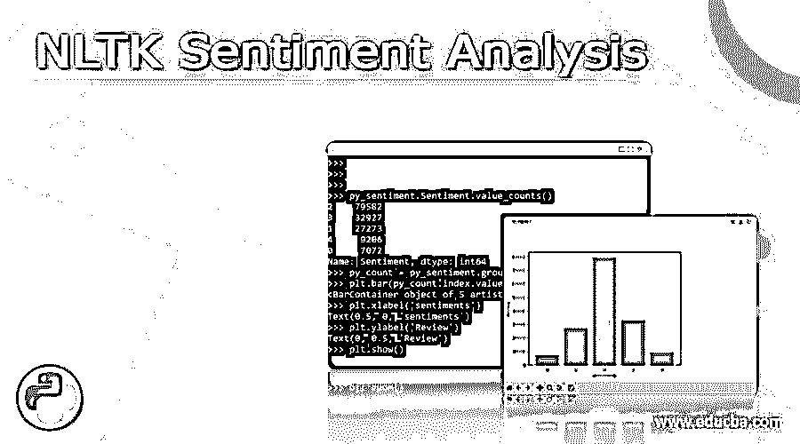
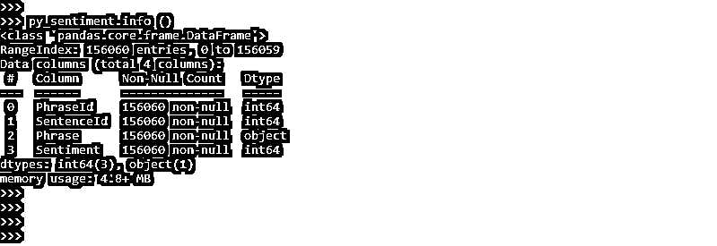
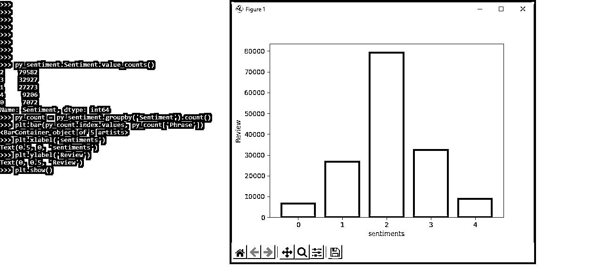

# NLTK 情感分析

> 原文：<https://www.educba.com/nltk-sentiment-analysis/>




## NLTK 情感分析的定义

NLTK 情绪分析可以帮助我们计算出在一个给定的问题上有多少积极和消极的参与。同样，我们可以通过分析产品评论、评论和推文等文本来获得受众的见解。NLTK 库提供了几个操作和分析语言数据的工具。文本分类器是其高级特性之一，可用于各种分类，包括情感分析。

### NLTK 情感分析简介

*   情感分析是使用算法将大量链接文本样本归类到不同类别的过程。我们可以使用这些技术，通过 NLTK 复杂的内置机器学习操作，从语言数据中提取见解。
*   非结构化数据构成了当今数据的主要部分，需要进行处理以获取洞察力。例如，报纸文章、社交媒体帖子和搜索历史都是非结构化数据的实例。
*   NLP 是研究自然语言并理解它的过程。情感分析是一项常见的 NLP 任务，它需要将文本或文本部分归类到几个预定义的情感之一。

### NLTK 情感分析怎么用？

*   情感分析是一种数据挖掘，它使用 NLP、计算语言学和文本分析从 Web(主要是社交媒体和其他相关来源)中提取和评估主观数据。
*   研究公众对特定事物、个人或想法的感觉或情绪，并揭示信息的上下文极性。
*   我们将利用 Python 的 NLTK(一个流行的 NLP 模块)来分析文本数据。说到情感分析，主要有两种方法。
*   基于词典的——它将计算给定文本中消极和积极词汇的数量；计数越大，文本的态度越积极。
*   使用预先标记的阴性和中性数据集，开发使用机器学习方法训练的分类模型。
*   文本挖掘中最关键的工作之一是文本分类。这是一种被严密监控的方法。
*   识别文本的类别，如博客、书籍、网页、新闻故事或推文。
*   垃圾邮件检测、CRM 系统中的任务分类、为搜索引擎对网站内容进行分类、消费者反馈意见等等是它在当今计算机世界中的一些应用。
*   要使用 NLTK 情感分析，我们必须导入代码的 numpy、pandas、matplotlib 和 seaborn 模块。
*   下面的例子表明我们需要将下面的模块导入到我们的代码中。

**代码:**

<small>网页开发、编程语言、软件测试&其他</small>

```
import pandas as pd
import numpy as np
import matplotlib.pyplot as plt
import seaborn as sns
```


### NLTK 情感分析分类器

*   情感分析是确定作者对所写主题的态度的过程。
*   我们需要构建一个训练数据集来训练一个模型。这是一个受监督的机器学习程序，要求我们为每个数据集分配一种“情绪”进行训练。
*   我们的模型在本课程中使用“积极”和“消极”态度。可以使用情感分析将文本分类到一系列情感中。
*   模型是描述系统的一组规则和等式。这可能就像根据身高估算一个人体重的算法一样简单。
*   我们将创建一个情绪分析模型，将推文与积极或消极的情绪联系起来。我们需要将数据分成两部分。
*   第一部分的目标是开发模型，而第二部分是测试模型的性能。
*   建模练习将使用 NLTK 的朴素贝叶斯分类器来完成。该模型需要一个以单词作为键和值的 Python 字典。
*   以下示例显示了如下朴素贝叶斯分类器。

**代码:**

```
def get_tweets_for_model (list_token):
    for py_token in list_token:
        yield dict ([token, True] for token in py_token)
```


*   在上面的例子中，我们首先定义了 get tweets 模型；在获取 tweets 模型中，我们定义了 list_token。然后我们使用了 py_token 和 list_token 对象。

### NLTK 情感分析思想方法

以下步骤显示了 NLTK 情感观点分析方法，如下所示。

#### 1.导入模块

在这一步中，我们使用 import 关键字导入 pandas、NumPy、matplotlib 和 seaborn 的模块。NumPy 模块用于线性代数方程。Panda 模块用于文档处理。Matplotlib 模块用于更好的可视化。Seaborn 模块也用于更好的可视化。以下示例显示了模块的导入，如下所示。

**代码:**

```
import pandas as pd
import numpy as np
import matplotlib.pyplot as plt
import seaborn as sns
```


#### 2.导入数据集

我们可以利用数据集“电影、评论的情感分析”。制表符分隔的文件包含数据。我们使用了组成数据集的四列。以下示例显示了如何通过 tsv 文件加载数据，如下所示。

```
py_sentiment = pd.read_csv ('train.tsv', sep='\t')
py_sentiment.head()
```


*   在上面的例子中，我们可以看到我们已经通过 train.tsv 文件上传了数据。我们已经使用 panda 模块的对象来读取 tsv 文件。我们已经创建了熊猫模块的别名 PD；我们在通过 tsv 文件加载数据时使用了这个别名。此外，我们使用 read_csv 方法从 tsv 文件中读取数据。我们还使用分隔符通过制表符来分隔值。上面的例子使用四列来定义 NLTK 情感分析。
*   在这一步中，我们使用 info 方法检查 tsv 文件的信息。对于 info 方法，我们使用的是 py _ perspective 对象。下面的例子显示了 tsv 文件的显示信息。

```
py_sentiment.info ()
```




*   下面的例子展示了情感分析。我们使用下面的代码来检查分析。

**代码:**

```
py_sentiment.Sentiment.value_counts()
py_count = py_sentiment.groupby('Sentiment').count()
plt.bar (py_count.index.values, py_count['Phrase'])
plt.xlabel('sentiments')
plt.ylabel('Review')
plt.show()
```




### 结论

情感分析是使用算法将大量链接文本样本归类到不同类别的过程。这些技术通过 NLTK 复杂的内置机器学习操作从语言数据中提取见解。例如，NLTK 情感分析可以帮助我们计算出在一个给定的问题上有多少积极和消极的参与。

### 推荐文章

这是 NLTK 情感分析指南。在这里，我们还讨论了 NLTK 情感分析、分类器和 idea 方法的定义和使用方法。您也可以看看以下文章，了解更多信息–

1.  [安装 NLTK](https://www.educba.com/install-nltk/)
2.  [蟒蛇版](https://www.educba.com/anaconda-version/)
3.  [Coq 语言](https://www.educba.com/coq-language/)
4.  [Java Swing GUI Widget 工具包](https://www.educba.com/course/online-java-swing-training/)


