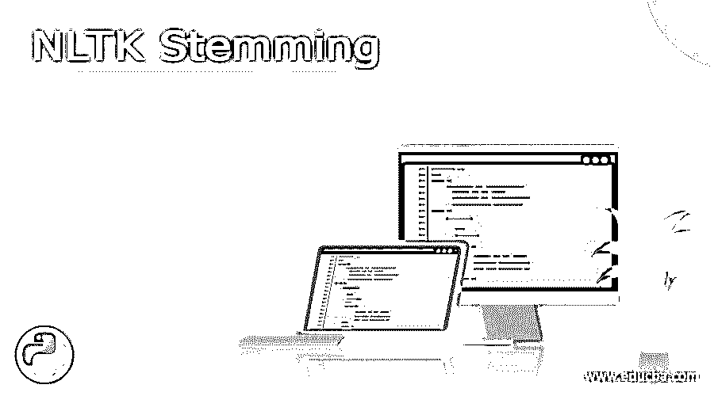
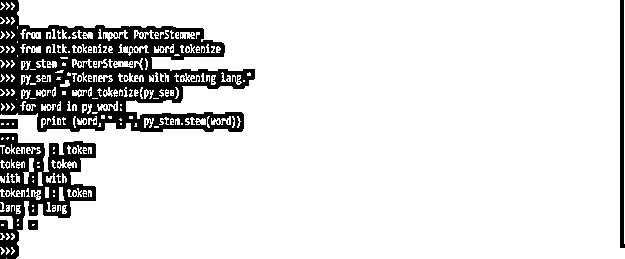
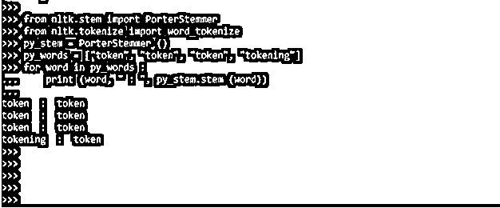

# NLTK 词干

> 原文：<https://www.educba.com/nltk-stemming/>




## NLTK 词干的定义

Nltk 词干是词根/基本词在形态上变化的过程，称为词干。词干分析器和词干算法是用来描述词干程序的两个术语。Tokens、tokened 和 tokening 都使用词干算法简化为基本单词 token。词干算法 PorterStemmer 包含在自然语言工具包中。语言学家马丁·波特负责 NLTK 的翻译。

### 什么是 NLTK 词干？

单词被去掉了词缀，只剩下词干。由于不规则词复杂的形态规则、词性和词义歧义，这是一个具有挑战性的课题。

<small>网页开发、编程语言、软件测试&其他</small>

*   在自然语言处理的规则中，词干分析是文本规范化，有时也称为单词规范化过程。当两个词干不同的单词被词干化为同一个词根时，就会出现超切分。
*   使用 NLTK，词干生成单词的原始词根形式。在语言学中，词干是这个过程的一个方面。词根和词干的词根必须相等。术语“词干分析器”指的是词干算法和技术。

### NLTK 词干应用程序

*   词干处理是一种 NLP 方法，它允许对文本、单词和文档进行预处理以实现文本规范化。
*   根据维基百科，词形变化是一个词的修饰，以传递各种语法特征。
*   因此，我们使用词干来将单词分解成语言中最简单的形式或有效的单词。
*   词干被用于各种应用，包括信息检索和单词分析。例如，在谷歌上搜索“预测”和“预测”，会得到类似的结果。
*   如前所述，英语中的一个术语包含多个变体。当创建 NLP 或机器学习模型时，这些偏差的存在就是数据冗余。
*   为了开发一个可行的模型，通过减少重复和将单词词干化为其基本形式来规范化文本是至关重要的。
*   信息检索系统，如搜索引擎，使用词干。下面的步骤显示了词干的应用如下。

1)使用 pip 命令安装 nltk–第一步是使用 pip 命令安装 nltk。下面是使用 pip 命令安装 nltk 的例子。

```
pip install nltk
```


2)安装完 pip 命令后，我们登录到 python shell 中使用 python 命令执行如下代码。

```
python
```


3)在登录到 python shell 之后，在这一步中，我们将使用 nltk 导入 word_tokenize 和 PorterStemmer 模块。tokenize 和 nltk.stem 库。下面的例子显示了导入 word_tokenize 和 PorterStemmer 模块如下。

```
from nltk.stem import PorterStemmer
from nltk.tokenize import word_tokenize
```


4)下面的例子显示了使用 nltk 实现词干如下。为了实现这个例子，我们首先使用 nltk 导入 porterstemmer 模块。stem 包，并使用 nltk.tokenize 包导入 word_tokenize 模块。导入包后，我们正在创建 porterstemmer 函数的对象。然后我们必须定义这个单词，在下一行中定义了这个单词之后，我们通过使用 for 循环输出了相同的内容。

**代码:**

```
from nltk.stem import PorterStemmer
from nltk.tokenize import word_tokenize
py_stem = PorterStemmer()
py_words = ["token", "tokens", "tokener", "tokening"]
for word in py_words :
    print (word, " : ", py_stem.stem (word))
```


5)下面的例子显示了通过使用如下句子来词干化该单词。为了实现这个示例，我们首先使用 nltk.stem 包导入 porterstemmer 模块，并使用 nltk.tokenize 包导入 word_tokenize 模块。我们用句子来做词干。与 word 实现相同，我们正在创建 PorterStemmer 函数的对象。

**代码:**

```
from nltk.stem import PorterStemmer
from nltk.tokenize import word_tokenize
py_stem = PorterStemmer()
py_sen = "Tokeners token with tokening lang."
py_word = word_tokenize (py_sen)
for word in py_word:
    print (word, " : ", py_stem.stem(word))
```




### NLTK 词干错误

*   在 NLP 中，词干是一种规范化单词的技术。它是一种将一组句子单词转换成一个序列的方法，目的是减少查找信息所需的时间。
*   使用这种方法对具有相同含义但由于上下文或句子不同而不同的单词进行归一化。
*   换句话说，有一个根项有几个变体。词干提取过度和不足是两个最常见的词干提取错误。当具有相同词根但不同词干的两个单词被词干化为相同的词根时，就会出现词干不足。
*   以下示例显示 nltk 词干错误如下。在下面的单词中，我们把同一个单词词干化了三次。

**代码:**

```
from nltk.stem import PorterStemmer
from nltk.tokenize import word_tokenize
py_stem = PorterStemmer ()
py_words = ["token", "token", "token", "tokening"]
for word in py_words :
    print (word, " : ", py_stem.stem (word))
```




### NLTK 词干抓取

*   词干是一种标准化技术。除了涉及时态之外，许多不同的单词都包含相同的意思。词干的目的是使查找过程更快，并使句子标准化。
*   让我们考虑两个句子，即我骑着马，我骑着马。马的情况也是如此。我以前也是这样。在这两种情况下，ing 都暗示了一个明确的过去式，所以在试图理解这个过去式活动时，区分 ride 和 riding 真的很重要吗？
*   下面的例子显示抓取词干分析器如下。

**代码:**

```
from nltk.stem import PorterStemmer
from nltk.tokenize import sent_tokenize, word_tokenize
py_stem = PorterStemmer()
py_word = ["token", "tokener", "tokening", "tokened", "tokenly"]
for word in py_word:
    print(py_stem.stem(word))
```


*   在下面的例子中，我们用的是难句而不是单词。

**代码:**

```
from nltk.stem import PorterStemmer
from nltk.tokenize import sent_tokenize, word_tokenize
py_stem = PorterStemmer()
py_text = "Nltk stemming in python"
py_words = word_tokenize(py_text)
for word in py_words:
    print(py_stem.stem(word))
```


### 结论

词干处理是一种 NLP 方法，它允许对文本、单词和文档进行预处理以实现文本规范化。Nltk 词干是词根/基本词在形态上变化的过程，称为词干。词干分析器和词干算法是用来描述词干程序的两个术语。

### 推荐文章

这是一个 NLTK 词干指南。在这里，我们讨论的定义，什么是 NLTK 词干，应用，NLTK 词干抓取，与实现的例子。您也可以看看以下文章，了解更多信息–

1.  [安装 NLTK](https://www.educba.com/install-nltk/)
2.  [数据科学工具](https://www.educba.com/data-science-tools/)
3.  [蟒蛇版](https://www.educba.com/anaconda-version/)
4.  [机器学习库](https://www.educba.com/machine-learning-libraries/)


