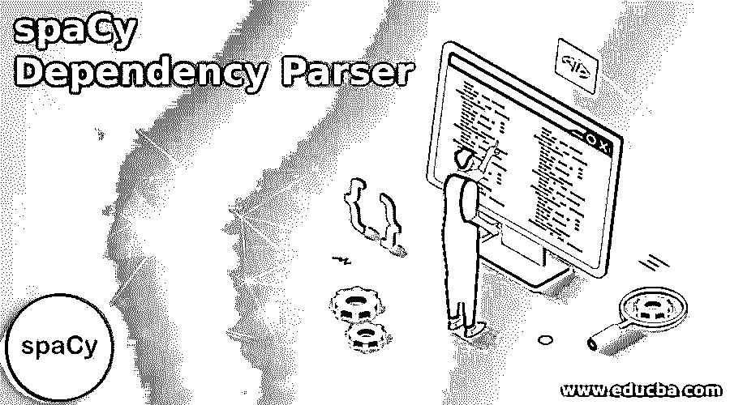
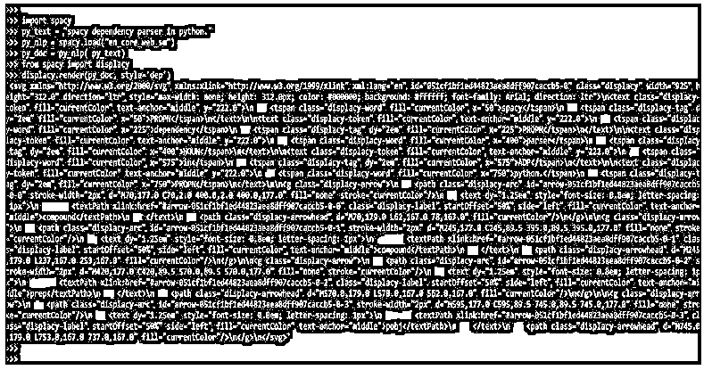

# 空间依赖分析器

> 原文：<https://www.educba.com/spacy-dependency-parser/>




## 空间依赖分析器简介

空间依存解析器是创建和描述短语中不同单词的句法功能的过程，称为依存解析。例如，在一个英语句子中，单词之间有许多依赖关系。SpaCy 包含一个语法依赖解析器，它返回多个依赖并解析标签。SpaCy 还允许我们使用依赖树和几种不同的访问方式来可视化它。

依存解析还通过向 spaCys 句子边界识别提供输入来帮助迭代短语。采用过渡方法的依赖分析器。因为 spaCy 采用了基于转换的依存性分析，包括左弧和右弧等术语，所以中心词与其依存词之间的边同样被软件视为弧。默认情况下，spaCy 中的 NLP 管道包括依赖关系解析。SpaCy 将在处理完文档对象后生成文档对象时完成对依赖关系的解析。因此，我们处理的 doc 对象中的每个标记都包含所有与依赖关系相关的信息。

<small>网页开发、编程语言、软件测试&其他</small>

### 创建新的空间依赖解析器

一个模仿学习目标被用来训练语法分析器。空间依赖解析器确定动作是否与在每个阶段从当前状态获得的最佳解析兼容。权重被改变以提高奖励给其他活动的值。值得注意的是，多种行动可能最适合某个特定的州。参数 Token.dep 和 Token.head 用于预测依赖性。解析器确定句子边界，记录在 Token 中。

下面是空间相关性分析器中使用的属性，如下所示:

*   **Token.dep:** 依赖关系中 Token.dep 属性的类型为 int。
*   **Token.dep:** 依赖关系中 token.dep_ attribute 的类型为 str。
*   **Token.head:** 依赖关系中 Token.head 属性的类型为 Token。
*   **Doc . sents:**token . is sent 的起始值决定了文档中短语的迭代器。依赖关系中 doc.sents 属性的类型是迭代器。

下面的例子显示了空间依赖解析器如下。

我们正在导入 spaCy 模块，以便在程序中使用依赖解析器。

**代码:**

```
import spacy
py_text = "spacy dependency parser in python"
py_nlp = spacy.load ("en_core_web_sm")
py_doc = py_nlp (py_text)
for token in py_doc:
            print (token.py_text, token.dep_,"token head is", token.head.py_text,
[child for child in token.children]
```

**输出:**


令牌对象有几个属性，有助于尽可能好地解析依赖关系树。

下面是空间依赖解析器的属性:

*   **token.left 和 token.right:** 这些属性表示左右句子中出现了该标记的哪些子元素。token.n lefts 和 token.n rights 属性可用于直接获得这些整数。
*   **token.subtree:** 返回通过处理 token 生成的子树。
*   **token.right_edge 和 token.left_edge:** 还有几个特质，比如 token.ancestors，还有 token.right edge 和 token.left edge。

下面的例子显示了如下可视化依赖关系树。

在下面的例子中，首先，我们导入空间模块。然后我们提供一条短信；发送完一条短信后，我们加载空间模块。

加载模型后，我们导入显示模块。然后我们用显示方法调用 render 方法。

**代码:**

```
import spacy
py_text = "spacy dependency parser in python."
py_nlp = spacy.load("en_core_web_sm")
py_doc = py_nlp( py_text)
from spacy import displacy
displacy.render(py_doc, style='dep')
```

**输出:**




我们正在加速代码流程的创建和调试。因此，我们最受欢迎的两个可视化工具 display 和 display ENT 被添加到核心集合中。如果我们打开了一个 Jupyter 笔记本，displacy 会检测到它。Displacy.serve 是可视化 Doc 最有效的技术。这将启动一个主 web 服务器，并允许我们在浏览器中检查结果。弧线显示单词，子是箭头处的单词，头是箭头末端的单词。弧形标签表示头部的 kid，称为 dep。单词“heading”是词根，因为它有许多输出箭头，但没有输入箭头。

### 空间相关性分析器配置

SpaCy dependency parser 定义了默认配置，该配置指定了应该如何设置组件。我们可以用 NLP.add 和 config.cfg 上的 config 选项改变它的参数。

以下是用于创建空间相关性解析器的配置参数，如下所示:

#### 1.移动

过渡的名称列表。如果没有提供数据，就会从中推断出来。默认为无。依赖关系中的移动属性的类型是可选的。

#### 2.用 oracle_cut_size 更新

将大型序列缩减为较短的部分。因为这个参数对模型的影响很小，所以我们不需要经常调整它。默认值为 100。依赖关系中 update_with_oracle_cut_size 属性的类型为 int。

#### 3.学习 _ 代币

是否要学习如何组合关于金本位实验的分音。默认值为 False。依赖关系中的 learn_tokens 属性类型为 bool。

#### 4.最小动作频率

必须保留的标记操作的最小数量。更罕见的标记活动的标签已经被退回到“dep”虽然这主要影响标签的准确性，因为标签被用来表达伪投影变换，但是它也可以影响附件结构。默认值为 30。依赖关系中 min_action_freq 属性的类型为 int。

以下示例显示了空间依赖解析器的配置如下。

我们已经在下面的例子中导入了空间模块。

**代码:**

```
import spacy
con_text = "spacy dependency parser in python."
py_nlp = spacy.load ("en_core_web_sm")
con_doc = py_nlp (con_text)
for token in con_doc:
    print(token.con_text, token.dep_,"Token head", token.head.con_text,
     [child for child in token.children]
```

**输出:**


### 结论

依存解析还通过向 spaCys 句子边界识别提供输入来帮助迭代短语。空间依存解析器是创建和描述不同单词的句法功能的过程，称为依存解析。SpaCy 使用 arc 来分析从头到子的依赖关系。

### 推荐文章

这是一个空间依赖解析器的指南。在这里我们讨论的介绍，创建一个新的空间依赖解析器和解析器配置。您也可以看看以下文章，了解更多信息–

1.  [Python 中的二分搜索法](https://www.educba.com/binary-search-in-python/)
2.  [Python 连接列表](https://www.educba.com/python-join-list/)
3.  [Python 用户自定义函数](https://www.educba.com/python-user-defined-functions/)
4.  [Python UUID](https://www.educba.com/python-uuid/)


