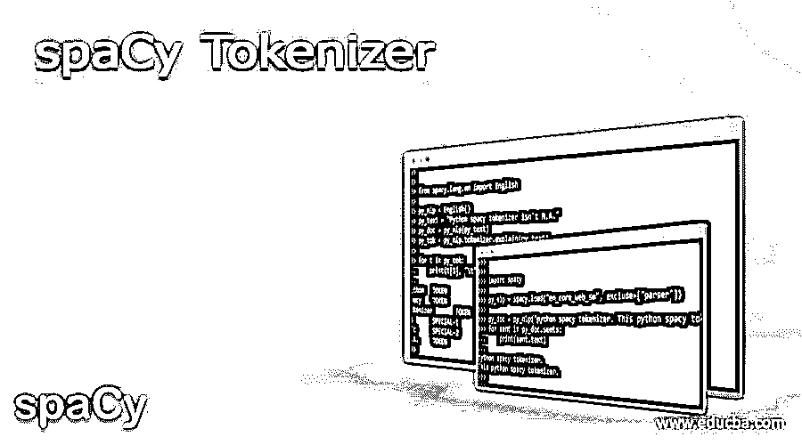
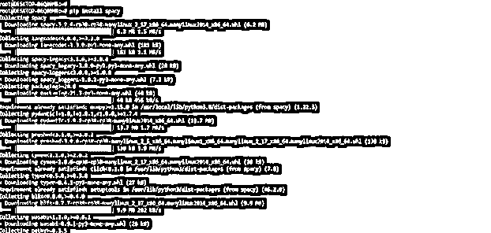
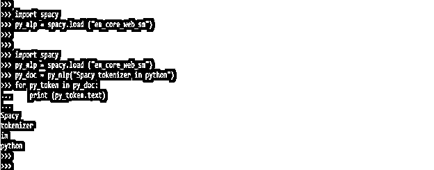
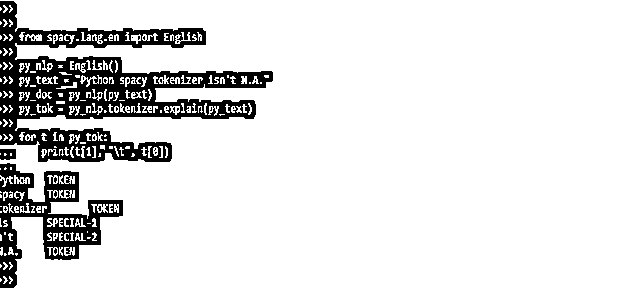
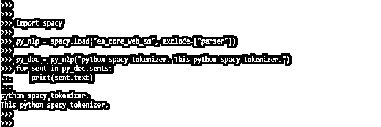
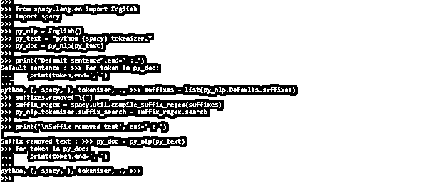

# 空间记号化器

> 原文：<https://www.educba.com/spacy-tokenizer/>




## 空间标记器的定义

SpaCy tokenizer 生成句子的标记，也可以在句子级别生成标记。我们还可以执行单词标记化和字符提取。单词、标点、空格、特殊字符、整数和数字都是记号的例子。无论是为了文本挖掘、文本分类还是其他目的，标记化都是任何文本处理管道的第一步。SpaCy tokenizer 在 python 中非常有用和重要。

### 什么是 spaCy tokenizer？

*   首先，必须使用 spaCy.load ('en ')这样的命令加载英语语言的模型。因此，创建了 spaCy 语言类的一个实例。
*   令牌化是所有其他 NLP 操作所需的令牌的初始阶段。
*   与 NLTK 一样，spaCy 也是一个著名的 NLP 库。不同之处在于 NLTK 有大量的方法来解决单个问题，而 spaCy 只有一种方法，但却是解决问题的最佳方法。NLTK 于 2001 年首次发布，但 spaCy 于 2015 年首次开发。

### 创建空间标记器

*   首先，我们需要在我们的系统中安装相同的软件。以下示例显示了使用 pip 命令进行的安装。在下面的例子中，我们在基于 Linux 的系统上安装了。

```
pip install spacy
```




<small>网页开发、编程语言、软件测试&其他</small>

*   安装 spaCy 后，我们需要检查它是否正确安装在我们的系统上，我们需要首先登录 python shell 来导入 spaCy 模块。下面的例子显示了登录到 python 外壳如下。

```
python3
```


*   登录 python shell 后，我们检查 scrapy tokenizer 是否正确安装在我们的系统上。我们可以通过将 spaCy 模块导入到我们的代码中来检查这一点。我们可以使用 import 关键字导入 spaCy tokenizer 模块。下面的例子显示了如何将空间模块导入我们的程序，如下所示。

```
import spacy
print (spacy)
```


*   单词和标点符号在 SpaCy 中被分解成几个步骤。从左到右处理文本。
*   首先，记号赋予器的分离方式与 split 方法相同。之后，记号赋予器检查子串。例如，is 没有空格，应该分为两个标记，“is”和“n't”，尽管“N.A .”应该始终是一个标记。
*   逗号、句点、连字符和引号是子字符串中可以找到的前缀、后缀和中缀的例子。
*   在下面的例子中，我们用 spaCy 来标记文本。为了在输出中打印 doc 对象的标记，我们首先导入了 SpaCy 库。

**代码:**

```
import spacy
py_nlp = spacy.load ("en_core_web_sm")
py_doc = py_nlp ("Spacy tokenizer in python")
for py_token in py_doc:
    print (py_token.text)
```




*   下面是 python 中相关的点如下。在下面的例子中，我们正在创建 spaCy tokenizer。
*   我们可以很容易地将自定义生成的标记器添加到 spaCy 管道中。例如，在下面的代码中，我们包含了一个只有英语词汇的空白记号赋予器。
*   我们可以在下面的示例中看到，它将显示我们添加的令牌。

**代码:**

```
from spacy.tokenizer import Tokenizer
from spacy.lang.en import English
py_nlp = English ()
py_tokenizer = Tokenizer (py_nlp.vocab)
py_tokens = py_tokenizer ("Python spacy tokenizer isn't N.A.")
print ("Blank tokenizer", end=" : ")
for py_tokens in py_tokens:
    print (py_tokens, end=', ')
```


*   在下面的例子中，我们通过使用 spaCy tokenizer 来隔离每个令牌，如下所示。

**代码:**

```
from spacy.lang.en import English
nlp = English()
py_tokenizer = nlp.tokenizer
py_token = py_tokenizer ("Python spaCy tokenizer isn't N.A.")
print ("\nDefault tokenizer",end=' : ')
for token in py_token:
    print (token, end=', ')
```


*   tokenizer.explain (text)是一个由 spaCy 库提供的调试工具，它可以生成包含令牌的元组列表。下面的例子显示了如下的调试。

**代码:**

```
from spacy.lang.en import English
py_nlp = English()
py_text = "Python spacy tokenizer isn't N.A."
py_doc = py_nlp(py_text)
py_tok = py_nlp.tokenizer.explain(py_text)
for t in py_tok:
    print (t[1], "\t", t[0])
```




*   通过提供 tokenizer.merge，我们可以将许多令牌合并成一个令牌。我们可以使用可选的 attrs 字典来设置将分配给合并令牌的属性。默认情况下，合并的令牌继承与合并的 span 的根相同的属性。以下示例显示了合并令牌。

**代码:**

```
import spacy
py_nlp = spacy.load("en_core_web_sm")
py_doc = py_nlp ("Python spaCy tokenizer isn't N.A.")
print("Before:", [token.text for token in py_doc])
with py_doc.retokenize() as retokenizer:
retokenizer.merge (py_doc[3:5], attrs={"Python": "spacy tokenizer"})
print ("After:", [token.text for token in py_doc])
```


*   空间库使用整个依存解析来建立句子边界。SpaCy tokenizer 是一种非常准确的方法，但需要训练有素的管道才能做出正确的预测。以下示例显示了解析依赖关系。

**代码:**

```
import spacy
py_nlp = spacy.load ("en_core_web_sm")
py_doc = py_nlp ("python spaCy tokenizer. This python spaCy tokenizer.")
for sent in py_doc.sents:
    print(sent.text)
```


*   数据是统计的。只提供句子边界的解析器被句子识别器取代。下面的例子显示了 spaCy tokenizer 通过使用一个统计句子分割。

**代码:**

```
import spacy
py_nlp = spacy.load ("en_core_web_sm", exclude=["parser"])
py_doc = py_nlp("python spacy tokenizer. This python spacy tokenizer.")
for sent in py_doc.sents:
    print (sent.text)
```




*   以下示例显示了使用 spaCy tokenizer 从搜索中删除字符，如下所示。

**代码:**

```
from spacy.lang.en import English
import spaCy
py_nlp = English()
py_text = "python (spacy) tokenizer."
py_doc = py_nlp (py_text)
print("Default sentence", end=' : ')
for token in py_doc:
    print (token, end=', ')
suffixes = list (py_nlp.Defaults.suffixes)
suffixes.remove ("\(")
suffix_regex = spacy.util.compile_suffix_regex (suffixes)
py_nlp.tokenizer.suffix_search = suffix_regex.search
print ('\nSuffix removed text', end=' : ')
py_doc = py_nlp(py_text)
for token in py_doc:
    print (token,end=', ')
```




### 结论

记号化是将文本分解成称为记号的小块的过程。可以进行标记化来生成句子标记，句子标记化来生成单词标记，或者单词标记化来生成字符标记。如果匹配，子字符串被分成两个标记。

### 推荐文章

这是一个 SpaCy tokenizer 指南。这里我们讨论定义，什么是 spaCy tokenizer，创建 spaCy tokenizer，代码实现的例子。您也可以看看以下文章，了解更多信息–

1.  [Python 中的 ordered dict](https://www.educba.com/ordereddict-in-python/)
2.  [Python 中的二分搜索法](https://www.educba.com/binary-search-in-python/)
3.  [Python 连接列表](https://www.educba.com/python-join-list/)
4.  [Python UUID](https://www.educba.com/python-uuid/)


