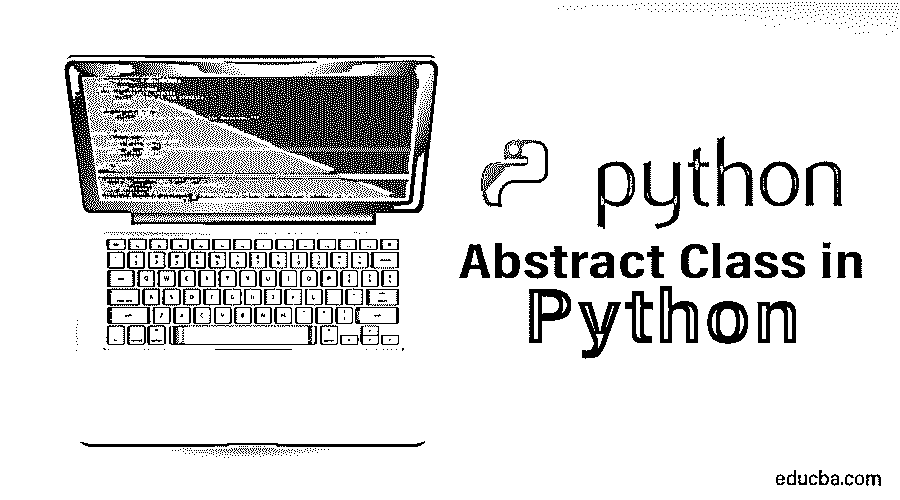
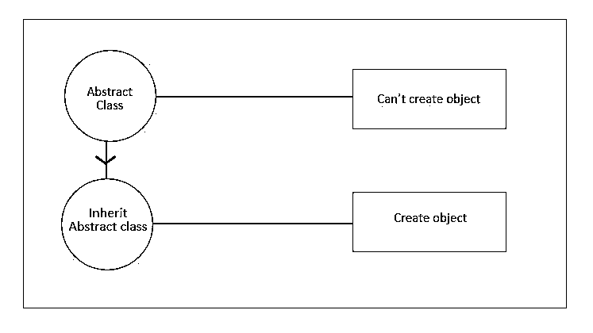

# Python 中的抽象类

> 原文：<https://www.educba.com/abstract-class-in-python/>




## Python 中抽象类概述

抽象类是一个不能独立实现的类，它需要子类来使用抽象类来访问抽象方法。这里出现了抽象类继承的概念，用于从基类创建对象。在 Python 中，抽象类由与相应类的抽象方法相关的各自的抽象属性组成，抽象方法由关键字“@abstractproperty”定义。

抽象类和具体类都可以包含在抽象类中。通过使用抽象类，我们可以定义方法的通用结构，而无需提供每个方法的完整实现。在抽象类中定义的抽象方法通常没有主体，但是在抽象类中有实现的抽象方法是可能的，如果任何子类是从这样的抽象类派生的，就需要为这样的方法提供实现。如果任何抽象方法不是由派生类实现的，那么它将抛出一个错误。抽象类对象不能直接创建，但是当我们使用这个抽象类为基类或子类提供某些功能时，可以通过创建基类的对象来实现。

<small>网页开发、编程语言、软件测试&其他</small>




### 抽象类的重要性

1.它提供了基类的默认功能。

2.它为子类集合定义了一个公共 API，在第三方在应用程序中提供插件的情况下非常有用。

3.在大型代码中，记住许多类是困难的。

**语法**

```
From abc import ABC
Class Educba(ABC):
```

要将任何类视为抽象类，该类必须从 python 内置的 abc 模块继承 ABC 元类。abc 模块导入 ABC 元类。

### Python 中的抽象方法

抽象方法是声明时没有任何实现的方法。

**语法**

```
from abc import ABC, abstractmethod
Class Educba(ABC):
 @abstractmethod
 def mymethod(self):
  #empty body
  pass
```

要定义抽象类中的抽象方法，必须用名为@abstractmethod decorator 的关键字来修饰方法。@abstractmethod 装饰器必须是从 python 名为 abc 的内置库中导入的[。](https://www.educba.com/python-features/)

### Python 中的抽象类是如何工作的？

默认情况下，Python 没有抽象类，但是它有一个模块或库，构成了定义抽象基类(ABC)的基础，该模块名为 ABC。它将基类的方法标记为抽象基类，然后生成具体的类作为抽象基类的实现。在名为@abstractmethod 的 decorator 关键字的帮助下，方法变成了抽象方法。

ABC 模块用于[创建抽象类](https://www.educba.com/abstract-class-in-c-sharp/)，@abstractmethod 是用于声明方法抽象的装饰器。ABC 模块在基类和具体类之间建立了一个契约。

abc 模块为在 Python 中定义抽象基类(ABC)提供了基础。集合模块有一些从 ABC 派生的具体类，它们可以进一步划分。除了所有这些，集合模块还包含一些 ABC，可以用来测试一个类或实例是否提供了一个特定的接口。

该模块提供了以下类:

abc 类。ABCMeta

元类用于定义抽象基类(ABC)

我们使用一个元类来创建一个抽象基类。

```
from abc import ABCMeta
class C:
    __metaclass__ = ABCMeta
MyABC.register(tuple)
assert issubclass(tuple, C)
assert isinstance((), C)
```

**例子**

```
# importing the ABC module
from abc import ABC, abstractmethod
class Shape(ABC):
    def common(self):
        print("This is a concrete method")
    @abstractmethod # decorator
    def area(self):
        pass
    @abstractmethod
    def perimeter(self):
        pass
class Square(Shape):
    def __init__(self,side):
        self.__side=side        
    def area(self):
        return self.__side*self.__side    
    def perimeter(self):
        return 4*self.__side       

class Rectangle(Shape):
    def __init__(self,length,breath):
        self.__length=length
class Rectangle(Shape):
    def __init__(self,length,breath):
        self.__length=length
        self.__breath=breath        
    def area(self):
        return self.__length*self.__breath    
    def perimeter(self):
        return 2*(self.__length+self.__breath)
S1=Square(4)
print(S1.common())
print(S1.area())
print(S1.perimeter())
R1=Rectangle(2,4)
print(R1.common())
print(R1.area())
print(R1.perimeter())
```

**获得的输出**

这是一个具体方法

Sixteen

Sixteen

这是一个具体方法

eight

Twelve

在上面的例子中，抽象类是 Shape，它包含一个名为 common 的具体方法和两个名为 area 和 perimeter 的抽象方法。有两个子类 Square 和 Rectangle 继承了抽象类 Shape 并实现了抽象方法。

通过子类化实现:

```
import abc  
class Shape:        
    def area(self): 
        pass  
class Square(Shape): 
    def area(self): 
        print("Square is a child class")    
print( issubclass(Square,Shape)) 
print( isinstance(Square(), Shape))
```

#### 抽象属性

[抽象类包含](https://www.educba.com/abstract-classes-in-javascript/)抽象属性以及由@abstractproperty 定义的抽象方法。

我们现在可以对抽象类使用 property、property.getter()、property.setter()和 property.deleter()。

**语法**

```
cclass class_name(ABC):
	@property
	@abstractmethod
	Def method(self):
```

这定义了只读属性。

```
class Class_name:
    __metaclass__ = ABCMeta
    def getx(self): ...
    def setx(self, value): ...
    x = abstractproperty(getx, setx)
```

#### Python 2

```
class C(ABC):
    @property
    @abstractmethod
    def my_abstract_property(self):
```

#### Python 3.3

```
import abc
from abc import ABC, abstractmethod
class Shape(ABC): 
    @abc.abstractproperty 
    def  area(self): 
        return "Shape class"
class Square(parent):
    @property
    def area(self):
        return "Square class"
  try: 
    s1 =Shape()
    print( s1.area)
except Exception as err:
    print (err)
   s1 = Square()
print (s1.area)
```

**输出:**

无法用抽象方法区域实例化抽象类形状

方形类

### 结论

最后，我得出结论,[抽象类](https://www.educba.com/abstract-class-in-c-plus-plus/)是确保一定水平的代码质量的一种方式，因为它们实施了一定的标准，并且可以减少我们编写的重复代码的数量。它在基类和具体类之间建立了一个连接。它提供了一个简单的代码实现。它定义了方法的通用结构，但没有完整的实现。它通过抽象后台进程，使程序员只关注重要的点，从而使他们的生活变得简单。通过理解代码中类的公共和简单结构，它使得研究和理解变得更快。

### 推荐文章

这是 Python 中抽象类的指南。在这里，我们讨论基本概念，抽象类如何在 Python 中工作，以及重要性和方法，并给出适当的例子。您也可以看看以下文章，了解更多信息–

1.  [Python 中的封装](https://www.educba.com/encapsulation-in-python/)
2.  [Python 中的循环](https://www.educba.com/loops-in-python/)
3.  [Python 中的构造函数](https://www.educba.com/constructor-in-python/)
4.  [PHP 中的抽象类](https://www.educba.com/abstract-class-in-php/)


