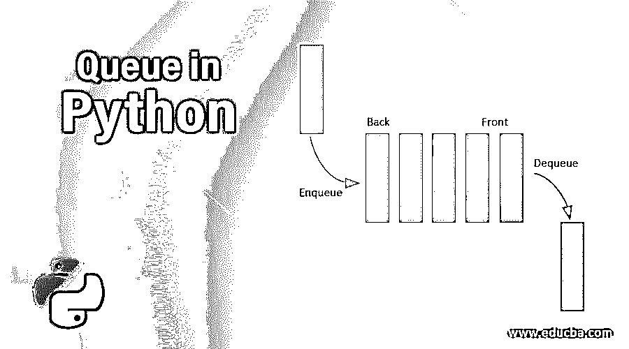
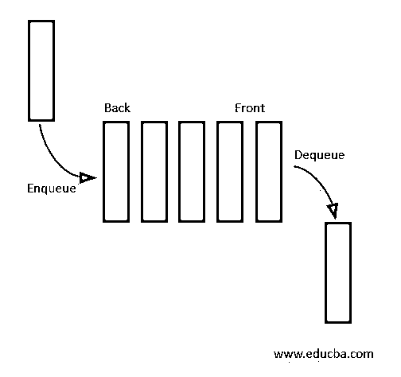

# Python 中的队列

> 原文：<https://www.educba.com/queue-in-python/>

## Python 中队列的介绍

队列是存储等待检索的数据项的容器。人们可以通过队列来控制和操作数据。有四种类型的队列:

1.  先进先出。比较 LIFO
2.  后进先出法。比较 FIFO
3.  优先队列
4.  环形队列

“队列”中有两个基本操作:

<small>网页开发、编程语言、软件测试&其他</small>

*   入队被称为插入。
*   出列被称为删除。

队列的两端都是开放的。首先进入的元素是队列中最先出来的元素。队列之间不允许随机添加或删除。Queue 帮助您创建任务流并跟踪它。

### 通用队列算法

以下是一般队列算法中的要点:

**1。**声明元素列表和队列的最大大小

**2。**将队列的头尾设置为 0

**3。**队列中的元素数量- >大小=尾部-头部

**4。**入队操作:

*   现在检查，如果大小< MaxSize:
*   如果是:将数据添加到队列中，然后将 Tail 递增 1
*   如果不是，打印消息:队列已满

**5。**出列操作

*   检查大小是否大于 0:
*   如果是:从列表中弹出第一个元素，然后将 Head 增加 1
*   如果没有:调用重置方法。打印消息:空消息

Python 以模块名“queue”的形式提供，可以导入到 python 环境中直接使用。

### 用 Python 实现队列的例子

下面是提到的例子:

#### 例 1。先进先出。比较 LIFO

以下是 FIFO 队列的示例:在队列中添加和删除一个元素:

**代码#1**

`import queue
s = queue.Queue()
type(s)`

**输出:**

如果队列类型没有明确定义，默认情况下 FIFO 为。现在让我们把一些东西放在一个队列里看看。

**代码#2**

`import queue
s = queue.Queue()
type(s)
s.put(10)
s.get()`

**输出:**

put()有助于将元素保存在队列中。而 s.get()将帮助从队列中检索元素。在队列中添加和删除多个元素:现在，既然我们已经在队列中添加了元素，让我们通过下面的代码来看看它是怎样的:

**代码#3**

`import queue
s = queue.Queue()
for j in range(5):
s.put(j)
while not s.empty():
print(s.get())
print("ENDs")`

**输出:**

#### 例 2。后进先出法。比较 FIFO

同样的添加和删除也可以在 LIFO 上完成。以下是后进先出队列的示例:

**代码:**

`import queue
s = queue.LifoQueue()
for j in range(5):
s.put(j)
while not s.empty():
print(s.get())
print("ENDs")`

**输出:**

#### 例 3。优先队列

这个队列与 LIFO 和 FIFO 队列有点不同。在这里，秩序不是利益的问题。

**代码:**

`import queue
s = queue.PriorityQueue()
s.put(2)
s.put(0)
s.put(1)
while not s.empty():
print(s.get())
print("ENDs")`

**输出:**

因此，可以看到，价值最低的项目首先从队列中出来。但是，如果有两个项目具有相同的值，则考虑顺序。

#### 实施例 4。环形队列

这是一种圆形队列。在这里，队列的尾部变成了队列的第一个头部。这也是基于“先进先出”的原理。这也称为“环形缓冲区”。循环队列的应用主要是在交通系统、CPU 调度等方面。

### 循环队列算法

下面我们学习循环队列算法。

*   用项目初始化队列。设置队列的大小，即 maxSize，初始化头指针和尾指针的值。

**入队:**检查元素个数是否= maxSize–1:

*   如果是，则返回消息:队列已满
*   如果否，那么将新的数据元素添加到尾指针的位置。递增尾指针。

**出列:**检查队列中的元素个数是否= 0:

*   如果是，则返回消息:队列为空
*   如果没有，则增加头指针。

**大小:**

*   如果，尾> =头，那么大小=尾–头
*   如果，head > tail，那么 size = maxSize(头尾)

### 队列中的操作

现在让我们来看一些与队列相关的操作:

**1。队列清空()**

In 根据队列中的任何可用项目返回 True 或 False。如果队列包含一些值，它返回 True。如果队列中没有任何项目，则返回 False。

**代码:**

`import queue
s = queue.PriorityQueue()
s.put(2)
s.put(0)
s.put(1)
s.empty()`

**输出:**

**2。队列已满()**

如果队列已满，则返回 True。否则为假。

**代码:**

`import queue
s = queue.PriorityQueue()
s.put(2)
s.put(0)
s.put(1)
s.full()`

**输出:**

**3。Queue task_done:** 如果任务已经排队并正在进行。为了检查是否完成，使用了这个函数。它基本上有助于线程处理。

**4。Qyeue qsize():** 返回队列的大小。

**代码:**

`import queue
s = queue.PriorityQueue()
s.put(2)
s.put(0)
s.put(1)
s.qsize()`

**输出:**

**5。Queue put():** 它将一个项目放入队列中。

**6。Queue get(): >** 这个函数用来从队列中删除条目。

“Collections.deque”和“multiprocessing.queue”是另外两个很好的 python 模块，可以用来研究队列。

### 多重处理的例子。长队

这是一种需要以并行模式处理项目的队列。它倾向于在进程间共享数据。

#### Python 代码

从多重处理导入队列

##### 代码#1

`qq = Queue()
qq.put('dance')
qq.put('play')
qq.put('read')
qq.put('sleep')
qq`

**输出:**

##### 代码#2

`qq = Queue()
qq.put('dance')
qq.put('play')
qq.put('read')
qq.put('sleep')
qq.get()`

**输出:**

##### 代码#3

`qq = Queue()
qq.put('dance')
qq.put('play')
qq.put('read')
qq.put('sleep')
qq.get()
qq.get()`

**输出:**

##### 代码#4

`qq = Queue()
qq.put('dance')
qq.put('play')
qq.put('read')
qq.put('sleep')
qq.get()
qq.get()
qq.get()`

**输出:**

##### 代码#5

`qq = Queue()
qq.put('dance')
qq.put('play')
qq.put('read')
qq.put('sleep')
qq.get()
qq.get()
qq.get()
qq.get()`

**输出:**

### 结论

上述内容是 python 数据结构中最重要的概念之一。我们讨论了队列的类型及其操作，这将有助于您很好地掌握它们，并且理解它们的真实用例。堆栈和队列是现实世界中使用最广泛的数据结构。在很好地理解了这一点之后，人们就会对有效地解决数据存储效率低下的问题充满信心。

### 推荐文章

这是一个用 Python 编写的队列指南。这里我们讨论 Python 中队列的介绍，循环算法，并通过相应的例子来更好地理解。您也可以浏览我们的其他相关文章，了解更多信息——

1.  [Python 的幂函数](https://www.educba.com/python-power-function/)
2.  [Python 唯一列表](https://www.educba.com/python-unique-list/)
3.  [Python 引用](https://www.educba.com/python-references/)
4.  [Python 中嵌套的 IF 语句](https://www.educba.com/nested-if-statement-in-python/)

